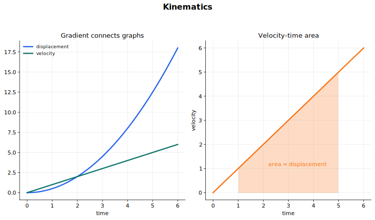

# Kinematics Lecture Notes

Kinematics describes motion without yet asking what causes it. A ball falls, a trolley speeds up, a car brakes, a projectile curves through the air. In this topic, the question is not "what force caused this?" but "how can we describe the motion clearly?"

The description has three layers:

1. quantities such as distance, displacement, speed, velocity, and acceleration;
2. graphs that show how those quantities change with time;
3. equations that work when acceleration is constant.

Most mistakes in kinematics come from mixing these layers. A formula may be correct but used outside its conditions. A graph may have the right shape but the wrong axis. A sign may be lost because the direction was never chosen. Start every problem by deciding the axis, the sign convention, and whether the acceleration is constant.

## Visual guide

This guide connects the main ideas of the topic: displacement, velocity, acceleration, graph gradients, graph areas, free fall, and projectile components.

## Source route

The syllabus route is CAIE Physics 9702, section 2:

- 2.1 Equations of motion

The coursebook route is Chapter 1, Kinematics: describing motion, and Chapter 2, Accelerated motion. The same ideas also depend on [Physical Quantities and Units](../01%20Physical%20Quantities%20and%20Units/10%20Lecture%20Notes.md), especially units, vectors, and sign conventions.

## 1. The language of motion

Kinematics starts with five quantities:

| Quantity | Meaning | Scalar or vector | Common unit |
|---|---|---|---|
| distance | total length of path travelled | scalar | $\mathrm{m}$ |
| displacement | change in position in a stated direction | vector | $\mathrm{m}$ |
| speed | rate of change of distance | scalar | $\mathrm{m\ s^{-1}}$ |
| velocity | rate of change of displacement | vector | $\mathrm{m\ s^{-1}}$ |
| acceleration | rate of change of velocity | vector | $\mathrm{m\ s^{-2}}$ |

Distance and displacement are not interchangeable. If you walk $3.0\ \mathrm{m}$ east and then $3.0\ \mathrm{m}$ west, the distance travelled is $6.0\ \mathrm{m}$, but the displacement is $0$.

Speed and velocity differ for the same reason. A speed of $20\ \mathrm{m\ s^{-1}}$ says how fast something is moving. A velocity of $20\ \mathrm{m\ s^{-1}}$ due north says how fast and in what direction.

For straight-line motion, directions are usually handled with signs. If east is positive, then a velocity of $12\ \mathrm{m\ s^{-1}}$ west is

$$
v=-12\ \mathrm{m\ s^{-1}}.
$$

The sign is part of the answer. Do not drop it just because the numerical value is tidy.

## 2. Average and instantaneous speed

Average speed is calculated over a time interval:

$$
\text{average speed}=\frac{\text{distance travelled}}{\text{time taken}}.
$$

In symbols,

$$
v=\frac{d}{t}.
$$

If the object moves at constant speed, this value is also its speed at every moment. If the speed changes during the interval, this is only an average.

Instantaneous speed is the speed at one moment. A car speedometer is meant to show instantaneous speed, not average speed over the whole journey.

The same distinction applies to velocity. Average velocity is

$$
\text{average velocity}=\frac{\text{change in displacement}}{\text{time taken}}
$$

or

$$
v=\frac{\Delta s}{\Delta t}.
$$

Here $\Delta$ means "change in". It is not a separate physical quantity.

## 3. Units and conversions

The SI unit of speed and velocity is

$$
\mathrm{m\ s^{-1}}.
$$

Other units appear in ordinary life, such as $\mathrm{km\ h^{-1}}$ or miles per hour, but physics calculations are usually safer in SI units.

To convert $\mathrm{km\ h^{-1}}$ into $\mathrm{m\ s^{-1}}$:

$$
1\ \mathrm{km\ h^{-1}}
=\frac{1000\ \mathrm{m}}{3600\ \mathrm{s}}
=0.278\ \mathrm{m\ s^{-1}}.
$$

So

$$
72\ \mathrm{km\ h^{-1}}=20\ \mathrm{m\ s^{-1}}.
$$

The unit of acceleration is

$$
\mathrm{m\ s^{-2}}.
$$

An acceleration of $5.0\ \mathrm{m\ s^{-2}}$ means that the velocity changes by $5.0\ \mathrm{m\ s^{-1}}$ every second, if the acceleration is constant.

## 4. Measuring speed and acceleration

The simplest way to find an average speed is to measure a distance and the time taken to travel it. That method does not tell you whether the object sped up or slowed down during the interval.

Common laboratory methods give more detail:

| Method | What is measured | How motion is found |
|---|---|---|
| two light gates | time between two fixed positions | average speed between the gates |
| one light gate with an interrupt card | time for a card of known length to pass | speed over the length of the card |
| ticker-timer | dot spacing at equal time intervals | speed pattern from distances between dots |
| motion sensor | position at many times | distance-time or displacement-time graph |

For a ticker-timer, equal dot spacing means constant speed. Increasing spacing means the object is speeding up. If dots are made every $0.02\ \mathrm{s}$, then every five-dot section represents $0.10\ \mathrm{s}$.

To measure acceleration, find how velocity changes over time:

$$
a=\frac{\Delta v}{\Delta t}.
$$

With light gates, an interrupt card can give two speeds, $u$ and $v$, at two times. The acceleration is then approximately

$$
a=\frac{v-u}{t}.
$$

With ticker tape or a motion sensor, the better route is often graphical: construct a velocity-time graph and find its gradient.

## 5. Displacement-time graphs

A displacement-time graph shows position relative to a chosen origin. The vertical axis is displacement, not distance.

The gradient of a displacement-time graph is velocity:

$$
v=\frac{\Delta s}{\Delta t}.
$$

Read the graph before calculating:

- A straight sloping line means constant velocity.
- A horizontal line means zero velocity, so the object is stationary.
- A steeper line means a greater speed.
- A negative gradient means motion in the negative direction.
- A curve means velocity is changing.

For a curved displacement-time graph, the instantaneous velocity at one moment is the gradient of the tangent at that point.

Do not read area from a displacement-time graph as a useful motion quantity in this course. The gradient is the important feature.

## 6. Velocity-time graphs

A velocity-time graph is different. The gradient gives acceleration:

$$
a=\frac{\Delta v}{\Delta t}.
$$

The area under a velocity-time graph gives displacement:

$$
s=\text{area under the velocity-time graph}.
$$

This is easy to see for constant velocity. If velocity is constant, then

$$
s=vt,
$$

which is the area of a rectangle on the graph.

For uniformly accelerated motion, the graph is a straight sloping line. The area may be a rectangle plus a triangle, or a trapezium.

Be careful with signs. Area above the time axis gives positive displacement. Area below the time axis gives negative displacement. If you want distance travelled, you may need to add magnitudes instead of signed areas.

For a curved velocity-time graph, the acceleration at a particular instant is found from the tangent gradient. The displacement over an interval is still the area under the graph, often estimated by counting squares.

## 7. Acceleration

Acceleration is the rate of change of velocity:

$$
a=\frac{\Delta v}{\Delta t}.
$$

For motion with constant acceleration from initial velocity $u$ to final velocity $v$ in time $t$,

$$
a=\frac{v-u}{t}.
$$

This can be rearranged to give

$$
v=u+at.
$$

Acceleration is a vector. An object can accelerate because its speed changes, because its direction changes, or both.

In straight-line kinematics, negative acceleration does not always mean "slowing down". It means acceleration in the negative direction. If an object has positive velocity and negative acceleration, it slows down. If it has negative velocity and negative acceleration, its speed increases in the negative direction.

## 8. Equations of uniformly accelerated motion

The standard equations of motion apply only when acceleration is constant and motion is along a straight line.

The quantities are:

| Symbol | Meaning |
|---|---|
| $s$ | displacement |
| $u$ | initial velocity |
| $v$ | final velocity |
| $a$ | constant acceleration |
| $t$ | time taken |

The four equations are:

$$
v=u+at
$$

$$
s=\frac{(u+v)}{2}t
$$

$$
s=ut+\frac{1}{2}at^2
$$

$$
v^2=u^2+2as
$$

Choose the equation that contains the known quantities and the unknown quantity. For example:

- If time is not mentioned, try $v^2=u^2+2as$.
- If final velocity is not mentioned, try $s=ut+\frac{1}{2}at^2$.
- If displacement is not mentioned, try $v=u+at$.
- If acceleration is not mentioned, try $s=\frac{(u+v)}{2}t$.

These are not separate tricks. They are different forms of the same model: straight-line motion with constant acceleration.

## 9. Where the equations come from

The equations are worth deriving once, because the derivation explains their conditions.

For constant acceleration, the velocity-time graph is a straight line. Its gradient is

$$
a=\frac{v-u}{t}.
$$

Rearranging gives

$$
v=u+at.
$$

The displacement is the area under the velocity-time graph. Since the graph is a straight line, the average velocity is

$$
\frac{u+v}{2}.
$$

Therefore

$$
s=\frac{(u+v)}{2}t.
$$

Substituting $v=u+at$ into this gives

$$
s=\frac{(u+u+at)}{2}t
$$

so

$$
s=ut+\frac{1}{2}at^2.
$$

To remove $t$, start from

$$
v=u+at
$$

so

$$
t=\frac{v-u}{a}.
$$

Substitute this into

$$
s=\frac{(u+v)}{2}t
$$

to get

$$
s=\frac{(u+v)(v-u)}{2a}.
$$

Since $(u+v)(v-u)=v^2-u^2$,

$$
2as=v^2-u^2,
$$

and therefore

$$
v^2=u^2+2as.
$$

The straight-line graph is the reason these equations work. If the velocity-time graph is curved, acceleration is not constant and these equations cannot be used directly over the whole interval.

## 10. Uniform and non-uniform acceleration

Uniform acceleration means constant acceleration. On a velocity-time graph, it appears as a straight line.

Non-uniform acceleration means the acceleration changes. On a velocity-time graph, it appears as a curve.

For non-uniform acceleration:

- acceleration at an instant is the gradient of the tangent to the velocity-time graph;
- displacement over an interval is the area under the velocity-time graph;
- the constant-acceleration equations do not apply across the interval unless the acceleration is actually constant.

This distinction matters. A car that brakes gently and then sharply may have a velocity-time graph made of several sections. Treat each section separately, or use graph gradients and areas.

## 11. Free fall without air resistance

Near the surface of the Earth, an object in free fall has acceleration

$$
g=9.81\ \mathrm{m\ s^{-2}}
$$

downwards, if air resistance is negligible.

You must choose a sign convention. If downward is positive, then a dropped object has

$$
u=0,\qquad a=g.
$$

For a drop from rest,

$$
s=\frac{1}{2}gt^2,
$$

$$
v=gt,
$$

and

$$
v^2=2gs.
$$

If upward is positive, then the acceleration due to gravity is

$$
a=-g.
$$

For an object thrown upwards, the velocity at the highest point is zero, but the acceleration is still $-g$. The object has not "run out of acceleration"; it has momentarily run out of upward velocity.

The phrase "without air resistance" is part of the model. If air resistance matters, acceleration is no longer simply $g$ throughout the motion.

## 12. Measuring the acceleration of free fall

One laboratory method uses an electromagnet, a steel ball, an electronic timer, and a trapdoor or switch.

1. The electromagnet holds the ball at rest.
2. When the current is switched off, the timer starts and the ball falls.
3. When the ball reaches the trapdoor or breaks a circuit, the timer stops.
4. The height $h$ and time $t$ are used to calculate $g$.

For a ball released from rest,

$$
h=\frac{1}{2}gt^2.
$$

So

$$
g=\frac{2h}{t^2}.
$$

A better procedure is to measure $t$ for several heights and plot $h$ against $t^2$. Since

$$
h=\frac{g}{2}t^2,
$$

the gradient of the graph is

$$
\frac{g}{2}.
$$

Therefore

$$
g=2\times\text{gradient}.
$$

Main uncertainty issues:

- reaction time if a hand stopwatch is used;
- uncertainty in measuring height;
- residual magnetism in the electromagnet, which may delay release;
- air resistance;
- friction if a falling mass pulls ticker tape through a ticker-timer.

The useful habit is to describe not just the apparatus, but how the measurements lead to $g$ and what could make the measured value too high or too low.

## 13. Motion in two dimensions

Two-dimensional motion becomes manageable when you split it into perpendicular components.

If an object is launched with speed $u$ at an angle $\theta$ above the horizontal, then

$$
u_x=u\cos\theta
$$

and

$$
u_y=u\sin\theta.
$$

In the absence of air resistance, projectile motion has two independent parts:

| Direction | Motion |
|---|---|
| horizontal | constant velocity |
| vertical | constant acceleration $g$ downwards |

If $x$ is horizontal and upward is positive in the vertical direction, then

$$
a_x=0,\qquad a_y=-g.
$$

The horizontal motion is usually

$$
x=u_x t.
$$

The vertical motion uses the constant-acceleration equations:

$$
y=u_y t-\frac{1}{2}gt^2,
$$

$$
v_y=u_y-gt.
$$

The same time $t$ links the two directions. That is the key to projectile problems.

## 14. Projectile problem routine

Use this routine for projectiles:

1. Draw the path and choose axes.
2. Resolve the initial velocity into horizontal and vertical components.
3. Write the horizontal model: constant velocity, $a_x=0$.
4. Write the vertical model: constant acceleration, usually $a_y=-g$ if upward is positive.
5. Use the vertical motion to find the time, unless the time is already known.
6. Use that same time in the horizontal motion.
7. Combine components if the final velocity or direction is required.

Special points:

- At the highest point, $v_y=0$ but $a_y=-g$.
- Horizontal velocity stays constant only when air resistance is ignored.
- Vertical displacement may be zero for landing at the same height, but it is not zero for landing below or above the launch point.
- The range is the horizontal distance travelled before the projectile lands.

## 15. A working routine for kinematics problems

Before choosing an equation, write a small data list:

$$
u=?,\qquad v=?,\qquad a=?,\qquad s=?,\qquad t=?
$$

Then:

1. Choose a positive direction.
2. Convert quantities into SI units.
3. Put signs into velocities, displacement, and acceleration.
4. Decide whether acceleration is constant.
5. Choose either a graph method or an equation method.
6. Solve algebraically before substituting if rearrangement is needed.
7. Check the answer using units, signs, and a rough estimate.

If a result has the wrong sign, do not erase the sign first. Ask what it means. A negative displacement, velocity, or acceleration is often the information the problem was trying to test.

## 16. Common mistakes

- Mixing distance with displacement.
- Mixing speed with velocity.
- Treating $s$ for displacement as the unit $\mathrm{s}$ for seconds.
- Forgetting that acceleration is a vector.
- Using $g=9.81\ \mathrm{m\ s^{-2}}$ with the wrong sign.
- Using constant-acceleration equations when acceleration is changing.
- Reading area from a displacement-time graph instead of gradient.
- Reading gradient from a velocity-time graph but calling it velocity instead of acceleration.
- Ignoring area below the time axis on a velocity-time graph.
- Forgetting to resolve velocity before a projectile calculation.
- Treating horizontal and vertical projectile motion as if they had different times.

## Quick self-check

You are ready to move on when you can do these without looking up the method:

- Define distance, displacement, speed, velocity, and acceleration.
- Explain the difference between average and instantaneous speed.
- Use gradients of displacement-time and velocity-time graphs correctly.
- Use areas under velocity-time graphs to find displacement.
- Derive the four constant-acceleration equations from definitions and graph areas.
- Choose the correct equation from $s$, $u$, $v$, $a$, and $t$.
- Solve free-fall problems with a consistent sign convention.
- Describe a laboratory method for determining $g$.
- Explain projectile motion as horizontal constant velocity plus vertical constant acceleration.
- Resolve an initial velocity into perpendicular components and use the same time in both directions.

## Connections

- [Physical Quantities and Units](../01%20Physical%20Quantities%20and%20Units/10%20Lecture%20Notes.md)
- [Dynamics](../03%20Dynamics/00%20Overview.md)
- [Kinematics and Newtonian Motion](../../../20%20Mathematics/02%20Mechanics/02%20Kinematics%20and%20Newtonian%20Motion/00%20Overview.md)
