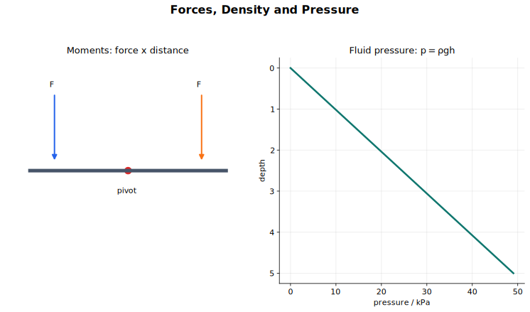

# 力、密度与压强讲义

这一节把 [Dynamics](../03%20Dynamics/10%20Lecture%20Notes.md) 里的力继续往三个方向展开。第一，力是矢量，所以多个力要按矢量相加。第二，力不一定只让物体平动；如果力的作用线不通过转轴或支点，它还会产生转动效果。第三，力分布在面积上就形成压强，而流体中的压强差会产生浮力。

读这一节时，可以反复问同一个问题：这里关心的是力的哪一种作用效果？

- 如果物体可能加速，关注合力。
- 如果物体可能转动，关注合力矩或合转矩。
- 如果题目涉及接触面或流体，关注单位面积上的力，以及压强差。

## 图示导读

这张图可以当作本节地图。左边是转动路线：重心、作用线、力矩、力偶、转矩和平衡。右边是流体路线：密度、压强、液体静压强和浮力。

## 来源范围

这份讲义对应 CAIE Physics 9702 的第 4 节 Forces, density and pressure：

- 4.1 Turning effects of forces
- 4.2 Equilibrium of forces
- 4.3 Density and pressure

教材上主要对应 Chapter 4 的力的矢量、分量、重心、力矩、力偶和平衡，以及 Chapter 7 的密度、压强、液体静压强和阿基米德原理。

## 1. 力是矢量

力是矢量，既有大小，也有方向。因此多个力不能只把大小相加，而要做矢量加法。

如果几个力在同一直线上，可以先规定正方向，再用正负号表示方向。比如规定向下为正，一个物体受到 $1.0\ \text{N}$ 向下的重力和 $0.2\ \text{N}$ 向上的空气阻力，则

$$
F_{\text{resultant}} = 1.0 - 0.2 = 0.8\ \text{N}
$$

结果为正，说明合力方向向下。

如果力之间有夹角，可以把力首尾相接画矢量图，也可以把力分解到互相垂直的方向上。一个力 $F$ 与正 $x$ 方向夹角为 $\theta$ 时，

$$
F_x = F\cos\theta
$$

$$
F_y = F\sin\theta
$$

两个互相垂直的分量可以分别处理。这也是斜面问题常把坐标轴取成“沿斜面”和“垂直斜面”的原因。斜面倾角为 $\theta$ 时，重力沿斜面向下的分量是

$$
mg\sin\theta
$$

而法向接触力垂直于斜面，所以它沿斜面方向没有分量。

## 2. 共面力的平衡

共面力指作用在同一平面内的力。如果三个共面力使物体保持平衡，它们的矢量和为零。把这三个力的矢量首尾相接画出来，会形成一个闭合三角形，这就是力的三角形。

力的三角形有两种用法：

- 如果力的三角形能闭合，说明合力为零。
- 如果已知物体平衡，那么这些力的矢量必须能闭合。

这个图像方法和分解力是同一件事的两种表示。物体平衡时，

$$
\sum F_x = 0
$$

并且

$$
\sum F_y = 0
$$

这表示任意方向上都没有合力。

## 3. 重心

物体的重力来自引力对物体各部分的作用。为了简化分析，我们通常把整个物体受到的总重力看成集中作用在一个点上，这个点叫重心（centre of gravity）。

均匀球体的重心在几何中心，均匀细杆的重心在中点。不规则薄片的重心可以用悬挂法找出：把薄片从一个点自由悬挂，静止后重心一定在悬点的正下方；沿铅垂线画一条线。换另一个悬点再画一次，两条线的交点就是重心。

重心不一定在物体材料内部。弯曲物体或空心物体的重心可能落在空处。力学分析真正关心的是重力这条作用线在哪里。

## 4. 力矩

力可以让物体绕某个点或支点转动。力的这种转动效果叫力矩。

某个力对某一点的力矩为

$$
M = Fd_\perp
$$

其中 $F$ 是力的大小，$d_\perp$ 是该点到力的作用线的垂直距离。

力矩的单位是

$$
\text{N m}
$$

注意，力矩里用的是“支点到作用线的垂直距离”，不一定是支点到施力点沿杆方向的距离。如果大小为 $F$ 的力作用在离支点距离为 $d$ 的位置，并且与杆成角 $\theta$，则

$$
M = Fd\sin\theta
$$

这个结果可以从两个角度理解：

- 支点到力的作用线的垂直距离是 $d\sin\theta$。
- 真正产生转动效果的是垂直于杆的力分量 $F\sin\theta$。

如果一个力的作用线通过支点，那么它对这个支点的力矩为零，因为 $d_\perp = 0$。

## 5. 力矩平衡原理

如果物体处于转动平衡，对任意一点取矩时，顺时针力矩之和等于逆时针力矩之和：

$$
\sum M_{\text{clockwise}} = \sum M_{\text{anticlockwise}}
$$

这就是力矩平衡原理，也常叫力矩原理。

例如，一个跷跷板左侧有 $20\ \text{N}$ 的力，离支点 $2.0\ \text{m}$；右侧有 $40\ \text{N}$ 的力，离支点 $1.0\ \text{m}$。左侧力产生的逆时针力矩为

$$
20 \times 2.0 = 40\ \text{N m}
$$

右侧力产生的顺时针力矩为

$$
40 \times 1.0 = 40\ \text{N m}
$$

两个力矩相等，所以没有合力矩，跷跷板不会开始转动。

做力矩题时，取矩点要选得聪明些。常见技巧是对支点或支持点取矩，因为通过取矩点的未知反作用力力矩为零，这样可以少解一个未知量。

## 6. 完整的平衡条件

物体真正处于平衡状态，必须同时满足两个条件：

$$
\sum \vec{F} = 0
$$

$$
\sum M = 0
$$

没有合力，表示没有平动加速度；没有合力矩或合转矩，表示没有角加速度。只满足其中一个条件是不够的。

例如，方向相反、大小相等的一对力作用在方向盘上，可以让合力为零，但方向盘仍然会转动。又比如，一个物体受到向上的支持力和向下的重力，如果两条作用线位置不合适，也可能发生转动。

## 7. 力偶和力偶矩

力偶（couple）是一对只产生转动效果的力。构成力偶的两个力需要满足：

- 大小相等。
- 方向相反且互相平行。
- 两条作用线之间有垂直距离。

力偶的合力为零，所以它不会让物体产生平动加速度；但它会产生转动效果。

力偶矩为

$$
\tau = Fd
$$

其中 $F$ 是其中一个力的大小，$d$ 是两个力的作用线之间的垂直距离。单位仍然是 $\text{N m}$。

力偶矩和单个力的力矩不完全一样。单个力对某一点的力矩取决于你选哪个点；力偶矩不依赖于选取的支点，只取决于力的大小和两条作用线之间的垂直距离。

## 8. 密度

密度定义为单位体积的质量：

$$
\rho = \frac{m}{V}
$$

其中 $\rho$ 是密度，$m$ 是质量，$V$ 是体积。SI 单位是

$$
\text{kg m}^{-3}
$$

密度描述的是一定体积里“装了多少质量”。在给定条件下，同一种材料的密度通常可以看成材料本身的性质。水的密度大约是

$$
1000\ \text{kg m}^{-3}
$$

也就是

$$
1.0\ \text{g cm}^{-3}
$$

单位换算要小心。因为

$$
1\ \text{m}^3 = 10^6\ \text{cm}^3
$$

所以从 $\text{g cm}^{-3}$ 换成 $\text{kg m}^{-3}$ 时，要乘以 $1000$。

## 9. 压强

压强定义为单位面积上的垂直作用力：

$$
p = \frac{F}{A}
$$

这里的垂直作用力指垂直于接触面的力。压强单位是帕斯卡：

$$
1\ \text{Pa} = 1\ \text{N m}^{-2}
$$

同样大小的力，如果分布在较大的面积上，压强会较小；如果集中在很小的面积上，压强会很大。锋利的刀更容易切开物体，是因为刀刃面积小，产生的压强大。雪鞋能让人不容易陷进雪里，是因为接触面积变大，压强变小。

流体压强对任何接触面都沿垂直方向产生力。在静止流体中的某一点，压强本身没有一个单独方向，虽然它对某个具体表面产生的力有方向。因此压强是标量。

## 10. 液体静压强

流体越深，压强越大，因为越深处上方压着的流体越多。液体静压强差为

$$
\Delta p = \rho g \Delta h
$$

这个式子给的是压强差，不一定是总压强。如果液面上方与大气相通，那么深度为 $\Delta h$ 处的总压强为

$$
p_{\text{total}} = p_{\text{atmospheric}} + \rho g\Delta h
$$

这个公式可以直接从密度和压强定义推出。取一段横截面积为 $A$、高度为 $\Delta h$ 的竖直液柱，它的体积是

$$
V = A\Delta h
$$

质量是

$$
m = \rho A\Delta h
$$

重力是

$$
W = mg = \rho g A\Delta h
$$

这段液柱的重力对底部产生的压强差为

$$
\Delta p = \frac{W}{A}
         = \frac{\rho g A\Delta h}{A}
         = \rho g\Delta h
$$

同一种连通的静止流体里，同一深度的压强相同。如果同一深度两处压强不同，流体就会沿水平方向流动，直到压强差消失。

## 11. 浮力和阿基米德原理

物体浸在流体中时，下表面比上表面更深，所以下表面受到的压强更大。下表面受到的向上压力大于上表面受到的向下压力，两者的合效果就是向上的浮力。

体积为 $V$ 的物体完全浸没在密度为 $\rho$ 的流体中时，浮力为

$$
F = \rho gV
$$

这就是阿基米德原理的公式形式：浮力等于被物体排开的流体所受的重力。

如果物体漂浮，只有浸入流体的部分排开流体，所以 $V$ 应该取浸没部分的体积。漂浮物体处于平衡时，

$$
\text{upthrust} = \text{weight}
$$

如果浮力大于重力，物体向上加速；如果重力大于浮力，物体向下加速。

把物体挂在测力计上再浸入液体中时，读数会变小，因为浮力承担了一部分重力：

$$
\text{apparent weight} = W - F_{\text{upthrust}}
$$

## 12. 解题工作流程

先判断题目在问力的哪种效果，再选方法。

1. 平动问题：画受力图，求合力。
2. 斜向力平衡：分解力，或者画力的三角形。
3. 转动问题：先画支点、作用线和垂直距离，再算力矩。
4. 力偶问题：取其中一个力，乘两条作用线之间的垂直距离。
5. 密度问题：确认质量和体积，并统一单位。
6. 压强问题：用垂直作用力除以受力面积。
7. 流体问题：先判断题目要的是压强差、总压强，还是浮力。

## 13. 常见错误

- 用了沿杆的距离，却忘了力矩需要的是到作用线的垂直距离。
- 只检查 $\sum \vec{F} = 0$，忘记还要检查 $\sum M = 0$。
- 把力偶当成有合力的一对力。
- 没有在 $\text{g cm}^{-3}$ 和 $\text{kg m}^{-3}$ 之间正确换算。
- 算压强时用了总力，却没有除以受力面积。
- 忘记 $\rho g\Delta h$ 给的是液体静压强差。
- 漂浮物体算浮力时，用了整个物体体积，而不是浸没部分体积。

## 快速自查

如果下面这些问题不用看笔记也能回答，就可以进入下一节。

1. 力的作用线是什么意思？
2. 为什么通过支点的力对这个支点的力矩为零？
3. 物体平衡需要同时满足哪两个条件？
4. 单个力的力矩和力偶矩有什么区别？
5. 为什么压强是标量，而不是矢量？
6. 怎样从密度和压强的定义推出 $\Delta p = \rho g\Delta h$？
7. 浸在流体中的物体为什么会受到浮力？
8. 漂浮物体使用 $F = \rho gV$ 时，$V$ 应该取哪个体积？

## 关联内容

- [Dynamics](../03%20Dynamics/10%20Lecture%20Notes.md) 提供本节需要的力和加速度基础。
- [Work, Energy and Power](../05%20Work%20Energy%20and%20Power/00%20Overview.md) 会把力和位移联系起来，而不是把力和垂直距离联系起来。
- [Deformation of Solids](../06%20Deformation%20of%20Solids/00%20Overview.md) 会再次使用“力除以面积”的思想来定义应力。
- [Forces and Equilibrium](../../../20%20Mathematics/02%20Mechanics/01%20Forces%20and%20Equilibrium/00%20Overview.md) 从数学力学角度继续处理力的分解和平衡。
