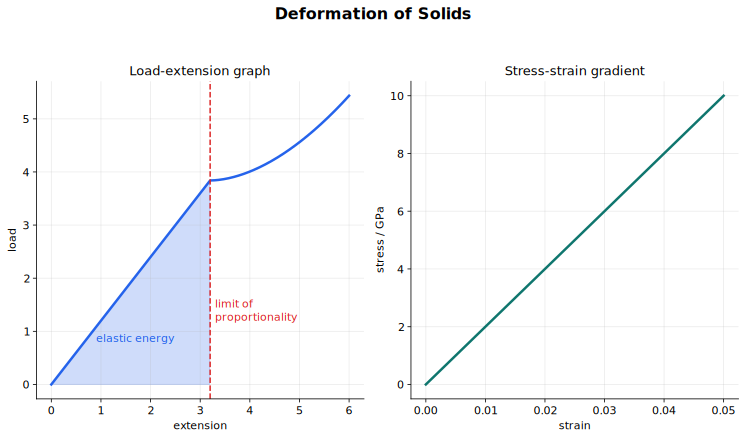

# 固体形变讲义

力不只会改变运动，也会改变物体形状。弹簧会伸长，金属丝会被拉长，梁会弯曲，橡皮筋被拉开后会储存能量。这一节研究一维形变，也就是沿一条直线方向的拉伸和压缩。

核心问题是：固体受到载荷后怎样响应？有些物体撤去力后能恢复原状，有些会留下永久形变。本节的图像和公式，就是用来定量描述这些行为的。

## 图示导读

这张图把载荷、伸长量、胡克定律、应力、应变、杨氏模量、弹性形变、塑性形变和弹性势能连起来。

## 来源范围

这份讲义对应 CAIE Physics 9702 的第 6 节 Deformation of solids：

- 6.1 Stress and strain
- 6.2 Elastic and plastic behaviour

教材上主要对应 Chapter 7 中压缩力和拉伸力、弹簧、材料拉伸、应力应变、杨氏模量和弹性势能这些部分。

## 1. 拉伸形变和压缩形变

形变指物体在力的作用下形状或大小发生变化。

拉伸力会把材料拉长，材料沿力的方向变长。压缩力会把材料压短，材料沿力的方向变短。

在这部分 syllabus 中，力和形变都按一维处理。也就是说，伸长或压缩都沿载荷作用线测量。

载荷（load）就是施加在物体上的力。伸长量 $x$ 是长度增加量：

$$
x = \text{new length} - \text{original length}
$$

压缩时道理相同，只是长度减少，这时通常说压缩量而不是伸长量。

## 2. 力-伸长量图像

研究形变最直接的方法，是给弹簧逐渐挂上不同载荷，并测量每个载荷对应的伸长量。把力画在纵轴、伸长量画在横轴，就得到力-伸长量图像。

图像本身就是实验信息。它的形状说明物体怎样响应载荷。

- 过原点的直线表示力和伸长量成正比。
- 直线越陡，说明弹簧或金属丝越硬。
- 图像开始弯曲，说明力和伸长量不再成正比。
- 卸载后如果不能回到原长，说明发生了永久形变。

在直线区域里，力-伸长量图像的斜率就是弹簧劲度系数，也就是 spring constant。

## 3. 胡克定律和弹簧劲度系数

胡克定律说：在没有超过比例极限时，材料的伸长量与所受载荷成正比。

对满足胡克定律的弹簧或金属丝，

$$
F = kx
$$

其中 $F$ 是载荷，$x$ 是伸长量，$k$ 是弹簧劲度系数。弹簧劲度系数为

$$
k = \frac{F}{x}
$$

单位是

$$
\text{N m}^{-1}
$$

$k$ 越大，弹簧越硬；要产生同样的伸长，需要更大的力。

比例极限（limit of proportionality）是指超过这个点后，伸长量不再与载荷成正比。超过比例极限后，图像不再是过原点的直线，也不能再用同一个常量 $k$ 写 $F = kx$。

## 4. 弹性形变和塑性形变

弹性形变是指撤去载荷后，物体能恢复原来的形状和大小。

塑性形变是指撤去载荷后，物体不能完全恢复原状，留下永久形变。

弹性极限（elastic limit）是材料仍能完全恢复原状的最大载荷或最大形变。

弹性极限不一定等于比例极限。它们可能很接近，但描述的是两件不同的事：

- 比例极限关心的是 $F$ 是否仍然与 $x$ 成正比。
- 弹性极限关心的是形变是否还能完全恢复。

读图时要把这两个点分开。材料可能先不再满足胡克定律，但仍然没有发生永久形变。

## 5. 应力

拉伸金属丝需要多大的力，和金属丝的横截面积有关。更粗的金属丝在同一种材料响应下需要更大的力。应力把这个几何因素除掉，用单位面积上的力来描述材料内部受到的拉伸程度。

拉应力定义为力除以横截面积：

$$
\sigma = \frac{F}{A}
$$

其中 $\sigma$ 是应力，$F$ 是拉伸力，$A$ 是垂直于力方向的横截面积。

应力的单位是

$$
\text{N m}^{-2}
$$

也就是帕斯卡：

$$
1\ \text{Pa} = 1\ \text{N m}^{-2}
$$

应力不是力。它表示这个力集中在材料横截面上的程度。

## 6. 应变

金属丝的伸长量还和原长有关。同种材料、同样横截面积、同样应力下，长金属丝比短金属丝伸长更多。应变把原长这个因素除掉，用相对伸长来描述形变。

拉应变定义为伸长量除以原长：

$$
\varepsilon = \frac{x}{L}
$$

其中 $\varepsilon$ 是应变，$x$ 是伸长量，$L$ 是原长。

应变没有单位，因为它是两个长度的比值。它可以写成小数，也可以写成百分数。

应变不是伸长量。伸长量是真实的长度变化，应变是长度变化占原长的比例。

## 7. 杨氏模量

弹簧劲度系数描述的是某一个弹簧或某一根金属丝有多硬。它不仅和材料有关，也和几何尺寸有关。材料相同但更粗、更短，劲度系数都会变化。

杨氏模量描述的是材料本身在弹性直线区域内的硬度。它定义为

$$
E = \frac{\text{stress}}{\text{strain}}
$$

也就是

$$
E = \frac{\sigma}{\varepsilon}
$$

代入 $\sigma = \dfrac{F}{A}$ 和 $\varepsilon = \dfrac{x}{L}$，得到

$$
E = \frac{F/A}{x/L}
  = \frac{FL}{Ax}
$$

因为应变没有单位，杨氏模量的单位和应力相同：

$$
\text{Pa}
$$

在应力-应变图像中，起始直线段的斜率就是杨氏模量：

$$
E = \frac{\Delta \sigma}{\Delta \varepsilon}
$$

杨氏模量越大，材料越硬。钢的杨氏模量远大于橡胶，所以要让钢产生同样应变，需要大得多的应力。

## 8. 测量金属丝的杨氏模量

要测量金属丝的杨氏模量，需要测量力、伸长量、原长和横截面积。

实验通常使用长而细的金属丝，因为金属丝的伸长量很小，长金属丝能产生更容易测量的伸长量。原长 $L$ 从夹紧点量到标记点或参考点。

金属丝直径 $d$ 用螺旋测微器测量。为了减少误差，要在不同位置、不同方向多次测量，取平均直径，再计算横截面积：

$$
A = \frac{\pi d^2}{4}
$$

逐渐增加载荷。每加一次载荷，计算力 $F = mg$，并测量伸长量 $x$。伸长量很小，可以用读数显微镜、游标尺或其他精细读数装置测量。

在弹性直线区域内画 $F$ 对 $x$ 的图像，斜率为

$$
\frac{F}{x}
$$

又因为

$$
E = \frac{FL}{Ax}
$$

所以

$$
E = \frac{L}{A} \times \text{gradient of the } F\text{-}x \text{ graph}
$$

测量结束后应逐渐卸载，检查金属丝是否回到原长。如果不能回到原长，说明已经超过弹性极限，这部分数据就不能当作纯弹性直线区域来处理。

## 9. 形变中的做功

拉伸或压缩材料需要做功，因为力的作用点发生了位移。如果材料发生的是弹性形变，这些做功会以弹性势能的形式储存在材料中。

对任意力-伸长量图像，做功等于图像下面积：

$$
W = \text{area under the } F\text{-}x \text{ graph}
$$

即使图像是曲线，这句话仍然成立，只是面积可能需要数格子或用数值方法估算。

在满足胡克定律的区域内，力-伸长量图像是过原点的直线。图像下面积是三角形：

$$
E_p = \frac{1}{2}Fx
$$

又因为这个区域内 $F = kx$，所以

$$
E_p = \frac{1}{2}kx^2
$$

这两个弹性势能公式只适用于没有超过比例极限的形变。

如果材料发生塑性形变，做功不可能全部恢复。一部分能量会转化为内能，因为材料内部结构已经发生不可逆变化。

## 10. 读形变图像

力-伸长量图像和应力-应变图像里含有很多物理信息。

对力-伸长量图像：

- 直线区域的斜率给出弹簧劲度系数。
- 图像下面积给出做功。
- 直线区域结束处对应比例极限。
- 卸载后仍有伸长，说明发生了塑性形变。

对应力-应变图像：

- 起始直线段的斜率给出杨氏模量。
- 图像可以比较材料本身，而不依赖样品尺寸。
- 直线区域表示应力与应变成正比。

一定要看清楚题目给的是哪一种图像。力-伸长量图像的斜率通常不是杨氏模量，除非图像坐标已经把几何因素处理掉。

## 11. 解题工作流程

处理形变题时，可以按下面顺序判断。

1. 先判断题目研究的是某个弹簧或金属丝，还是材料本身。
2. 研究具体弹簧或金属丝时，只在比例区域内使用 $F = kx$。
3. 研究材料硬度时，先算应力和应变，再用 $E = \sigma/\varepsilon$。
4. 算应变用原长，不用末长度。
5. 算应力用垂直于力方向的横截面积。
6. 图像斜率常对应硬度，图像下面积对应做功。
7. 使用弹性势能公式前，先确认形变仍在弹性和比例区域内。

## 12. 常见错误

- 把伸长量 $x$ 和应变 $\varepsilon$ 混为一谈。
- 把弹簧劲度系数 $k$ 和杨氏模量 $E$ 混为一谈。
- 超过比例极限后仍然使用胡克定律。
- 默认弹性极限和比例极限一定是同一个点。
- 算应力时用了直径，而不是横截面积。
- 算应变时用了末长度，而不是原长。
- 忘记力-伸长量图像下面积的单位是能量。
- 在非线性区域或塑性形变区域使用 $E_p = \frac{1}{2}kx^2$。

## 快速自查

如果下面这些问题不用看笔记也能回答，就可以进入下一节。

1. 拉伸形变和压缩形变有什么区别？
2. 力-伸长量图像的斜率表示什么？
3. 使用 $F = kx$ 之前必须满足什么条件？
4. 弹性形变和塑性形变有什么区别？
5. 为什么应力和应变可以用来比较材料，而不是只比较样品？
6. 怎样从应力-应变图像求杨氏模量？
7. 测量金属丝杨氏模量需要哪些量？
8. 为什么满足胡克定律的弹簧弹性势能是 $\frac{1}{2}kx^2$，而不是 $kx^2$？

## 关联内容

- [Forces, Density and Pressure](../04%20Forces%20Density%20and%20Pressure/10%20Lecture%20Notes.md) 引入了单位面积上的力，本节把它发展成应力。
- [Work, Energy and Power](../05%20Work%20Energy%20and%20Power/10%20Lecture%20Notes.md) 讲过做功等于力-位移图像下面积，本节把它用到形变能量。
- [Work, Energy, Power and Elasticity](../../../20%20Mathematics/02%20Mechanics/04%20Work%20Energy%20Power%20and%20Elasticity/00%20Overview.md) 会从数学力学角度继续处理弹簧和弹性势能。
