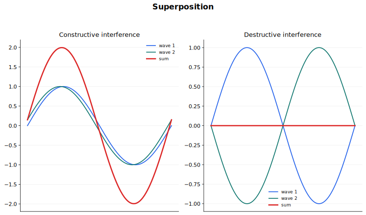

# Superposition Lecture Notes

Superposition is the part of wave physics where one wave no longer acts alone. Two waves can pass through the same region at the same time, and the observed displacement is produced by both of them together. This single idea explains stationary waves, diffraction patterns, interference fringes, and diffraction gratings.

This topic should feel like a continuation of [Waves](../07%20Waves/00%20Overview.md). Keep the wave model from that topic visible: displacement has a sign, phase tells you where a point is in its cycle, and wavelength gives the spatial repeat of the pattern.

## Source Route

- Primary syllabus source: CAIE Physics 9702, Topic 8 Superposition.
- Main subtopics: stationary waves, diffraction, interference, and diffraction gratings.
- Coursebook route: superposition of waves and stationary waves.
- Useful earlier knowledge: phase, wavelength, amplitude, wavefronts, wave speed, frequency, and intensity.

## Visual Guide

The visual guide is a reminder that superposition is displacement addition. A crest meeting a crest gives a larger crest. A crest meeting an equal trough gives zero displacement at that instant.

## 1. Principle of Superposition

The principle of superposition says that when two or more waves meet at a point, the resultant displacement at that point is the algebraic sum of the displacements due to the individual waves.

If the individual displacements are $s_1$, $s_2$, $s_3$, and so on, then

$$
s = s_1 + s_2 + s_3 + \cdots
$$

The word algebraic matters. Displacement is a signed quantity. A displacement above the equilibrium line might be taken as positive, while a displacement below the equilibrium line is negative. If one wave gives $+2.0\ \text{mm}$ and another gives $-1.5\ \text{mm}$ at the same point and time, the resultant displacement is

$$
s = +2.0\ \text{mm} - 1.5\ \text{mm} = +0.5\ \text{mm}
$$

Superposition does not mean the waves destroy each other permanently. In the linear wave model used here, each wave continues after the overlap as if the other wave had passed through it. The pattern during overlap can change dramatically, but the waves themselves remain identifiable.

Use this method whenever you are asked to combine waves:

1. Choose a positive direction for displacement.
2. Find each wave's displacement at the point and instant of interest.
3. Add the displacements with their signs.
4. Interpret the result as the actual displacement of the medium or field at that instant.

Graphically, superposition is done point by point. At each horizontal position, add the vertical displacement of the first wave to the vertical displacement of the second wave. This is often clearer than trying to remember a separate rule for every pattern.

## 2. Constructive and Destructive Interference

Interference is the observable effect of superposition when waves overlap. The clearest cases are constructive interference and destructive interference.

Constructive interference occurs when the waves arrive in phase. Crests meet crests and troughs meet troughs. The resultant amplitude is larger than either individual amplitude if the waves have the same sign at the same time.

Destructive interference occurs when the waves arrive in antiphase. Crests meet troughs. If two waves have equal amplitude and are exactly in antiphase, their resultant displacement is zero at that point.

For two equal-amplitude waves:

- in phase: resultant amplitude is $2A$
- in antiphase: resultant amplitude is $0$

Do not confuse displacement and intensity. Displacement can be positive, negative, or zero. Intensity is related to energy transfer and is never negative. For waves of the same type under the usual assumptions,

$$
I \propto A^2
$$

So doubling the amplitude gives four times the intensity. That is why bright fringes can be much brighter than the light from one slit alone, even though the displacement rule is a simple addition rule.

## 3. Path Difference, Phase Difference, and Coherence

For two waves from separate routes to interfere at a point, compare the distances travelled by the waves. The difference between these distances is the path difference.

If the path difference is a whole number of wavelengths, the waves arrive in phase and produce constructive interference:

$$
\text{path difference} = n\lambda
$$

where $n = 0, 1, 2, 3, \ldots$.

If the path difference is an odd number of half wavelengths, the waves arrive in antiphase and produce destructive interference:

$$
\text{path difference} = \left(n + \frac{1}{2}\right)\lambda
$$

where $n = 0, 1, 2, 3, \ldots$.

Phase difference is the same idea expressed as an angle rather than a distance. One complete wavelength corresponds to $2\pi\ \text{rad}$ or $360^\circ$. A path difference of $\frac{1}{2}\lambda$ corresponds to a phase difference of $\pi\ \text{rad}$ or $180^\circ$.

For a stable interference pattern, the sources must be coherent. Coherent sources have a constant phase difference. In practice, that also means the waves have the same frequency. If the phase relationship changes randomly, bright and dark regions move too quickly or irregularly to form a steady pattern.

This is why light interference experiments usually split light from one source into two paths. Two separate lamps do not usually have a fixed phase relationship, so they do not give stable fringes.

## 4. Diffraction

Diffraction is the spreading of waves as they pass through a gap or around an edge. It is not a separate kind of wave. It is a consequence of wavefronts continuing from different parts of an aperture and then superposing.

The amount of diffraction depends mainly on the size of the gap compared with the wavelength.

- If the gap is much larger than the wavelength, the wave mostly travels straight through. Spreading is small.
- If the gap is similar to the wavelength, spreading is large and easy to observe.
- If the gap is very narrow, the wave spreads strongly, although very little energy may pass through.

A ripple tank makes this visible. Plane water waves pass through a gap. When the gap is wide compared with the wavelength, the wavefronts after the gap remain almost straight. When the gap is close to one wavelength wide, the outgoing wavefronts are strongly curved and spread over a large angle.

The same idea applies to sound, radio waves, microwaves, and light. Sound diffracts noticeably around doors because everyday openings are often comparable with sound wavelengths. Light has a much shorter wavelength, so diffraction by ordinary doorways is not obvious.

## 5. Two-Source Interference

Two-source interference occurs when waves from two coherent sources overlap. The pattern contains positions of constructive interference and positions of destructive interference.

The experiment can be done with different wave types:

- water waves from two vibrating dippers in a ripple tank
- sound waves from two loudspeakers driven by the same signal generator
- microwaves from a transmitter arrangement that creates two coherent routes
- light from a single source passing through a double slit

The same logic is used in each case. At a given point, compare the path from source 1 with the path from source 2.

- Path difference $0$, $\lambda$, $2\lambda$, and so on gives constructive interference.
- Path difference $\frac{1}{2}\lambda$, $\frac{3}{2}\lambda$, $\frac{5}{2}\lambda$, and so on gives destructive interference.

For a clear two-source interference pattern, the following conditions are important:

- The two sources must be coherent.
- The waves must have the same frequency.
- The waves must have similar amplitudes if the dark regions are to be very dark.
- The waves must overlap in the region where the pattern is observed.
- For light, monochromatic light gives evenly spaced fringes of one colour. White light gives coloured patterns because different wavelengths produce different fringe spacings.

In explanations, always identify what changes from point to point. The waves from the two sources have the same wavelength and frequency. The path difference to the observation point changes, so the phase relationship at that point changes.

## 6. Double-Slit Interference

In Young's double-slit experiment, light from one source passes through two narrow slits. Each slit acts as a coherent source because both slits are illuminated by the same original wave. The diffracted light from the two slits overlaps on a screen and forms bright and dark fringes.

For small angles and with the screen far from the slits, the fringe spacing is given by

$$
\lambda = \frac{ax}{D}
$$

where:

- $\lambda$ is the wavelength of the light
- $a$ is the separation of the two slits
- $x$ is the separation of adjacent bright fringes or adjacent dark fringes
- $D$ is the distance from the slits to the screen

The formula is often rearranged as

$$
x = \frac{\lambda D}{a}
$$

This form is useful for predicting how the pattern changes:

- Increasing $\lambda$ increases the fringe spacing.
- Increasing $D$ increases the fringe spacing.
- Increasing $a$ decreases the fringe spacing.

Fringe spacing is measured between the centres of adjacent bright fringes or adjacent dark fringes. In real measurements, it is better to measure the distance across many fringe spacings and divide by the number of spacings:

$$
x = \frac{\text{distance across many fringes}}{\text{number of fringe spacings}}
$$

This reduces the percentage uncertainty in $x$.

The formula is not just a rule to substitute into. It comes from path difference. Bright fringes occur where the path difference is $n\lambda$. The geometry of the double-slit arrangement connects that path difference to position on the screen. The usual simple formula assumes the screen distance is much larger than the slit separation.

## 7. Diffraction Gratings

A diffraction grating has many equally spaced slits or lines. Each slit acts as a source of diffracted waves. The waves from many slits superpose, producing sharp bright maxima at certain angles.

The grating equation is

$$
d\sin\theta = n\lambda
$$

where:

- $d$ is the separation of adjacent slits, called the grating spacing or grating element
- $\theta$ is the angle from the central direction to the bright maximum
- $n$ is the order of the maximum, with $n = 0, 1, 2, 3, \ldots$
- $\lambda$ is the wavelength

The central maximum is the zero order, $n = 0$. It lies straight ahead because $\theta = 0$ gives $\sin\theta = 0$.

If a grating has $N$ lines per metre, then the line spacing is

$$
d = \frac{1}{N}
$$

with $N$ expressed in $\text{m}^{-1}$. A common mistake is to use lines per millimetre without converting to lines per metre.

Only orders that satisfy $\sin\theta \le 1$ are possible. From the grating equation,

$$
\sin\theta = \frac{n\lambda}{d}
$$

so a large value of $n\lambda$ may be impossible for a given grating. The largest possible order is the largest whole number for which $\frac{n\lambda}{d} \le 1$.

With white light, each wavelength has a different angle for the same order. Red light has a longer wavelength than violet light, so red is diffracted through a larger angle than violet in the same order. The zero order is white because all wavelengths have $\theta = 0$ there.

Diffraction gratings are useful for measuring the wavelength of light. Measure the angle $\theta$ for a known order $n$, find $d$ from the grating specification, and use

$$
\lambda = \frac{d\sin\theta}{n}
$$

The measurement is usually more accurate when a higher order can be used, because the angle is larger and easier to measure precisely. However, the chosen order must actually exist.

## 8. Stationary Waves

A stationary wave is formed when two progressive waves of the same frequency, wavelength, and amplitude travel in opposite directions and superpose. This often happens when a wave reflects from a boundary and overlaps with the incoming wave.

The result is a pattern that does not travel along the medium. Some positions always have zero amplitude. These positions are nodes. Other positions have maximum amplitude. These positions are antinodes.

Key spacing rules:

$$
\text{adjacent nodes are separated by } \frac{\lambda}{2}
$$

$$
\text{adjacent antinodes are separated by } \frac{\lambda}{2}
$$

$$
\text{a node and the nearest antinode are separated by } \frac{\lambda}{4}
$$

The word stationary can be misleading. The particles of the medium still oscillate, except at the nodes. What is stationary is the pattern of nodes and antinodes.

Phase is also important:

- Points between the same pair of adjacent nodes oscillate in phase.
- Points in neighbouring loops oscillate in antiphase.
- A node has zero amplitude, so its phase is not normally described in the same way as an oscillating point.

Stationary waves and progressive waves differ in several ways:

- A progressive wave transfers energy from one place to another. A stationary wave does not transfer energy along the pattern in the same way.
- In a progressive wave, all particles of the same amplitude pass through the same cycle with phase changing smoothly along the wave.
- In a stationary wave, amplitude depends on position. It is zero at nodes and maximum at antinodes.
- In a progressive wave, the wave profile moves. In a stationary wave, the node and antinode positions stay fixed.

## 9. Stationary Wave Experiments

Stationary waves can be demonstrated in several ways. The important skill is to identify the boundary conditions, locate nodes and antinodes, and use their spacing to determine wavelength.

### Stretched String

A string is attached to a vibration generator and kept under tension. A reflected wave travels back along the string and superposes with the incoming wave. At certain frequencies, a clear stationary wave pattern appears.

The fixed end of a string is a node because it cannot move. The middle of a loop is an antinode. If you measure the distance between adjacent nodes and double it, you get the wavelength:

$$
\lambda = 2 \times \text{node spacing}
$$

Changing the frequency changes the allowed mode. Higher modes have more loops along the same length of string.

### Microwaves

A microwave transmitter can be aimed at a metal reflector. The reflected wave overlaps with the incident wave and forms a stationary wave between the transmitter and reflector. A detector probe moved through the space finds positions of high and low signal.

High signal positions correspond to antinodes of the electric field. Low signal positions correspond to nodes. Adjacent nodes or adjacent antinodes are separated by $\frac{\lambda}{2}$. Once $\lambda$ is found, the wave speed can be checked using

$$
c = f\lambda
$$

### Air Columns and Sound

Sound waves in air columns form stationary waves because sound reflects at open or closed ends. A closed end is a displacement node for the air. An open end is approximately a displacement antinode. End corrections are not needed for this course.

For a tube closed at one end and open at the other, the simplest pattern has a node at the closed end and an antinode at the open end, so

$$
L = \frac{\lambda}{4}
$$

For a tube open at both ends in its simplest pattern, both ends are antinodes and there is a node in the middle, so

$$
L = \frac{\lambda}{2}
$$

The same node and antinode spacing rules still apply.

### Sound Tube with Dust or a Microphone

In a sound tube, dust can collect at nodes because the air motion is small there. A microphone probe can also be used to find minima and maxima in sound intensity. Measuring across several node spacings and averaging improves accuracy.

## 10. Working Routine

Use this routine for most superposition questions:

1. Identify whether the situation is simple displacement addition, diffraction, two-source interference, a grating, or a stationary wave.
2. Draw the geometry or wave pattern before calculating.
3. Mark wavelength, path difference, phase relationship, nodes, antinodes, or grating angle as appropriate.
4. Choose the condition: constructive, destructive, double-slit, grating, or stationary-wave spacing.
5. Substitute values with units and convert line densities or distances before calculating.
6. Check whether the result makes physical sense. Larger wavelength should usually mean wider fringe spacing or larger grating angle.

## Common Traps

- Adding amplitudes without signs. Superposition uses algebraic displacement.
- Saying waves are coherent only because they have the same wavelength. Coherence requires a constant phase difference.
- Treating diffraction as something that happens only through slits. Waves also diffract around edges.
- Forgetting that adjacent nodes are separated by $\frac{\lambda}{2}$, not $\lambda$.
- Using the double-slit formula with $a$, $x$, and $D$ mixed up.
- Forgetting to convert grating line density into slit spacing.
- Assuming every order in a diffraction grating exists. Check $\sin\theta \le 1$.
- Saying a stationary wave means the medium does not move. Particles move except at nodes.

## Quick Self-Check

You should be able to answer these without looking back:

- What exactly is added in the principle of superposition?
- What path differences give constructive and destructive interference?
- Why does a stable interference pattern need coherent sources?
- How does reducing the gap width affect diffraction?
- In a double-slit pattern, how do $\lambda$, $a$, and $D$ affect fringe spacing?
- How do you find the slit spacing of a diffraction grating from lines per metre?
- What is the spacing between adjacent nodes in a stationary wave?
- How can a microwave stationary wave experiment be used to find wavelength?

## Connections

- [Waves](../07%20Waves/00%20Overview.md) gives the language of wavelength, phase, amplitude, and intensity.
- [Oscillations](../17%20Oscillations/00%20Overview.md) helps with phase and sinusoidal motion.
- [Quantum Physics](../22%20Quantum%20Physics/00%20Overview.md) uses interference and diffraction as evidence for wave behaviour of particles and light.
