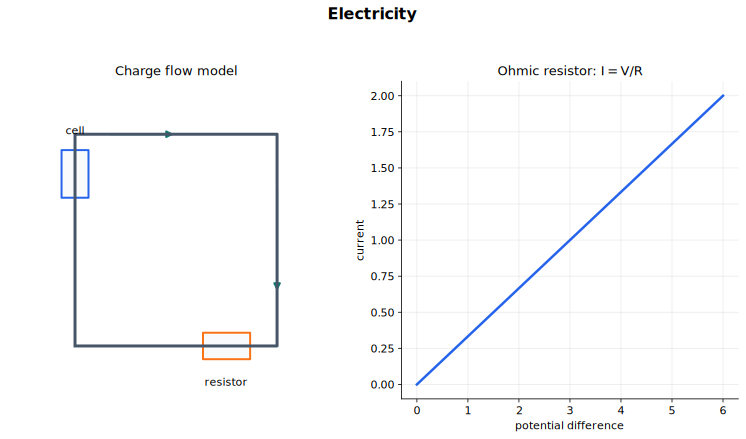

# Electricity 中文讲义

电学基础这一章可以抓成两条主线：电荷怎样流动，能量怎样转移。电流描述电荷通过某点的快慢；电势差描述每单位电荷转移多少能量；电阻描述在给定电势差下，元件对电流的阻碍程度。

这一章的公式很多，但不要把它学成公式表。每个公式都要挂回一个问题：是在数电荷、算能量，还是描述阻碍电流的能力。

## 来源范围

- 主要依据：CAIE Physics 9702，Topic 9 Electricity。
- 主要内容：电流、电势差与功率、电阻与电阻率。
- 教材路线：电流、电势差、电阻、$I$-$V$ 特性、温度影响、LDR、热敏电阻、电阻率。
- 需要先会：SI 单位、变化率、能量转移、功率、图像斜率、正比例关系。

## 图示导读

这张图说明最基本的电路语言：电荷沿闭合电路流动，电势差要跨接在元件两端测量，电阻控制同一电势差下电流的大小。

## 1. 电流是电荷的流动

电流是电荷载流子的流动。电荷载流子就是带电且能够移动的粒子。

在金属中，载流子是自由电子。金属正离子基本固定在晶格位置上，自由电子可以移动。在电解质溶液中，正离子和负离子都可以移动。在粒子束里，载流子也可能是质子或电子。

电流定义为电荷通过某一点的速率：

$$
I = \frac{Q}{t}
$$

也就是

$$
Q = It
$$

其中：

- $I$ 是电流，单位是安培，$\text{A}$；
- $Q$ 是电荷量，单位是库仑，$\text{C}$；
- $t$ 是时间，单位是秒，$\text{s}$。

$1\ \text{A}$ 的意思是每秒有 $1\ \text{C}$ 的电荷通过某点：

$$
1\ \text{A} = 1\ \text{C s}^{-1}
$$

如果电流随时间变化，更严格地说，电流是某一时刻电荷流动的速率。不过这一章大多数计算都用恒定电流，所以 $Q = It$ 已经够用。

## 2. 规定电流方向与电子流方向

规定电流方向是正电荷流动的方向。在有电池的简单电路中，外电路里的规定电流方向是从电池正极出发，经过外电路回到负极。

但在金属导线里，真正移动的是电子。电子带负电，所以电子的漂移方向与规定电流方向相反。

这不表示电路要等某个电子从电池一路跑完一圈才有电流。导线中本来就到处有自由电子。电路一闭合，导线中建立电场，整个电路里的电子几乎同时开始漂移。

把这几种方向分清：

- 金属中的规定电流：外电路中从正极到负极；
- 金属中的电子漂移：外电路中从负极到正极；
- 正电荷载流子形成的电流：电流方向与载流子运动方向相同；
- 负电荷载流子形成的电流：电流方向与载流子运动方向相反。

## 3. 电荷量子化

电荷是量子化的。意思是电荷不是任意连续取值，而是一份一份出现。

元电荷大小为

$$
e = 1.60 \times 10^{-19}\ \text{C}
$$

电子的电荷是 $-e$，质子的电荷是 $+e$。常见离子的电荷可以是 $+e$、$-e$、$+2e$、$-2e$ 等。

一个孤立物体或离子的总电荷通常是 $e$ 的整数倍：

$$
Q = Ne
$$

其中 $N$ 是整数，符号按正负电荷处理。

例如，$3.20 \times 10^{-19}\ \text{C}$ 是可能的，因为它等于 $2e$；而 $2.50 \times 10^{-19}\ \text{C}$ 不是普通孤立物体可能具有的净电荷，因为它不是 $e$ 的整数倍。

## 4. 导体中的电流与漂移速度

载流导体中的电流满足

$$
I = Anvq
$$

其中：

- $A$ 是导体横截面积，单位 $\text{m}^2$；
- $n$ 是单位体积内的载流子数，叫数密度，单位 $\text{m}^{-3}$；
- $v$ 是载流子的平均漂移速度，单位 $\text{m s}^{-1}$；
- $q$ 是每个载流子的电荷量，单位 $\text{C}$。

这个公式的想法是：数一秒内有多少电荷穿过某个横截面。漂移速度为 $v$ 时，一秒内通过截面的那一段导体长度是 $v$，体积是 $Av$，其中有 $Anv$ 个载流子，总电荷量就是 $Anvq$。

如果载流子是金属中的电子，严格带符号时 $q$ 为负。但大多数大小计算中，用 $q = e$，把 $I$ 和 $v$ 当作所选方向上的正值即可。

金属中电子的平均漂移速度通常很小，可能只有每秒几分之一毫米。灯泡却能几乎立刻亮，是因为电路闭合后电场在导线中建立，整个电路中的电子几乎同时开始漂移，而不是某个电子高速跑完整个电路。

这个公式还能直接读出几个关系：

- 同一根导线、同一材料中，电流越大，漂移速度越大；
- 同一电流下，横截面积越小，漂移速度越大；
- 同一电流和面积下，载流子数密度越小，漂移速度越大。

单位检查也很有用：

$$
\text{m}^2 \times \text{m}^{-3} \times \text{m s}^{-1} \times \text{C}
= \text{C s}^{-1}
= \text{A}
$$

## 5. 电势差

电势差讲的是能量转移。某元件两端的电势差定义为：电荷通过该元件时，每单位电荷转移的能量。

$$
V = \frac{W}{Q}
$$

其中：

- $V$ 是电势差，单位伏特，$\text{V}$；
- $W$ 是转移的能量或做功，单位焦耳，$\text{J}$；
- $Q$ 是电荷量，单位库仑，$\text{C}$。

$1\ \text{V}$ 的意思是每库仑电荷转移 $1\ \text{J}$ 能量：

$$
1\ \text{V} = 1\ \text{J C}^{-1}
$$

变形可得

$$
W = VQ
$$

这个形式很直观：每库仑转移 $V$ 焦耳，那么 $Q$ 库仑就转移 $VQ$ 焦耳。

电压表要并联在元件两端，因为电势差测的是两点之间、也就是元件两端之间的能量差。

语言上要精确。电流不会在元件中“被用掉”；电荷也不会在普通电路中凭空消失。真正被转移出去的是能量。同一批电荷可以依次通过串联元件，在每个元件中转移一部分能量。

## 6. 电功率

功率是能量转移的速率：

$$
P = \frac{W}{t}
$$

把 $V = \frac{W}{Q}$ 和 $I = \frac{Q}{t}$ 合起来，得到

$$
P = VI
$$

其中 $P$ 的单位是瓦特，$\text{W}$。

若题目涉及电阻，可以把 $P = VI$ 与 $V = IR$ 结合：

$$
P = I^2R
$$

以及

$$
P = \frac{V^2}{R}
$$

选公式时看已知量：

- 已知 $V$ 和 $I$，用 $P = VI$；
- 已知 $I$ 和 $R$，用 $P = I^2R$；
- 已知 $V$ 和 $R$，用 $P = \frac{V^2}{R}$。

这些公式表示电能转化为其他形式能量的速率，例如内能、光能、声能或动能。

若题目还给时间，用

$$
W = Pt
$$

需要时可合并成

$$
W = VIt
$$

## 7. 电阻

电阻定义为元件两端电势差与通过元件电流之比：

$$
R = \frac{V}{I}
$$

电阻单位是欧姆，$\Omega$：

$$
1\ \Omega = 1\ \text{V A}^{-1}
$$

把定义式变形可得

$$
V = IR
$$

只要 $V$ 是该元件两端的电势差，$I$ 是通过该元件的电流，这个式子就可以用来计算该工作状态下的电阻。

但不要把 $V = IR$ 说成欧姆定律。欧姆定律说的是在温度等物理条件不变时，电流与电势差成正比，也就是电阻保持不变。即使是非欧姆元件，也仍然可以在某个工作点用 $R = \frac{V}{I}$ 算出此时的电阻。

电流表要串联，因为它测通过元件的电流。电压表要并联，因为它测元件两端的电势差。

## 8. 欧姆定律与 $I$-$V$ 特性

若在温度等物理条件不变时，通过导体的电流与导体两端电势差成正比，则该导体遵守欧姆定律。

对恒温下的欧姆导体：

$$
I \propto V
$$

它的 $I$-$V$ 特性图像是过原点的直线。

一定要看清坐标轴。如果画的是 $I$ 随 $V$ 变化的图像，斜率是

$$
\frac{I}{V} = \frac{1}{R}
$$

如果画的是 $V$ 随 $I$ 变化的图像，斜率才是

$$
\frac{V}{I} = R
$$

恒温金属导体的 $I$-$V$ 图像是过原点的直线。把电势差反向，电流也反向，图像关于原点对称。

## 9. 灯丝灯泡

灯丝灯泡是非欧姆元件。它的 $I$-$V$ 图像过原点，但随着电流变大，图像会弯曲。

电流很小时，灯丝较冷，电阻较小。电流增大后，灯丝温度升高。金属离子振动更剧烈，导电电子与离子碰撞更频繁。在同样电场作用下，电子平均漂移受阻更明显，所以电阻增大。

如果纵轴是 $I$、横轴是 $V$，那么随着 $|V|$ 增大，图像会变得不那么陡。电势差变大仍会让电流变大，但不再是正比例增加。

解释灯丝灯泡时，按这条链条说：

1. 电流增大，灯丝发热；
2. 温度升高，金属离子振动更剧烈；
3. 电子与离子碰撞更频繁；
4. 电阻增大。

## 10. 半导体二极管

半导体二极管明显更容易让电流沿一个方向通过。

正向偏置时，二极管接成容易导通的方向。对硅二极管来说，在电势差达到约 $0.6\ \text{V}$ 以前，电流几乎为零；超过这个阈值电压后，电流迅速增大，二极管电阻显著变小。

反向偏置时，二极管只允许极小电流通过，电阻很大。

二极管的 $I$-$V$ 图像不是直线，也不关于原点对称，所以二极管是非欧姆元件。

记图像形状时抓三点：

- 反向偏置时几乎没有电流；
- 较小正向电势差下几乎没有电流；
- 硅二极管约在 $0.6\ \text{V}$ 后电流迅速上升。

## 11. 热敏电阻与 LDR

热敏电阻的电阻会随温度显著变化。本课程中，如果没有特别说明，热敏电阻按负温度系数热敏电阻处理。负温度系数的意思是温度升高时电阻减小。

对 NTC 热敏电阻：

- 温度越高，电阻越小；
- 温度越低，电阻越大。

它和金属的机制不同。在半导体热敏电阻中，温度升高会释放出更多载流子。载流子数量增加的影响超过碰撞增加的影响，所以总电阻下降。

光敏电阻 LDR 是电阻随光强变化的半导体元件。光照增强时，半导体中产生更多可移动载流子，导电能力增强，电阻下降。

对 LDR：

- 光照越强，电阻越小；
- 环境越暗，电阻越大。

这些元件适合做传感电路，因为环境变化会转化成电阻变化。

## 12. 电阻率

电阻不仅取决于材料，也取决于导体的形状和尺寸。对恒温下的导线：

- 导线越长，电阻越大；
- 横截面积越大，电阻越小；
- 长度和面积相同，不同材料的电阻也可能不同。

描述材料本身导电能力的量叫电阻率，符号为 $\rho$。

对均匀导体：

$$
R = \frac{\rho L}{A}
$$

其中：

- $R$ 是电阻，单位 $\Omega$；
- $\rho$ 是电阻率，单位 $\Omega\ \text{m}$；
- $L$ 是长度，单位 $\text{m}$；
- $A$ 是横截面积，单位 $\text{m}^2$。

变形可得

$$
\rho = \frac{RA}{L}
$$

电阻率的单位是欧姆米，$\Omega\ \text{m}$，不是欧姆每米。

如果导线直径为 $d$，横截面积是

$$
A = \frac{\pi d^2}{4}
$$

计算面积前，要先把直径换算成米。

电阻率是某材料在某一温度下的性质。改变样品长度或横截面积，会改变这段样品的电阻，但不会改变材料本身的电阻率。改变温度则可能改变电阻率。

对金属来说，温度升高时电阻率通常增大，因为晶格离子振动更强，导电电子碰撞更频繁。

## 13. 做题流程

电学基础题可以按这个顺序处理：

1. 先判断题目问的是电荷流动、每单位电荷能量、功率、电阻、$I$-$V$ 图像，还是电阻率。
2. 新概念先写定义，再写公式。
3. 先换单位：分钟换秒，毫米换米，$\text{mm}^2$ 换 $\text{m}^2$，千瓦换瓦。
4. 判断题目里的电流是规定电流、电子流方向，还是只问大小。
5. 读 $I$-$V$ 图像时，先看清横轴和纵轴，再用斜率。
6. 电阻率题要认真算横截面积。
7. 解释元件特性时，要说明物理原因，不要只描述图像弯了。

## 常见错误

- 说电流被元件用掉。电荷在电路中流动，被转移的是能量。
- 把电势差和电流说成同一个东西。
- 忘记金属中电子流方向与规定电流方向相反。
- 用 $Q = It$ 时忘记把时间换成秒。
- 把 $V = IR$ 当成欧姆定律。欧姆定律是恒定物理条件下的正比例关系。
- 在 $I$ 对 $V$ 的图像上直接把斜率当电阻。这个坐标下斜率是 $\frac{1}{R}$。
- 忘记灯丝灯泡发热后电阻增大。
- 在 $R = \frac{\rho L}{A}$ 中把直径当横截面积。
- 把电阻率单位写成 $\Omega\ \text{m}^{-1}$。正确单位是 $\Omega\ \text{m}$。

## 快速自查

不用翻讲义，你应该能回答：

- 金属中的规定电流方向和电子流方向有什么区别？
- 电荷量子化是什么意思？
- $I = Anvq$ 中每个符号表示什么？
- 为什么电子漂移很慢，但灯泡几乎能立刻亮？
- 电势差和能量、电荷的关系是什么？
- 已知 $I$ 和 $R$ 时应该用哪个功率公式？
- $V = IR$ 和欧姆定律有什么区别？
- 金属导体、灯丝灯泡、二极管的 $I$-$V$ 图像有什么不同？
- 光照增强时，LDR 的电阻怎样变化？
- 为什么电阻率单位是 $\Omega\ \text{m}$？

## 关联内容

- [D.C. Circuits](../10%20DC%20Circuits/00%20Overview.md) 会用这些定义分析完整电路。
- [Electric Fields](../18%20Electric%20Fields/00%20Overview.md) 会进一步解释单位电荷受力和单位电荷能量。
- [Magnetic Fields](../20%20Magnetic%20Fields/00%20Overview.md) 会把电流看作运动电荷，并研究它产生的磁效应。
