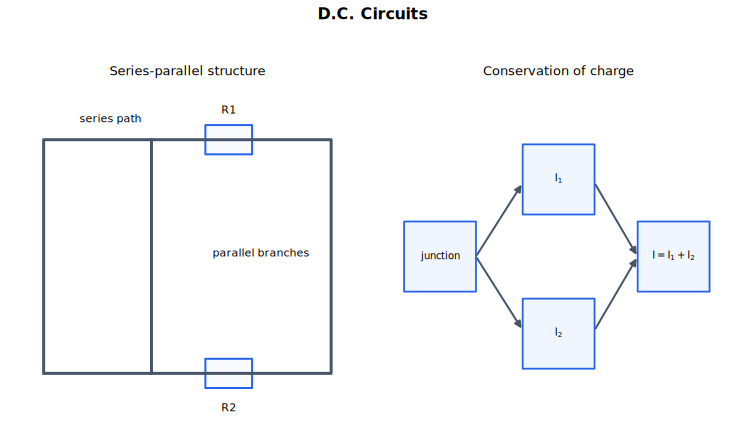

# D.C. Circuits 中文讲义

直流电路分析，本质上是把电荷守恒和能量守恒写成电路方程。Kirchhoff 第一定律管结点处电荷不能凭空增加或消失；Kirchhoff 第二定律管一圈回路中每库仑电荷获得的能量和失去的能量相等。串并联电阻、内阻、路端电压（端电压）、分压器和电位差计，都可以从这两条守恒规律出发理解。

学习这一章时，不要只看电阻值。要看元件在电路中的位置：它在哪个支路里，和谁串联，和谁并联，电流从哪里分开，电势差跨在哪两个点之间。

## 来源范围

- 主要依据：CAIE Physics 9702，Topic 10 D.C. circuits。
- 主要内容：实际电路、Kirchhoff 定律、分压器。
- 教材路线：Kirchhoff 定律、电阻组合、内阻、分压器、传感器、电位差计电路。
- 需要先会：电流、电势差、电动势、电阻、功率、$I$-$V$ 特性、LDR 和热敏电阻。

## 图示导读

这张图提醒你：先看电路结构，再计算。串联部分电流相同，并联支路电势差相同；Kirchhoff 定律用来检查电荷和能量是否守恒。

## 1. 实际电路语言

电路图是模型。它用标准符号代替真实元件，让电路连接关系变清楚。图上线画得弯不弯不重要，关键是哪些点相连、哪些元件在同一支路、哪些元件跨接在同两点之间。

读图或画图时，先做这些事：

- 找出电动势源；
- 标出电流可能分开或汇合的结点；
- 找出闭合回路；
- 判断哪些元件串联，哪些元件并联；
- 电流表串联在被测电流所在支路中；
- 电压表并联在被测元件或被测部分两端。

理想电流表电阻为零，这样不会改变被测电流。真实电流表电阻很小。

理想电压表电阻无穷大，这样不会从电路中分走电流。真实电压表电阻很大。如果电压表电阻没有远大于被测元件电阻，它会改变原来的电路，这叫负载效应。

## 2. 电动势与电势差

电源的电动势（e.m.f.）定义为：电源驱动电荷绕完整电路运动时，每单位电荷获得的能量。

$$
E = \frac{W}{Q}
$$

单位是伏特，$\text{V}$，因为电动势也是每单位电荷的能量：

$$
1\ \text{V} = 1\ \text{J C}^{-1}
$$

electromotive force 这个名字是历史遗留名称。电动势不是力，而是每单位电荷的能量。

元件两端的电势差（p.d.）定义为：电荷通过该元件时，每单位电荷转移给元件或环境的能量。

两者的区别可以记成“获得能量”和“失去能量”：

- 电荷通过电动势源时获得能量；
- 电荷通过有电势差的元件时，把能量转移给元件或环境。

例如，$6.0\ \text{V}$ 的电池给每库仑电荷 $6.0\ \text{J}$ 能量；某电阻两端电势差为 $2.0\ \text{V}$，表示每库仑电荷通过它时向它转移 $2.0\ \text{J}$ 能量。

## 3. Kirchhoff 第一定律

Kirchhoff 第一定律：流入某结点的电流总和等于流出该结点的电流总和。

$$
\sum I_{\text{in}} = \sum I_{\text{out}}
$$

这就是电荷守恒。在稳定直流电路中，电荷不能无限堆积在结点处。单位时间内流入结点的电荷量，必须等于单位时间内流出结点的电荷量。

例如，$5.0\ \text{A}$ 电流进入某结点，分成两条支路，其中一条为 $2.0\ \text{A}$，另一条为 $I$，则

$$
5.0 = 2.0 + I
$$

所以

$$
I = 3.0\ \text{A}
$$

如果你先给未知电流随便假设一个箭头方向，最后算出负值，意思是实际电流方向与箭头相反。这很正常，不需要推翻重做。

## 4. Kirchhoff 第二定律

Kirchhoff 第二定律：沿任意闭合回路，电动势的代数和等于电势差的代数和。

$$
\sum E = \sum V
$$

这就是能量守恒。$1\ \text{C}$ 电荷绕完整回路一圈回到出发点后，总能量不能凭空增加或减少。所以它从电源获得的能量，必须等于它在各元件中转移出去的能量。

对一个含电动势 $E$ 和两个串联电阻 $R_1$、$R_2$ 的简单回路，同一电流 $I$ 通过两个电阻。Kirchhoff 第二定律给出

$$
E = IR_1 + IR_2
$$

如果回路中有多个电源，方向可能相助，也可能相反。选定绕行方向后，推动电荷沿这个方向运动的电动势取正；与这个方向相反的电动势取负。电阻上的电势差也要注意方向：顺着电流方向穿过电阻，是电势下降；逆着电流方向穿过电阻，是电势上升。

实用步骤：

1. 先选一个绕回路的方向。
2. 标出电流方向。
3. 电源若沿所选方向升高电势，记正；若降低电势，记负。
4. 电阻项根据绕行方向与电流方向的关系取符号。
5. 解方程后，若电流为负，说明实际方向与假设方向相反。

## 5. 串联电阻

几个电阻串联，意思是同一个电流依次通过它们，中间没有让电流分流的结点。

对两个串联电阻 $R_1$ 和 $R_2$，总电势差等于两段电势差之和：

$$
V = V_1 + V_2
$$

用 $V = IR$ 代入：

$$
IR = IR_1 + IR_2
$$

约去相同的电流：

$$
R = R_1 + R_2
$$

多个电阻串联时：

$$
R = R_1 + R_2 + R_3 + \cdots
$$

串联规则：

- 每个元件电流相同；
- 总电势差由各元件分担；
- 总电阻大于任意一个单独电阻；
- 同一串联链中，电阻越大，分到的电势差越大。

## 6. 并联电阻

几个电阻并联，意思是它们连接在同两个点之间，所以每条支路两端的电势差相同。

对两个并联电阻，进入分支点的总电流等于各支路电流之和：

$$
I = I_1 + I_2
$$

每个电阻两端电势差相同，所以

$$
I = \frac{V}{R}, \quad I_1 = \frac{V}{R_1}, \quad I_2 = \frac{V}{R_2}
$$

代入 Kirchhoff 第一定律：

$$
\frac{V}{R} = \frac{V}{R_1} + \frac{V}{R_2}
$$

约去共同的电势差：

$$
\frac{1}{R} = \frac{1}{R_1} + \frac{1}{R_2}
$$

多个电阻并联时：

$$
\frac{1}{R} = \frac{1}{R_1} + \frac{1}{R_2} + \frac{1}{R_3} + \cdots
$$

并联规则：

- 各支路电势差相同；
- 总电流等于各支路电流之和；
- 总电阻小于任意一条支路的电阻；
- 在电源电势差不变时，增加并联支路会降低总电阻、增大电源输出电流。

并联电阻不能直接相加。要先加倒数，再把结果取倒数。

## 7. 简单电路求解

多数直流电路题有两种做法：逐步化简，或者直接写 Kirchhoff 方程。

如果电路明显由串联、并联组合构成，就逐步化简：

1. 找最小的串联组或并联组。
2. 用等效电阻替换它。
3. 重复直到求出总电阻。
4. 用电源电势差或电动势求总电流。
5. 再倒推回各支路电流和各元件电势差。

如果电路有多个回路、多个电源，或者不容易化简，就写 Kirchhoff 方程：

1. 给未知电流标箭头。
2. 在结点处用 Kirchhoff 第一定律。
3. 选独立回路。
4. 在每个回路上用 Kirchhoff 第二定律。
5. 解联立方程。
6. 根据正负号解释实际方向，并用电荷守恒、能量守恒检查。

检查答案时看这些：

- 每个结点处，流入电流等于流出电流；
- 每个闭合回路中，每库仑电荷获得的能量等于失去的能量；
- 并联支路两端电势差相同；
- 串联元件电流相同；
- 并联总电阻小于最小支路电阻。

## 8. 内阻与路端电压

真实电源有内阻。可以把电池看成一个理想电动势源 $E$ 与一个内阻 $r$ 串联。

当电源向外部电阻 $R$ 提供电流 $I$ 时，电流同时通过外部电阻和内阻。Kirchhoff 第二定律给出

$$
E = I(R + r)
$$

也就是

$$
E = IR + Ir
$$

路端电压 $V$ 是电源两端、也就是外电路两端的电势差。若外电路只是电阻 $R$，则

$$
V = IR
$$

$Ir$ 是内阻上的电势差，所以电源向外供电时

$$
V = E - Ir
$$

电流越大，内阻上损失的电压 $Ir$ 越大，路端电压就越低。

物理意义是：

- $E$ 是电源给每库仑电荷的能量；
- $Ir$ 是每库仑电荷在电源内部转移掉的能量，通常变成内能；
- $V$ 是每库仑电荷能交给外电路的能量。

如果外电阻远大于内阻，电流很小，$V$ 接近 $E$。如果外电阻很小，电流很大，路端电压会明显下降。

实验测 $E$ 和 $r$ 时，可以改变外电阻，测路端电压 $V$ 和电流 $I$。由

$$
V = E - Ir
$$

可知，画 $V$ 随 $I$ 变化的图像，得到直线：

- 纵截距是 $E$；
- 斜率是 $-r$。

## 9. 分压器

分压器用串联元件从输入电势差中取出一部分作为输出电势差。

两个电阻 $R_1$、$R_2$ 串联在输入电势差 $V_{\text{in}}$ 两端，若输出取在 $R_2$ 两端，则

$$
V_{\text{out}} = V_{\text{in}} \frac{R_2}{R_1 + R_2}
$$

原因是两个电阻中电流相同：

$$
I = \frac{V_{\text{in}}}{R_1 + R_2}
$$

$R_2$ 两端电势差为

$$
V_{\text{out}} = IR_2
$$

所以串联电路中，电势差按电阻比例分配。输出跨在哪个电阻上，分子就用哪个电阻。

可变电阻也可以做分压器。滑片移动时，上下两段电阻比例改变，输出电势差就可以连续变化。

分压公式默认输出端几乎不取电流。如果在输出端接入一个电阻不够大的负载，它会与输出电阻形成并联，改变等效电阻，从而改变 $V_{\text{out}}$。这就是负载效应。

## 10. LDR 与热敏电阻分压器

LDR 和热敏电阻把环境变化变成电阻变化；分压器把电阻变化变成电压变化。

LDR 的电阻随光强增大而减小。

如果输出取在 LDR 两端：

- 光变强，$R_{\text{LDR}}$ 变小；
- LDR 分到的电势差变小；
- $V_{\text{out}}$ 减小。

如果输出取在固定电阻两端：

- 光变强，$R_{\text{LDR}}$ 变小；
- 固定电阻分到的电势差变大；
- $V_{\text{out}}$ 增大。

NTC 热敏电阻的电阻随温度升高而减小。

如果输出取在热敏电阻两端：

- 温度升高，$R_{\text{thermistor}}$ 变小；
- 热敏电阻分到的电势差变小；
- $V_{\text{out}}$ 减小。

如果输出取在固定电阻两端：

- 温度升高，$R_{\text{thermistor}}$ 变小；
- 固定电阻分到的电势差变大；
- $V_{\text{out}}$ 增大。

所有传感分压器都按这个逻辑分析：先看哪个电阻随环境变化，再看输出跨在哪个元件上。

## 11. 电位差计与零示法

电位差计用来比较电势差。它可以看作一种特殊的分压器，通常由一根均匀电阻丝和一个驱动电源组成。

如果电阻丝均匀，沿电阻丝的电势差与长度成正比。也就是说，取电阻丝上长度为 $l$ 的一段，就取到了总电势差中的相应比例。

比较电动势或电势差时，把待测电池或待测电势差通过检流计和滑动触点接入电路。移动触点，直到检流计示数为零。这个位置叫平衡点。

平衡时：

- 检流计中电流为零；
- 待测电池或待测电路不向检流计供电流；
- 电阻丝上对应长度的电势差等于待测电势差。

这种方法叫零示法。它不是直接读一个有电流通过的表，而是寻找“零电流”位置。因此，用电位差计比较电动势时，可以避免从被测电池取电流，精度较高。

如果两个电势差在同一电位差计上对应的平衡长度分别为 $l_1$ 和 $l_2$，且驱动电路不变，则

$$
\frac{V_1}{V_2} = \frac{l_1}{l_2}
$$

若比较的是两个电池的电动势：

$$
\frac{E_1}{E_2} = \frac{l_1}{l_2}
$$

驱动电源必须能在电阻丝上提供足够大的电势差。如果待测电势差大于整根电阻丝可提供的电势差，就找不到平衡点。

触点不要用力压着电阻丝滑动。这样可能刮伤电阻丝，使它不再均匀，电势差就不再与长度成正比。

## 12. 做题流程

直流电路题可以按这个流程：

1. 如果原图不清楚，先重画电路。
2. 标出结点、支路和闭合回路。
3. 给未知电流假设方向。
4. 判断能否用串并联逐步化简。
5. 如果不能，就在结点写 Kirchhoff 第一定律，在独立回路写 Kirchhoff 第二定律。
6. 电动势和电阻电势差都要保持符号一致。
7. 有内阻时，把 $E$、$Ir$ 和路端电压 $V$ 分清。
8. 分压器题中，明确 $V_{\text{out}}$ 跨在哪个元件上。
9. 用极限情况检查，例如电阻很大、电阻很小、电流为零时答案是否合理。

## 常见错误

- 看见元件画在一条线上就当串联。串联的判断标准是电流相同。
- 看见两个元件挨得近就当并联。并联的判断标准是跨在同两个点之间。
- 忘记并联总电阻小于任何一个支路电阻。
- 绕回路加电压时不考虑电源方向。
- 把电动势和路端电压总当成相等。有内阻且电流不小时，它们不同。
- 套 $V_{\text{out}} = V_{\text{in}}\frac{R_2}{R_1 + R_2}$ 前，没有确认输出跨在 $R_2$ 上。
- 输出端接了负载，却仍然按空载分压器计算。
- 以为检流计零示数表示整个电路没有电势差。它只表示检流计支路中没有电流。

## 快速自查

不用翻讲义，你应该能回答：

- 为什么 Kirchhoff 第一定律是电荷守恒？
- 为什么 Kirchhoff 第二定律是能量守恒？
- 如何用 Kirchhoff 定律推出串联电阻公式？
- 如何用 Kirchhoff 定律推出并联电阻公式？
- 电源向外供电时，为什么路端电压小于电动势？
- $V$ 对 $I$ 图像的截距和斜率怎样给出电源的 $E$ 和 $r$？
- 分压器中，下方电阻变大时 $V_{\text{out}}$ 怎样变？
- LDR 或热敏电阻怎样把光强或温度变化变成电压变化？
- 为什么电位差计的平衡法适合比较电动势？

## 关联内容

- [Electricity](../09%20Electricity/00%20Overview.md) 提供电流、电势差、电阻、功率、LDR 和热敏电阻的基本定义。
- [Capacitance](../19%20Capacitance/00%20Overview.md) 会用电势差、电荷和随时间变化的电路。
- [Alternating Currents](../21%20Alternating%20Currents/00%20Overview.md) 会把电路思想推广到随时间变化的电流和电压。
