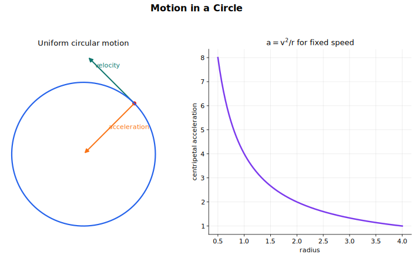

# Motion in a Circle Lecture Notes

Uniform circular motion is a situation where the speed is constant but the velocity is not. Velocity is a vector, so changing direction means changing velocity. Therefore an object moving at constant speed in a circle is accelerating, and the acceleration is directed towards the centre of the circle.

This topic is a clean test of vector thinking. The object is not speeding up, but it is not in equilibrium. The resultant force is not zero. It points towards the centre and changes the direction of motion.

## Source Route

- Primary syllabus source: CAIE Physics 9702, Topic 12 Motion in a circle.
- Main subtopics: kinematics of uniform circular motion and centripetal acceleration.
- Coursebook route: radians, angular speed, steady speed with changing velocity, centripetal force, and origins of centripetal force.
- Useful earlier knowledge: velocity as a vector, Newton's laws, resultant force, acceleration, work done, and trigonometry.

## Visual Guide

The visual guide should be read as a direction map: velocity is tangential, acceleration is inward, and the resultant force is also inward.

## 1. Circular Motion and Angular Displacement

An object moving around a circle changes position by moving through an angle. This angle is the angular displacement, usually written as $\theta$.

For an object moving along an arc of length $s$ on a circle of radius $r$:

$$
\theta = \frac{s}{r}
$$

when $\theta$ is measured in radians.

This equation also gives

$$
s = r\theta
$$

This form is useful because it connects circular motion with ordinary distance along the path.

Angular displacement is dimensionless because it is a ratio of two lengths. However, we use the unit radian, written $\text{rad}$, to show that the angle is being measured in radians.

## 2. The Radian

One radian is the angle subtended at the centre of a circle by an arc whose length is equal to the radius of the circle.

If $s = r$, then

$$
\theta = \frac{s}{r} = 1\ \text{rad}
$$

A full circle has circumference $2\pi r$, so the angular displacement for one complete revolution is

$$
\theta = \frac{2\pi r}{r} = 2\pi\ \text{rad}
$$

Therefore

$$
360^\circ = 2\pi\ \text{rad}
$$

and

$$
180^\circ = \pi\ \text{rad}
$$

Useful conversions:

$$
\theta_{\text{rad}} = \theta_{\text{deg}} \times \frac{\pi}{180}
$$

$$
\theta_{\text{deg}} = \theta_{\text{rad}} \times \frac{180}{\pi}
$$

In circular motion equations, angles must be in radians. If a question gives degrees, convert before using angular equations.

## 3. Angular Speed

Angular speed is the rate of change of angular displacement:

$$
\omega = \frac{\Delta\theta}{\Delta t}
$$

where:

- $\omega$ is angular speed in $\text{rad s}^{-1}$
- $\Delta\theta$ is angular displacement in radians
- $\Delta t$ is time in seconds

For one complete revolution, the angular displacement is $2\pi\ \text{rad}$. If the period is $T$, then

$$
\omega = \frac{2\pi}{T}
$$

If the frequency is $f$, then $f = \frac{1}{T}$, so

$$
\omega = 2\pi f
$$

These equations are for uniform circular motion, where the angular speed is constant.

## 4. Relating Linear Speed and Angular Speed

The speed along the circular path is the distance travelled per unit time. For an arc,

$$
s = r\theta
$$

Divide by time:

$$
\frac{s}{t} = r\frac{\theta}{t}
$$

so

$$
v = r\omega
$$

where:

- $v$ is the linear speed along the circular path, in $\text{m s}^{-1}$
- $r$ is the radius of the circle, in $\text{m}$
- $\omega$ is angular speed, in $\text{rad s}^{-1}$

This explains why points further from the centre move faster for the same angular speed. Every point on a rotating wheel has the same angular speed, but a point near the rim has a larger $r$ and therefore a larger linear speed.

Another useful expression comes from the circumference:

$$
v = \frac{2\pi r}{T}
$$

This is the same as $v = r\omega$ because $\omega = \frac{2\pi}{T}$.

## 5. Constant Speed but Changing Velocity

Speed is a scalar. Velocity is a vector.

In uniform circular motion:

- the speed is constant
- the direction of velocity changes continuously
- therefore velocity changes continuously
- therefore the object accelerates

The instantaneous velocity is always tangent to the circular path. If the object were suddenly released from the force keeping it in circular motion, it would continue along the tangent at that instant, assuming no other force changed its motion.

The acceleration is not in the direction of motion. It is directed towards the centre of the circle. This is called centripetal acceleration.

The word centripetal means centre-seeking. It describes a direction, not a separate physical interaction.

## 6. Centripetal Acceleration

For uniform circular motion, the centripetal acceleration has magnitude

$$
a = r\omega^2
$$

Using $v = r\omega$, this can also be written as

$$
a = \frac{v^2}{r}
$$

Both forms describe the same inward acceleration.

Use $a = r\omega^2$ when angular speed is known or easy to find. Use $a = \frac{v^2}{r}$ when linear speed and radius are known.

Direction matters:

$$
\vec{a}\ \text{is towards the centre of the circle}
$$

The acceleration changes direction continuously as the object moves, because "towards the centre" points in a different direction at different positions around the circle. Its magnitude is constant if $v$ and $r$ are constant.

## 7. Centripetal Force

Newton's second law says that the resultant force is in the direction of the acceleration:

$$
F = ma
$$

For circular motion:

$$
F = mr\omega^2
$$

and

$$
F = \frac{mv^2}{r}
$$

This force is directed towards the centre.

Do not add "centripetal force" as an extra force in a free-body diagram. The centripetal force is the resultant inward force. It must be supplied by real forces such as tension, friction, gravity, normal contact force, electric force, or magnetic force.

For example:

- A stone on a string: tension provides the inward force.
- A car turning on a flat road: friction provides the inward force.
- A planet orbiting a star: gravitational force provides the inward force.
- A charged particle moving in a magnetic field: magnetic force can provide the inward force.

The correct question is not "What is the centripetal force?" but "Which real force, or resultant of real forces, is acting towards the centre?"

## 8. Why Speed Can Stay Constant

In uniform circular motion, the resultant force is perpendicular to the instantaneous velocity.

Because the force has no component along the direction of motion, it does not increase or decrease the speed. It changes the direction of the velocity instead.

The same idea can be expressed using work done. Work done depends on displacement in the direction of the force. During circular motion, the instantaneous displacement is tangential while the centripetal force is radial. These directions are perpendicular, so the centripetal force does no work in uniform circular motion.

If no work is done by the resultant force, the kinetic energy stays constant, so speed stays constant.

This is why uniform circular motion can have:

- constant speed
- constant kinetic energy
- changing velocity
- changing momentum
- non-zero acceleration
- non-zero resultant force

## 9. Common Sources of Centripetal Force

### Object on a String

For a mass moving in a horizontal circle on a string, tension provides the inward force. If the string breaks, the tension disappears and the object moves off along a tangent.

In a conical pendulum, the tension is not horizontal. Its vertical component balances the weight, and its horizontal component provides the centripetal force.

### Vehicle on a Level Road

For a car turning on a flat road, friction between the tyres and the road provides the inward force. On ice, friction is too small, so the car cannot follow the intended circular path.

The maximum safe speed depends on the available friction and the radius of the bend. A smaller radius or larger speed requires a larger inward force.

### Banked Road or Banking Aircraft

On a banked road, the normal contact force has a horizontal component. This component can help provide the centripetal force.

For a banking aircraft, the lift force is tilted. Its vertical component supports the weight, while its horizontal component provides the centripetal force for the turn.

### Orbital Motion

For a satellite or planet in circular orbit, gravity provides the centripetal force. The object is continuously falling towards the central body, but its tangential motion carries it around the curved path.

This connects directly to [Gravitational Fields](../13%20Gravitational%20Fields/00%20Overview.md).

## 10. Working Routine

Use this routine for circular motion questions:

1. Draw the circular path and mark the centre.
2. Draw the velocity tangent to the path.
3. Draw the acceleration towards the centre.
4. Identify the real force or resultant force that points towards the centre.
5. Convert angles to radians if needed.
6. Use $\omega = \frac{2\pi}{T}$ or $\omega = 2\pi f$ if period or frequency is given.
7. Use $v = r\omega$ to connect linear speed and angular speed.
8. Use $a = r\omega^2$ or $a = \frac{v^2}{r}$ for acceleration.
9. Use $F = mr\omega^2$ or $F = \frac{mv^2}{r}$ for the inward resultant force.
10. Check that the direction of the force is physically possible.

## Common Traps

- Saying acceleration is zero because speed is constant. Velocity changes because direction changes.
- Drawing the velocity towards the centre. Velocity is tangential.
- Drawing the acceleration along the tangent. Centripetal acceleration is inward.
- Treating centripetal force as an extra force. It is the inward resultant of real forces.
- Using degrees in equations that require radians.
- Forgetting to convert revolutions per minute to radians per second.
- Using radius in centimetres or kilometres without converting to metres.
- Assuming circular motion is equilibrium. A resultant inward force is required.
- Thinking there is a real outward force in an inertial frame. The object tends to continue tangentially because of inertia.

## Quick Self-Check

You should be able to answer these without looking back:

- What is one radian?
- Why must angles be in radians in circular motion equations?
- How are $\omega$, $T$, and $f$ related?
- Why is velocity changing in uniform circular motion?
- What is the direction of centripetal acceleration?
- When should you use $a = r\omega^2$ rather than $a = \frac{v^2}{r}$?
- Why is centripetal force not an extra force?
- What provides the centripetal force for a car on a flat bend, a stone on a string, and a satellite in orbit?
- Why does an inward force not make the object speed up?

## Connections

- [Dynamics](../03%20Dynamics/00%20Overview.md) supplies Newton's laws and resultant force.
- [Gravitational Fields](../13%20Gravitational%20Fields/00%20Overview.md) uses circular motion for orbits.
- [Oscillations](../17%20Oscillations/00%20Overview.md) uses angular frequency and radian measure.
- [Magnetic Fields](../20%20Magnetic%20Fields/00%20Overview.md) uses circular motion of charged particles in magnetic fields.
