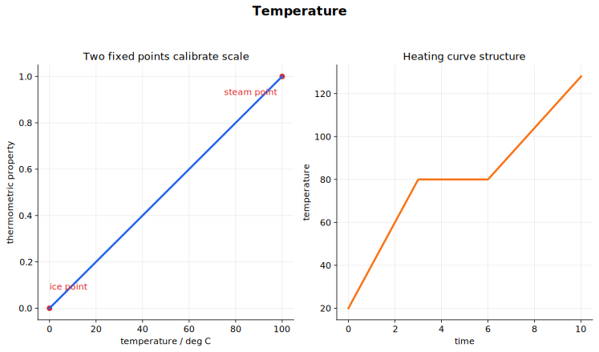

# Temperature 中文讲义

温度不等于热量，也不等于内能。温度最直接告诉我们的是：热能会从哪里流向哪里。热能从高温区域传向低温区域，直到达到热平衡。

这一章把三件事连起来：温度怎样测量，温标怎样定义，以及改变温度或改变状态需要多少能量。

## 来源范围

- 主要依据：CAIE Physics 9702，Topic 14 Temperature。
- 主要内容：热平衡、温标、比热容、比潜热。
- 教材路线：温度测量、热力学温度、绝对零度、加热和冷却曲线、比热容、比潜热。
- 需要先会：能量转移、功率、电能、物质粒子模型、物态、图像斜率。

## 图示导读

这张图把三件事放在一起：温度计要先和被测物体达到热平衡，开尔文温标以绝对零度为起点，加热曲线把升温和物态变化分开。

## 1. 温度与热平衡

热能从高温区域传向低温区域。

如果两个物体接触并且温度不同，能量会在它们之间转移。高温物体失去能量，低温物体获得能量。

当两个区域温度相同时，它们处于热平衡。热平衡时，两者之间没有净热能转移。

温度计的工作原理也靠这个。温度计放入热水时，并不会立刻显示热水温度；它先显示自己的温度。经过一段时间，温度计和热水之间发生能量转移，二者达到热平衡。此时温度计读数才可以看作热水温度。

关键关系：

$$
\text{same temperature} \iff \text{thermal equilibrium}
$$

前提是两个物体能够交换热能。

## 2. 温度、内能与热能

这几个词很接近，但不能混用。

温度与粒子的平均动能有关。温度越高，粒子的平均无规则动能通常越大。

内能是系统微观层面储存的总能量，包括粒子的无规则动能和粒子间相互作用对应的势能。

热能是由于温度差而转移的能量。

在同一物态内加热，例如把水从室温加热到更高温度，水分子的平均动能增加，温度上升。

在物态变化过程中，可以不断输入能量，但温度不变。此时能量主要改变粒子的排列和间距，也就是改变内能中的势能部分。

## 3. 温度测量

温度计利用某种随温度变化的物理性质。这个性质叫测温性质。

常见例子包括：

- 液体密度；
- 恒压下气体体积；
- 金属电阻；
- 热电偶产生的电动势；
- 玻璃液体温度计中液柱长度。

要把这些性质用于测温，必须校准温度计。校准就是在已知温度下记录测温性质的数值，然后建立刻度。

评价温度计时常看这些指标：

- 量程：能测的最低到最高温度范围；
- 灵敏度：温度变化一点时读数变化多大；
- 线性：相同温度变化是否带来相同读数变化；
- 响应时间：温度计多快与被测物体达到热平衡。

不同温度计在校准点可能一致，但在校准点之间不一定一致，因为不同测温性质未必完全线性。

## 4. 热力学温度与开尔文温标

热力学温标不依赖某一种具体物质的性质。因此，它比依靠某种液体膨胀来定义的温标更基本。

热力学温度用开尔文表示，单位符号为 $\text{K}$。开尔文是 SI 基本单位。

热力学温标上的最低可能温度是

$$
0\ \text{K}
$$

这叫绝对零度。它表示不可能再从物质中移走更多能量的极限温度。

摄氏温标和开尔文温标的温度间隔大小相同。变化 $1\ \text{K}$ 与变化 $1\ ^\circ\text{C}$ 一样大。

换算关系是

$$
T\ (\text{K}) = \theta\ (^\circ\text{C}) + 273.15
$$

以及

$$
\theta\ (^\circ\text{C}) = T\ (\text{K}) - 273.15
$$

如果题目数据精度不高，很多计算中可用 $273$ 近似代替 $273.15$。

注意不要说 degree kelvin。单位名称就是开尔文。

## 5. 摄氏温度数值与温度变化量

要区分“温度数值”和“温度变化量”。

在气体定律或热力学公式中，若使用绝对温度数值，要用开尔文。

但对温度变化量来说，$1\ \text{K}$ 和 $1\ ^\circ\text{C}$ 的间隔大小相同。因此

$$
\Delta T = 15\ \text{K}
$$

和

$$
\Delta\theta = 15\ ^\circ\text{C}
$$

表示同样的温度变化。

所以比热容计算中，温度变化可以用 K，也可以用 $^\circ\text{C}$，只要它是变化量，不是绝对温度。

## 6. 加热曲线与粒子能量

若以恒定功率加热物质，温度随时间图像可能有斜线段，也可能有平台段。

在斜线段：

- 物质保持同一物态；
- 温度上升；
- 粒子平均动能增加；
- 内能增加。

在平台段：

- 物质发生物态变化；
- 温度保持不变；
- 粒子平均动能不增加；
- 粒子间距和无序程度增加；
- 内能中的势能部分增加。

对水来说，熔化平台对应冰变成水，沸腾平台对应水变成水蒸气。同样质量下，沸腾通常比熔化需要更多能量，因为汽化时分子要分离得更彻底。

这说明：输入能量不一定导致温度升高。

## 7. 比热容

某物质的比热容定义为：使单位质量该物质温度升高 $1\ \text{K}$ 或 $1\ ^\circ\text{C}$ 所需的能量。

公式是

$$
E = mc\Delta\theta
$$

其中：

- $E$ 是转移的能量，单位 $\text{J}$；
- $m$ 是质量，单位 $\text{kg}$；
- $c$ 是比热容，单位 $\text{J kg}^{-1}\text{ K}^{-1}$；
- $\Delta\theta$ 是温度变化，可用 $\text{K}$ 或 $^\circ\text{C}$ 表示。

变形得

$$
c = \frac{E}{m\Delta\theta}
$$

$c$ 越大，说明同样质量升高同样温度需要的能量越多。水的比热容很大，所以水加热或冷却时温度变化相对慢。

## 8. 测量比热容

常见电学方法用加热器、电流表、电压表、温度计、保温材料，以及已知质量的金属块或液体样品。

加热器提供的能量为

$$
E = Pt
$$

若用电学测量，

$$
P = VI
$$

所以

$$
E = VIt
$$

于是

$$
c = \frac{VIt}{m\Delta\theta}
$$

主要误差来源：

- 能量散失到环境中，会使算出的 $c$ 偏大；
- 加热太快时，样品内部温度可能不均匀；
- 温度计或容器也会吸收能量；
- 保温只能减少热损失，不能完全消除。

也可以用图像法。恒定功率加热时，画温度随时间变化图像，斜率是 $\frac{\Delta\theta}{\Delta t}$。因为

$$
P = mc\frac{\Delta\theta}{\Delta t}
$$

所以

$$
c = \frac{P}{m \times \text{gradient}}
$$

## 9. 比潜热

比潜热定义为：使单位质量物质在温度不变的情况下发生物态变化所需的能量。

公式是

$$
E = mL
$$

其中：

- $E$ 是转移的能量，单位 $\text{J}$；
- $m$ 是质量，单位 $\text{kg}$；
- $L$ 是比潜热，单位 $\text{J kg}^{-1}$。

公式里没有温度变化量，因为物态变化过程中温度不变。

熔化或凝固对应比熔化潜热：

$$
\text{solid} \leftrightarrow \text{liquid}
$$

沸腾、蒸发或凝结对应比汽化潜热：

$$
\text{liquid} \leftrightarrow \text{gas}
$$

同一种物质中，比汽化潜热通常大于比熔化潜热，因为气态下分子分离得更彻底。

## 10. 测量比潜热

测量比汽化潜热时，可以用电加热器使液体沸腾。测量加热功率和一定时间内减少的质量。

如果有效传给液体的能量为 $E = Pt$，汽化质量为 $m$，则

$$
L = \frac{Pt}{m}
$$

若用电学测量：

$$
L = \frac{VIt}{m}
$$

测量比熔化潜热时，可以用加热器熔化冰，并测量产生的水的质量。

主要误差来源：

- 汽化实验中，能量散失到环境中，会使测得的 $L$ 偏大；
- 熔化实验中，环境传入的能量可能额外熔化冰，会使测得的 $L$ 偏小；
- 开始计时时，物质应已经处在物态变化温度上。

## 11. 做题流程

温度与加热题可以按这个流程：

1. 先判断过程是升温、物态变化，还是两者都有。
2. 温度变化用 $E = mc\Delta\theta$。
3. 恒温物态变化用 $E = mL$。
4. 有加热器时，用 $E = Pt$ 或 $E = VIt$ 求能量。
5. 质量先换成 kg。
6. 绝对热力学温度用开尔文。
7. 温度变化量中，K 和 $^\circ\text{C}$ 间隔大小相同。
8. 加热曲线中，斜线段对应比热容，平台段对应潜热。
9. 说明保温和热损失假设。

## 常见错误

- 以为温度计一放进去就读到物体温度。它必须先达到热平衡。
- 以为热能总是从大物体传到小物体。热能从高温传到低温。
- 把温度和内能混为一谈。
- 在气体或热力学公式中把摄氏温度当绝对温度用。
- 忘记 $0\ ^\circ\text{C}$ 是 $273.15\ \text{K}$，不是 $0\ \text{K}$。
- 以为输入能量时温度一定上升。物态变化时温度保持不变。
- 混淆 $c$ 和 $L$。比热容单位是 $\text{J kg}^{-1}\text{ K}^{-1}$，比潜热单位是 $\text{J kg}^{-1}$。
- 忘记把 g 换成 kg。

## 快速自查

不用翻讲义，你应该能回答：

- 温度告诉我们能量怎样转移？
- 什么是热平衡？
- 为什么温度计读数需要等待？
- 说出四种测温性质。
- 为什么热力学温标不依赖某一种具体物质？
- 摄氏温度与开尔文温度怎样换算？
- 什么是绝对零度？
- 什么时候用 $E = mc\Delta\theta$？
- 什么时候用 $E = mL$？
- 比熔化潜热和比汽化潜热有什么区别？

## 关联内容

- [Ideal Gases](../15%20Ideal%20Gases/00%20Overview.md) 会在气体定律和分子动理论中使用开尔文温度。
- [Thermodynamics](../16%20Thermodynamics/00%20Overview.md) 会进一步研究内能和热力学第一定律。
- [Electricity](../09%20Electricity/00%20Overview.md) 提供电加热实验中的 $P = VI$。
