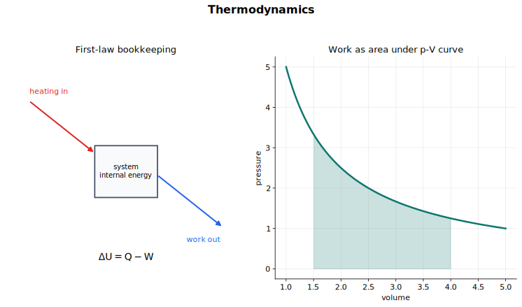

# Thermodynamics 中文讲义

热力学这一节研究能量怎样进入系统、离开系统，以及进入以后怎样表现为系统内部的变化。这里的系统常常是一缸气体，但同样的语言也可以用来分析固体、液体和其他物理系统。

这节最重要的习惯，是先说清楚“系统是谁”。系统确定以后，加热和做功就不是模糊词了。它们都是能量穿过系统边界的方式，只是机制不同。

## 图示导读

这张图用能量流向看热力学：能量可以通过热传递进入系统，也可以通过外界对系统做功进入系统，最后表现为内能的变化。

## 1. 系统、边界和状态

热力学系统就是你选择研究的那一部分。系统以外的部分叫环境。系统边界可以是真实的容器壁，也可以是我们为了分析方便画出来的假想边界。

这一节常用的状态量有：

- 内能 $U$；
- 压强 $p$；
- 体积 $V$；
- 温度 $T$。

内能是状态量。也就是说，只要系统状态确定，内能就确定；至于系统怎样到达这个状态，不影响这个状态下内能的数值。加热和做功不一样，它们是过程量，描述的是状态变化过程中能量怎样穿过系统边界。

因此不要说“系统含有热量”。系统可以有内能，但“热”指的是由于温度差而发生的能量传递。

## 2. 内能

系统的内能，是组成系统的分子所具有的无规则动能和分子势能之和。

可以把这个意思写成

$$
U = \sum E_\text{k, random} + \sum E_\text{p, molecular}.
$$

无规则动能来自分子的运动。固体中，粒子主要在平衡位置附近振动；液体和气体中，粒子的运动更自由。分子势能来自分子间相互作用，尤其和分子间距离、排列方式有关。

温度升高通常意味着内能增加。很多情况下，这是因为分子的平均无规则动能增加。发生物态变化时，温度可能不变，但内能仍然增加，因为能量主要用来改变分子间的距离和排列，而不是提高平均动能。

对理想气体来说，分子间势能被忽略，所以内能主要来自分子的动能。这就是上一节 [Ideal Gases](../15%20Ideal%20Gases/00%20Overview.md) 中“温度和分子平均平动动能成正比”为什么重要。

## 3. 加热和做功

加热指的是由于温度差而发生的能量传递。系统比环境冷，能量可能通过热传递进入系统；系统比环境热，能量可能通过热传递离开系统。

做功指的是力在位移方向上移动时发生的能量传递。对气体来说，最典型的是边界移动：

- 压缩：环境把活塞向内推，外界对气体做功；
- 膨胀：气体把活塞向外推，气体对外界做功。

加热和做功都可能改变内能，但它们不是同一种机制。加热依赖温度差；做功依赖力和位移。

## 4. 热力学第一定律

热力学第一定律就是能量守恒在热力学系统中的表达：

$$
\Delta U = q + W.
$$

这里采用的符号约定是：

- $\Delta U$：系统内能的增加量；
- $q$：通过加热传递给系统的能量；
- $W$：外界对系统做的功。

符号的正负要按物理意义理解：

- $\Delta U > 0$：系统内能增加；
- $\Delta U < 0$：系统内能减少；
- $q > 0$：能量通过热传递进入系统；
- $q < 0$：能量通过热传递离开系统；
- $W > 0$：外界对系统做功；
- $W < 0$：系统对外界做功。

做题时最怕中途换约定。只要一开始写清楚 $\Delta U = q + W$ 且 $W$ 表示外界对系统做功，后面就一直按这个约定走。

## 5. 恒定压强下气体做功

设气体装在带活塞的圆筒中，活塞横截面积为 $A$，气体压强为 $p$。气体对活塞的力为

$$
F = pA.
$$

如果活塞向外移动距离 $s$，气体体积增加

$$
\Delta V = As.
$$

气体对外界做功为

$$
W_\text{by gas} = Fs = pAs = p\Delta V.
$$

这个式子默认压强保持不变。若 $\Delta V > 0$，气体膨胀，气体对外界做正功。

但热力学第一定律里的 $W$ 是“外界对系统做功”。所以对气体来说，

$$
W_\text{on gas} = -p\Delta V.
$$

于是：

- 膨胀时，$\Delta V > 0$，所以 $W_\text{on gas} < 0$；
- 压缩时，$\Delta V < 0$，所以 $W_\text{on gas} > 0$。

把“气体对外做功”和“外界对气体做功”分开，是这一节最关键的防错点。

## 6. 读 $p$-$V$ 图像

在压强-体积图像中，曲线下方的面积表示气体对外界做的功：

$$
W_\text{by gas} = \int p\,dV.
$$

若压强恒定，图像下面就是一个矩形：

$$
W_\text{by gas} = p\Delta V.
$$

如果气体膨胀，这块面积对应气体对外做功；如果气体被压缩，体积减小，外界对气体做功。代入第一定律时，记得换成

$$
W_\text{on gas} = -W_\text{by gas}.
$$

很多基础计算只需要恒压情形，但图像能帮你看出一件事：做功和变化路径有关，不只由初末状态决定。

## 7. 几种典型过程

### 恒定体积加热

如果气体在刚性容器中被加热，体积不变：

$$
\Delta V = 0.
$$

边界没有移动，所以没有体积功：

$$
W = 0.
$$

第一定律变为

$$
\Delta U = q.
$$

通过加热进入气体的能量全部表现为内能增加。

### 加热并膨胀

如果气体受热时可以膨胀，能量一方面通过热传递进入气体，另一方面又有一部分作为气体对外做功离开系统。在第一定律的符号约定下，

$$
W < 0.
$$

所以内能增加量小于单纯的加热输入：

$$
\Delta U = q + W.
$$

这解释了为什么两份气体吸收同样的能量，其中一份若能膨胀，它的温度升高可能更少。

### 无热交换压缩

如果气体被快速压缩，或者容器绝热很好，可以近似认为没有热量进出：

$$
q = 0.
$$

于是

$$
\Delta U = W.
$$

外界对气体做功会增加气体内能。对理想气体来说，这通常意味着温度升高。

### 缓慢等温变化

如果变化足够缓慢，并且温度保持不变，这叫等温变化。对理想气体，内能只和温度有关，所以

$$
\Delta U = 0.
$$

第一定律变为

$$
0 = q + W.
$$

缓慢压缩时，外界对气体做功，$W > 0$，因此必须有能量通过热传递离开系统，$q < 0$。缓慢膨胀时，气体对外做功，$W < 0$，因此必须有能量通过热传递进入系统，$q > 0$。

即使题目没有要求深入讨论等温过程，这个模型也能帮你理解第一定律中的符号。

## 8. 和分子图像连起来

好的热力学解释通常要有两层：一层是能量守恒，一层是分子图像。

物体受热并升温时，分子的平均无规则动能增加。物质熔化或沸腾时，温度可以不变，但分子之间的排列和距离发生变化，分子势能增加。气体被压缩时，分子撞上向内移动的边界，反弹后可能具有更大的动能。

第一定律告诉你能量账怎么算；分子图像告诉你系统内部到底发生了什么。

## 9. 做题顺序

做热力学第一定律题，可以按这个顺序：

1. 先定义系统。
2. 写出符号约定：$\Delta U = q + W$，其中 $W$ 是外界对系统做功。
3. 判断热量是进入系统还是离开系统。
4. 判断功是外界对系统做，还是系统对外界做。
5. 如果是恒压下气体体积改变，先算 $W_\text{by gas} = p\Delta V$，再根据需要换成 $W_\text{on gas}$。
6. 带符号代入，不要只带大小。
7. 最后用一句话检查：内能和温度变化是否合理。

写分子层面的解释时，可以按这个顺序：

1. 判断分子动能是否改变。
2. 判断分子势能是否改变。
3. 把温度升高和内能增加联系起来。
4. 若涉及气体做功，要说明边界移动和分子碰撞。

## 10. 常见错误

- 把内能说成“系统储存的热量”。
- 忘记内能是状态量，而加热和做功是过程量。
- 写 $W = p\Delta V$ 时不说明这是气体对外做功还是外界对气体做功。
- 在 $\Delta U = q + W$ 中把膨胀做功当成正的 $W$，但这里 $W$ 明明定义为外界对系统做功。
- 气体膨胀或压缩时漏掉做功。
- 以为只要有能量输入，温度就一定升高。发生物态变化时，内能可以增加而温度不变。

## 11. 快速自查

学完这一节后，你应该能够：

- 把内能定义为分子无规则动能和分子势能之和；
- 解释为什么温度升高意味着内能增加；
- 区分通过加热传递能量和通过做功传递能量；
- 用固定符号约定正确使用 $\Delta U = q + W$；
- 用 $p\Delta V$ 计算恒压下气体做功；
- 说明气体对外做功和外界对气体做功的区别；
- 把简单 $p$-$V$ 图像下方的面积解释为气体对外做功。

## 关联内容

- [Temperature](../14%20Temperature/00%20Overview.md)
- [Ideal Gases](../15%20Ideal%20Gases/00%20Overview.md)
