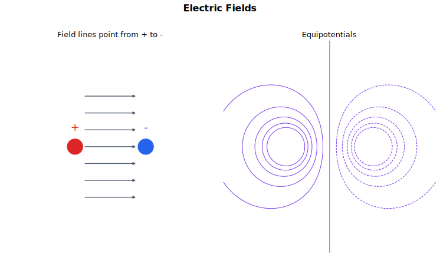

# Electric Fields 中文讲义

电场是由电荷产生的力场。它描述的是：如果在空间某点放入一个很小的正试探电荷，这个电荷会受到怎样的力。

这一节要把三件事分清：力、电场强度和电势。力描述某个具体电荷受到什么作用；电场强度描述某点对单位正电荷的作用；电势描述某点对单位正电荷的能量意义。

## 图示导读

这张图用场线表示电场方向和强弱，用等势线表示电势分布。复习时要同时问：正电荷受力往哪边？电势往哪边降低？场线和等势线是什么关系？

## 1. 电场是一种力场

如果某点放入电荷后会受到电场力，就说该点存在电场。电场方向定义为正试探电荷在该点受到的力的方向。

这个约定非常重要：

- 正电荷受力方向和电场方向相同；
- 负电荷受力方向和电场方向相反。

电场强度定义为单位正电荷所受的力：

$$
E = \frac{F}{q}.
$$

所以电荷在电场中受到的力为

$$
F = qE.
$$

如果 $q$ 是负值，符号本身就说明力的方向和电场方向相反。电场强度的单位可以写成

$$
\mathrm{N\ C^{-1}},
$$

也可以写成

$$
\mathrm{V\ m^{-1}}.
$$

这两个单位等价。

## 2. 电场线

电场可以用电场线表示。电场线上某点的切线方向，就是正试探电荷在该点受力的方向。

读电场线时注意：

- 电场线从正电荷出发，指向负电荷；
- 电场线越密，电场越强；
- 平行且等间距的电场线表示匀强电场；
- 点电荷或带电球体外部产生径向电场；
- 电场线不能相交，因为同一点的电场方向不能有两个。

电场线不是空间中真实存在的线，而是一种表示方式。它的好处是把方向和相对强弱同时画出来。

## 3. 匀强电场

匀强电场指每一点的电场强度大小和方向都相同。两块带等量异种电荷的大平行金属板之间，远离边缘处可以近似看成匀强电场。

如果两板间电势差为 $\Delta V$，板间距为 $\Delta d$，则匀强电场强度的大小为

$$
E = \frac{\Delta V}{\Delta d}.
$$

这也解释了为什么电场强度可以用 $\mathrm{V\ m^{-1}}$ 作单位。

如果带方向地写，电场方向指向电势降低最快的方向：

$$
E = -\frac{\Delta V}{\Delta d}.
$$

负号表示正电荷会沿着电势降低的方向受力。

## 4. 带电粒子在匀强电场中的运动

在匀强电场中，电荷受到恒力：

$$
F = qE.
$$

所以加速度也是恒定的：

$$
a = \frac{F}{m} = \frac{qE}{m}.
$$

如果粒子从静止开始，正电荷沿电场方向加速，电子等负电荷沿电场反方向加速。

如果带电粒子以垂直于电场的速度进入匀强电场，它的运动很像平抛运动：

- 没有受力的方向上，速度分量保持不变；
- 沿电场力方向，速度分量均匀变化；
- 合运动轨迹是抛物线。

在许多电子束问题中，重力远小于电场力，可以忽略。

## 5. 库仑定律

库仑定律给出真空中两个点电荷之间的电场力：

$$
F = \frac{Q_1Q_2}{4\pi\varepsilon_0r^2}.
$$

其中：

- $Q_1$ 和 $Q_2$ 是两个电荷量；
- $r$ 是它们中心之间的距离；
- $\varepsilon_0$ 是真空介电常量。

如果只求大小，使用

$$
|F| = \frac{|Q_1Q_2|}{4\pi\varepsilon_0r^2}.
$$

力的性质由电荷符号决定：

- 同号电荷相互排斥；
- 异号电荷相互吸引。

在球形导体外部某点，球面上的电荷可以等效为集中在球心的点电荷。因此用库仑定律时，距离要从球心量起，而不是从球面量起。

库仑力满足平方反比关系。距离变为原来的 2 倍，力变为原来的 $\frac{1}{4}$。

## 6. 点电荷的电场

要求点电荷 $Q$ 在距离 $r$ 处产生的电场，可以想象在那里放一个很小的正试探电荷，再用库仑力除以试探电荷量。结果是

$$
E = \frac{Q}{4\pi\varepsilon_0r^2}.
$$

如果只求大小：

$$
|E| = \frac{|Q|}{4\pi\varepsilon_0r^2}.
$$

方向由源电荷 $Q$ 的符号决定：

- 正电荷产生的电场向外；
- 负电荷产生的电场向内。

这是径向电场，不是匀强电场，因为 $E$ 会随距离改变。距离变为原来的 2 倍，电场强度变为原来的 $\frac{1}{4}$。

电场可以叠加。如果多个电荷同时在某点产生电场，要做矢量叠加，而不是只把大小相加。

## 7. 电势

某点的电势定义为：把一个很小的单位正电荷从无穷远处移到该点，外力所做的功。

也可以写成

$$
V = \frac{E_\text{p}}{q},
$$

其中 $E_\text{p}$ 是电势能，$q$ 是放在该点的电荷量。

电势是标量，可以为正，也可以为负，但没有方向。对孤立点电荷，通常选无穷远处电势为零。

真空中点电荷 $Q$ 在距离 $r$ 处产生的电势为

$$
V = \frac{Q}{4\pi\varepsilon_0r}.
$$

$V$ 的符号和 $Q$ 的符号相同。正源电荷产生正电势，负源电荷产生负电势。

如果有多个源电荷，电势直接代数相加：

$$
V_\text{total} = V_1 + V_2 + V_3 + \cdots.
$$

这比叠加电场简单，因为电势是标量。

## 8. 两个点电荷的电势能

电荷 $q$ 放在电势为 $V$ 的位置时，电势能为

$$
E_\text{p} = qV.
$$

两个点电荷 $Q$ 和 $q$ 相距 $r$ 时，它们的电势能为

$$
E_\text{p} = \frac{Qq}{4\pi\varepsilon_0r}.
$$

符号要保留：

- 同号电荷的电势能为正；
- 异号电荷的电势能为负。

正电势能表示把它们从无穷远处移到一起需要外力做正功。负电势能表示它们靠近时会释放能量。

## 9. 电势梯度和电场强度

电场强度等于电势梯度的负值：

$$
E = -\frac{dV}{dr}.
$$

在一维问题中，这句话的意思是：电场指向电势降低最快的方向。对两平行板间的匀强电场，

$$
|E| = \frac{\Delta V}{\Delta d}.
$$

如果给出电势-距离图像，某点的电场强度等于该点切线斜率的相反数。

等势线连接电势相等的点。沿等势线移动电荷时，$\Delta V = 0$，所以电场力不做功。

电场线与等势面垂直。如果不垂直，电场就会有沿等势线方向的分量，电荷沿等势线移动时就会发生能量变化，这和“等势”矛盾。

## 10. 电场和引力场的比较

电场和引力场使用很相似的语言：

- 场强都是“单位某种属性所受的力”；
- 场线都表示方向和相对强弱；
- 径向场都满足平方反比规律；
- 势都是“单位某种属性的能量”。

关键区别在于电荷有正负，而质量没有负质量。引力总是吸引；电场力既可以吸引，也可以排斥。电势也可以为正或为负。

所以电场题比引力场题更容易因为符号出错。

## 11. 做题顺序

做力和场强题时：

1. 先画出电荷，并标清正负。
2. 判断电场是匀强电场还是径向电场。
3. 匀强电场用 $E = \frac{\Delta V}{\Delta d}$ 和 $F = qE$。
4. 点电荷问题用库仑定律，或用 $E = \frac{Q}{4\pi\varepsilon_0r^2}$。
5. 用电荷符号和正试探电荷约定判断方向。
6. 多个电场同时存在时，做矢量叠加。

做电势和能量题时：

1. 先确定零电势位置，通常取无穷远处。
2. 点电荷电势用 $V = \frac{Q}{4\pi\varepsilon_0r}$。
3. 多个电势直接代数相加。
4. 电势能用 $E_\text{p} = qV$ 或 $E_\text{p} = \frac{Qq}{4\pi\varepsilon_0r}$。
5. 在电势图像和电场强度之间转换时，用 $E = -\frac{dV}{dr}$。

## 12. 常见错误

- 忘记电场方向是按正试探电荷定义的。
- 以为电子受力方向和电场方向相同。
- 把电势 $V$ 和电势能 $E_\text{p}$ 混在一起。
- 多个电场方向不同，却只把大小相加。
- 把匀强电场公式用到点电荷电场里。
- 对带电球体外部用点电荷模型时，从球面量距离，而不是从球心量距离。
- 在电势和电势能计算中随意丢掉正负号。

## 13. 快速自查

学完这一节后，你应该能够：

- 把电场强度定义为单位正电荷所受的力；
- 正确使用 $F = qE$ 并判断力的方向；
- 画出并解释匀强电场和径向电场的电场线；
- 用 $E = \frac{\Delta V}{\Delta d}$ 处理两平行板间电场；
- 描述带电粒子在匀强电场中的运动；
- 用库仑定律处理点电荷之间的力；
- 使用 $E = \frac{Q}{4\pi\varepsilon_0r^2}$ 和 $V = \frac{Q}{4\pi\varepsilon_0r}$；
- 解释为什么 $E = -\frac{dV}{dr}$；
- 用 $E_\text{p} = \frac{Qq}{4\pi\varepsilon_0r}$ 计算两个点电荷的电势能。

## 关联内容

- [Gravitational Fields](../13%20Gravitational%20Fields/00%20Overview.md)
- [Capacitance](../19%20Capacitance/00%20Overview.md)
