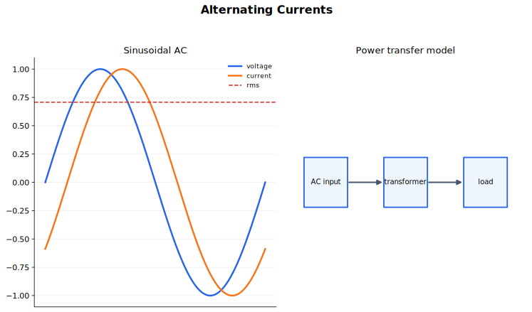

# Alternating Currents 中文讲义

交流电这一节的主线很清楚：电流和电压随时间变化，而且经常按正弦规律变化。只要会读波形，就能处理三个核心问题：怎样描述交流电，怎样用有效值计算电阻中的平均功率，以及怎样用二极管和电容把交流变成比较平稳的直流输出。

## 图示导读

这张图用来对应几个最重要的量：峰值、周期、频率、相位和有效值（r.m.s.）。

## 1. 什么是交流电

直流电的方向不变。交流电的方向会周期性改变。A Level 里最常见、最标准的模型是正弦交流电：

$$
I = I_0 \sin \omega t
$$

交流电压也可以写成

$$
V = V_0 \sin \omega t .
$$

这里的 $I_0$ 和 $V_0$ 是峰值，也就是电流和电压能达到的最大大小。它们不是平时算平均功率时直接代进去的数。

周期 $T$ 是完成一个完整循环所需的时间，频率 $f$ 是每秒完成多少个循环：

$$
f = \frac{1}{T}.
$$

角频率为

$$
\omega = 2 \pi f .
$$

$\omega t$ 是角度，单位用弧度。频率越高，每秒振荡次数越多；峰值越大，波形上下摆动的最大幅度越大。但平均功率不能只看峰值，要看有效值。

## 2. 读示波器图像

示波器图像本质上是“电压-时间图像”。竖直方向读电压，水平方向读时间。

读图时按这个顺序：

1. 从中线到波峰数竖直格数。
2. 乘以竖直灵敏度，得到峰值电压。
3. 数一个完整周期占多少水平格。
4. 乘以时基，得到周期。
5. 用 $f = 1/T$ 求频率。

如果题目给的是峰峰值电压，要先除以 2：

$$
V_0 = \frac{V_{\text{peak-to-peak}}}{2}.
$$

峰值、峰峰值、有效值和平均值不是同一个量。很多错题不是公式不会，而是把这些量混用了。

## 3. 电阻中的瞬时功率

对电阻来说，任一瞬间的功率为

$$
p = VI = I^2 R = \frac{V^2}{R}.
$$

若电流为

$$
I = I_0 \sin \omega t,
$$

则功率为

$$
p = I_0^2 R \sin^2 \omega t.
$$

$\sin^2 \omega t$ 永远不为负，所以功率也不为负。这和物理图像一致：电阻在两个半周中都把电能转化为内能。电流反向时，电阻两端电压也反向，$VI$ 的乘积仍然是正的。

最大瞬时功率为

$$
P_{\max} = I_0^2 R = \frac{V_0^2}{R}.
$$

对正弦交流电通过电阻性负载的情况，平均功率等于最大瞬时功率的一半：

$$
P_{\text{mean}} = \frac{1}{2} P_{\max}.
$$

这个结论来自一个图像事实：$\sin^2 \omega t$ 在一个完整周期内的平均值是 $1/2$。

## 4. 有效值

有效值（r.m.s. value）是把交流电和直流电拿来公平比较的量。一个交流电流的有效值，指的是“能在同一个电阻中产生相同平均功率的直流电流”。

对正弦交流电流，

$$
I_{\text{r.m.s.}} = \frac{I_0}{\sqrt{2}}.
$$

对正弦交流电压，

$$
V_{\text{r.m.s.}} = \frac{V_0}{\sqrt{2}}.
$$

算电阻中的平均功率时，用有效值：

$$
P_{\text{mean}} = V_{\text{r.m.s.}} I_{\text{r.m.s.}},
$$

$$
P_{\text{mean}} = I_{\text{r.m.s.}}^2 R,
$$

$$
P_{\text{mean}} = \frac{V_{\text{r.m.s.}}^2}{R}.
$$

最常见的错误是把峰值直接代入这些平均功率公式。对正弦波来说，这样会把平均功率算成实际值的 2 倍。题目问“最大瞬时功率”时用峰值；题目问“平均功率”或电源标称值时，用有效值。

## 5. 半波整流

整流就是利用二极管，让负载中的电流只沿一个方向流动。一个二极管和负载串联，就能做半波整流。

在一个半周中，二极管正向偏置，电流通过负载；在另一个半周中，二极管反向偏置，负载电流近似为零。所以输出图像是一串脉冲，中间有一段段零输出。

从图像上看，半波整流保留正弦波的一半，去掉另一半。它结构简单，但只利用了一半输入周期，输出很不平稳。

## 6. 全波整流

全波整流通常用四个二极管组成桥式整流器。它的关键效果是：输入电压换向以后，负载中的电流方向仍然不变。

一个半周里有一对二极管导通，另一个半周里换成另一对二极管导通。输入端极性变了，但负载电流方向不变。图像上看，就是把正弦波的两个半周都翻成同一方向的脉冲。

全波整流的平均输出比半波整流大，而且脉冲之间间隔更短，所以后面更容易做平滑处理。

## 7. 用电容平滑输出

平滑电容接在负载电阻两端，也就是与负载并联。它不是把输出变成绝对恒定的直流，而是减小输出电压的起伏。

整流电压升高时，电容迅速充电；整流电压降低时，电容通过负载电阻放电。电容放电会暂时维持负载两端电压，所以输出不会立刻掉到零，而是变成带有较小纹波的直流电压。

纹波大小和时间常量有关：

$$
\tau = RC.
$$

电容越大，在同样电压下储存的电荷越多；负载电阻越大，放电电流越小。两者都会增大时间常量，使纹波变小。但只靠一个电容，输出仍然会有纹波，并不是完美恒定。

全波整流比半波整流更容易平滑，因为电容被重新充电的频率更高，两次波峰之间的时间更短，电容来不及放掉太多电荷。

## 8. 做题套路

处理波形题：

1. 先判断题目给的是峰值、峰峰值、有效值还是平均值。
2. 用 $T = 1/f$ 和 $\omega = 2 \pi f$ 连接时间和角度。
3. 代入正弦式前，先确认单位和角度制。

处理功率题：

1. 先判断题目问的是瞬时功率、最大功率还是平均功率。
2. 最大瞬时功率用峰值。
3. 电阻中的平均功率用有效值。

处理整流和平滑题：

1. 先画输入正弦波。
2. 再画经过二极管后的输出。
3. 加上电容效果：接近波峰时快速充电，波峰后通过负载慢慢放电。
4. 说明改变 $C$ 或 $R$ 会怎样改变纹波。

## 9. 常见错误

- 用峰值电压去算平均功率。
- 把 $V_0$ 和 $V_{\text{r.m.s.}}$ 当成同一个量。
- 混淆频率 $f$ 和角频率 $\omega$。
- 忘记本节的有效值公式只适用于正弦波。
- 说平滑电容能完全消除纹波。
- 把全波整流输出画成交替正负的脉冲。

## 10. 快速自查

不用看笔记时，你应该能做到：

- 解释为什么交流通过电阻时，两个半周都在耗散功率。
- 在正弦波的峰值和有效值之间转换。
- 说明为什么正弦交流电在电阻中的平均功率是最大瞬时功率的一半。
- 从同一个输入正弦波画出半波整流和全波整流输出。
- 说明增大电容或负载电阻会怎样影响纹波。

## 关联内容

- [Electricity](../09%20Electricity/00%20Overview.md)
- [DC Circuits](../10%20DC%20Circuits/00%20Overview.md)
- [Capacitance](../19%20Capacitance/00%20Overview.md)
- [Magnetic Fields](../20%20Magnetic%20Fields/00%20Overview.md)
