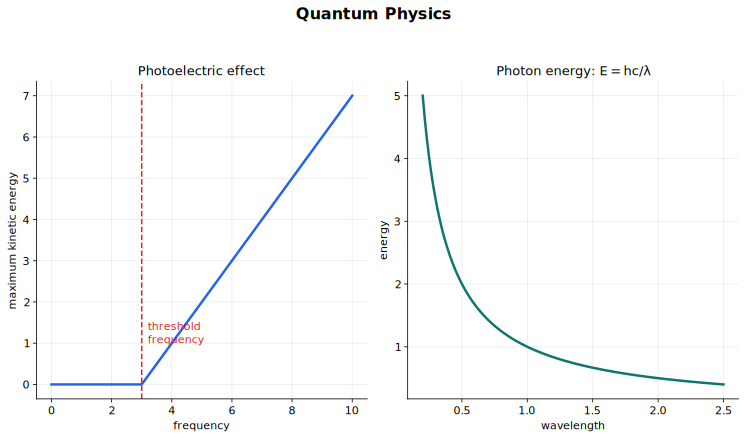

# Quantum Physics 中文讲义

这一节的重点不是把“量子物理”讲成很玄的东西，而是学会几组很具体的实验和模型：光有时要按光子处理，电子有时要按波处理，原子里的电子能量不是连续的。题目里的公式并不多，但每个公式背后都有明确的实验图像。

## 图示导读

这张图对应光电效应的主线：光子能量、逸出功、阈频和最大动能。

## 1. 两种模型

波模型能解释衍射、干涉和偏振。这些现象依赖波长、相位、光程差和叠加。

粒子模型能解释能量以一份一份的方式传递。对电磁辐射来说，这一份能量叫光子。光子是电磁能量的一个量子。

学习时不要把问题变成“光到底只是什么”。更好的问法是：这个实验支持哪一种描述？传播、衍射、干涉通常用波模型；物质吸收或发射光时，常常要用光子模型。

## 2. 光子能量

频率为 $f$ 的光子能量为

$$
E = hf,
$$

其中 $h$ 是普朗克常量：

$$
h = 6.63 \times 10^{-34}\,\text{J s}.
$$

电磁波在真空中满足

$$
c = f \lambda,
$$

所以也可以写成

$$
E = \frac{hc}{\lambda}.
$$

频率越高，单个光子的能量越大；波长越短，单个光子的能量也越大。这就是为什么紫外光可能把某些金属表面的电子打出来，而强度很大的可见光却不一定可以。

## 3. 电子伏特

单个光子或电子的能量很小，用焦耳表示常常不方便，所以引入电子伏特（electronvolt, eV）。

一个电子伏特是电子通过 $1\,\text{V}$ 电势差时获得的能量：

$$
1\,\text{eV} = 1.60 \times 10^{-19}\,\text{J}.
$$

换算时记住：

$$
E(\text{J}) = E(\text{eV}) \times 1.60 \times 10^{-19},
$$

$$
E(\text{eV}) = \frac{E(\text{J})}{1.60 \times 10^{-19}}.
$$

带电粒子通过电势差 $V$ 时，获得的能量为

$$
E = qV.
$$

如果电子从静止开始加速，而且速度还没有接近光速，通常可以把这部分能量当作电子获得的动能。

## 4. 光子动量

光子没有静质量，但有动量。光子的动量与能量关系为

$$
p = \frac{E}{c}.
$$

再结合 $E = hf$ 和 $c = f\lambda$，可得

$$
p = \frac{h}{\lambda}.
$$

这个式子很有意思：动量像粒子性质，波长像波的性质，而量子物理把它们直接连在一起。

## 5. 光电效应

光电效应是指电磁辐射照射金属表面时，金属表面有电子逸出。逸出的电子叫光电子。

关键实验现象有几条：

- 频率低于某个值时，不管光多强，都没有光电子逸出。
- 频率超过这个值时，光电子几乎立即逸出。
- 在超过阈频的前提下，增大光强会增大光电流。
- 增大光强不会增大光电子的最大动能。
- 增大频率会增大光电子的最大动能。

这些现象很难只用经典波模型解释，但用光子模型就很自然。

## 6. 逸出功和阈频

逸出功 $\Phi$ 是电子从金属表面逸出所需的最小能量。

阈频 $f_0$ 是能产生光电效应的最小入射频率：

$$
hf_0 = \Phi.
$$

阈波长 $\lambda_0$ 是还能产生光电效应的最长波长：

$$
\lambda_0 = \frac{c}{f_0} = \frac{hc}{\Phi}.
$$

“最长波长”这几个字很重要。因为 $E = hc/\lambda$，波长越长，光子能量越小。超过阈波长以后，单个光子的能量就不够让电子逸出。

## 7. 爱因斯坦光电方程

光电效应里，一个光子只和一个电子相互作用。光子把自己的全部能量交给这个电子；一部分能量用来克服金属表面的束缚，剩下的变成电子动能。

对最大动能的光电子，

$$
hf = \Phi + \frac{1}{2}mv_{\max}^2.
$$

也就是

$$
K_{\max} = hf - \Phi.
$$

这条式子直接解释实验现象：

- 若 $hf < \Phi$，电子不能逸出。
- 若 $hf = \Phi$，电子刚好逸出，最大动能为零。
- 若 $hf > \Phi$，多出来的能量成为光电子动能。
- 光强变大表示每秒到达的光子数变多，所以光电流变大。
- 在频率不变时，单个光子的能量 $hf$ 不变，所以最大动能不变。

若画 $K_{\max}$ 与 $f$ 的图像，会得到直线：

$$
K_{\max} = hf - \Phi.
$$

斜率是 $h$，纵轴截距是 $-\Phi$，横轴截距是阈频 $f_0$。

## 8. 波粒二象性

光电效应说明电磁辐射有粒子性。衍射和干涉说明电磁辐射有波动性。

这就是波粒二象性。它不是让你把光子画成一个小球，同时又画成一整列经典波；它的意思是：同一个物理对象，在不同实验中表现出不同侧面。

对电磁辐射来说：

- 和物质相互作用时，经常用光子描述。
- 传播、衍射、干涉时，用波描述。

## 9. 物质波和电子衍射

德布罗意提出，运动粒子有对应的波长：

$$
\lambda = \frac{h}{p}.
$$

对非相对论粒子，若质量为 $m$、速度为 $v$，

$$
\lambda = \frac{h}{mv}.
$$

电子衍射证明了粒子也有波动性。在电子衍射管中，电子被加速后穿过很薄的晶体材料，例如石墨，屏幕上会出现衍射环。衍射环是波动现象，因为它依赖电子波长与晶体原子层间距相近。

如果加速电压变大，电子动能变大，动量变大。由 $\lambda = h/p$ 可知，德布罗意波长变小，所以衍射图样收缩。

日常物体也可以代入德布罗意公式，但它们的动量太大，对应波长极小，观察不到衍射。电子的波长可以接近原子间距，所以电子衍射可以被测量到。

## 10. 分立能级

孤立原子中的电子只能具有某些特定能量，不能取两个允许能级之间的任意能量。这叫能量量子化。

低能级电子只有吸收能量刚好匹配的光子，才能跃迁到更高能级。

高能级电子回到低能级时，会发出一个光子，光子能量等于两个能级的能量差：

$$
hf = \Delta E.
$$

若两个能级写成 $E_{\text{high}}$ 和 $E_{\text{low}}$，则

$$
hf = E_{\text{high}} - E_{\text{low}}.
$$

能级图中经常出现负能量，零能量表示电子刚好脱离原子。所以相减时要取正的能量差，不要被负号绕进去。

## 11. 发射线谱和吸收线谱

低压热气体会发出某些特定波长的光，形成发射线谱：黑背景上的亮线。每条亮线对应一次电子从高能级跃迁到低能级，并发出一个光子。

白光通过较冷气体时，可能形成吸收线谱：连续光谱上出现暗线。能量刚好匹配的光子被原子吸收，使电子跃迁到高能级。之后电子会再发光，但方向是四面八方，不一定沿原来方向继续前进，所以原方向上这些波长的光强变弱，出现暗线。

不同元素的能级间隔不同，所以能发出和吸收的波长组合不同。线谱因此可以用来识别元素。

## 12. 做题套路

光子计算：

1. 先看题目给的是频率、波长、能量还是动量。
2. 用 $E = hf$ 或 $E = hc/\lambda$。
3. 需要时再在焦耳和电子伏特之间换算。
4. 求光子动量时用 $p = E/c$ 或 $p = h/\lambda$。

光电效应：

1. 先比较 $hf$ 与 $\Phi$。
2. 若 $hf < \Phi$，没有光电子逸出。
3. 若有光电子逸出，用 $K_{\max} = hf - \Phi$。
4. 把光强理解为每秒到达的光子数，不要理解为单个光子的能量。

能级题：

1. 先画两个能级和跃迁箭头。
2. 取正的能量差。
3. 用 $hf = \Delta E$。
4. 如需波长，再用 $c = f\lambda$。

## 13. 常见错误

- 认为低于阈频时，只要光够强或照得够久也能打出电子。
- 把光强当成单个光子的能量。
- 使用 SI 公式前忘记把 eV 换成 J。
- 计算负能级差时符号取反。
- 写光电方程时漏掉逸出功。
- 用纯粒子模型解释电子衍射。
- 把波粒二象性理解成两个经典图像同时真实存在。

## 14. 快速自查

不用看笔记时，你应该能做到：

- 说明为什么光电效应支持电磁辐射的光子模型。
- 正确使用 $E = hf$、$E = hc/\lambda$ 和 $p = E/c$。
- 区分阈频和阈波长。
- 解释为什么增大光强会增大光电流，但不会增大最大动能。
- 用 $\lambda = h/p$ 解释电子衍射。
- 解释发射线谱和吸收线谱如何来自分立能级。

## 关联内容

- [Waves](../07%20Waves/00%20Overview.md)
- [Superposition](../08%20Superposition/00%20Overview.md)
- [Particle Physics](../11%20Particle%20Physics/00%20Overview.md)
- [Nuclear Physics](../23%20Nuclear%20Physics/00%20Overview.md)
