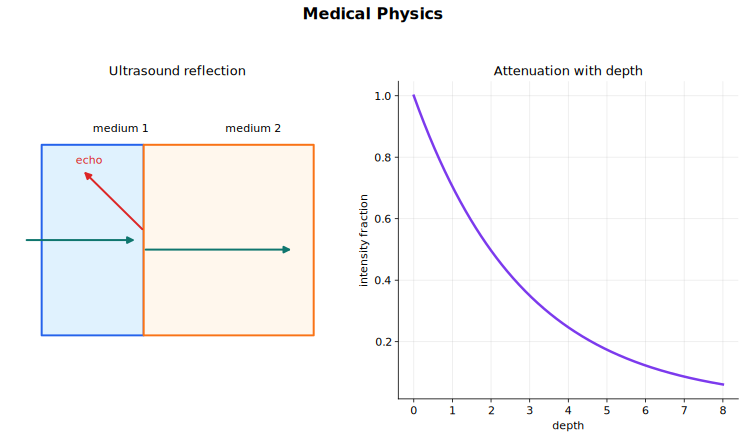

# Medical Physics Lecture Notes

Medical physics in this topic is about imaging. Each method has the same basic chain: produce a signal, let it interact with body tissue, detect what emerges or returns, then reconstruct useful information about internal structure or tracer concentration.

The three imaging methods in the syllabus are ultrasound, X-ray imaging including CT, and PET scanning. They use different physical contrast mechanisms, so learn them as separate systems rather than as one list of medical facts.

## Source Route

- Primary syllabus source: CAIE Physics 9702.
- 24 Medical physics
- 24.1 Production and use of ultrasound
- 24.2 Production and use of X-rays
- 24.3 PET scanning
- Coursebook route: Physics Coursebook Chapter 30: medical imaging, ultrasound, X-rays, CT, and PET scanning.

## Visual Guide

Figure: Ultrasound images depend on reflection at tissue boundaries, while attenuation models describe how beam intensity decreases in matter.

## 1. The Imaging Chain

For any medical imaging method, ask four questions:

1. What is the source?
2. What physical interaction creates contrast?
3. What is detected?
4. How is the image reconstructed?

For ultrasound, the source is a piezoelectric transducer and the contrast comes mainly from reflection at boundaries with different specific acoustic impedances. For X-ray imaging, the source is an X-ray tube and the contrast comes from different attenuation in different tissues. For PET, the signal starts inside the body from a radioactive tracer and the image is reconstructed from gamma-ray photon detections.

## 2. Ultrasound And The Piezoelectric Effect

Ultrasound is sound with frequency greater than about $20\,\text{kHz}$. Medical ultrasound usually uses frequencies in the megahertz range. Sound is a longitudinal wave and needs a material medium.

A piezoelectric crystal changes shape when a p.d. is applied across it. If an alternating p.d. is applied, the crystal expands and contracts at the same frequency and produces ultrasound waves.

The reverse effect is also used. When returning ultrasound echoes apply a changing stress to the crystal, an e.m.f. is generated across it. The same transducer can therefore act as both transmitter and receiver.

In pulse-echo imaging, the transducer sends a short pulse, then waits for reflected pulses. Damping material behind the crystal helps stop the crystal vibrating after transmission so that it can detect returning echoes clearly.

## 3. Echo Timing

Ultrasound images use the time taken for echoes to return. If an echo from a boundary returns after time $\Delta t$, and the speed of ultrasound in the tissue is $c$, then the depth $d$ of the boundary is

$$
d = \frac{c \Delta t}{2}.
$$

The factor of 2 appears because the pulse travels to the boundary and back. This is one of the most common calculation traps in ultrasound questions.

In an A-scan, echoes appear as spikes on a voltage-time graph. The positions of spikes give depths, and their amplitudes give information about the strength of reflection. In a B-scan, many A-scan measurements are combined to form a two-dimensional image. Brighter points correspond to stronger reflected ultrasound.

## 4. Specific Acoustic Impedance

The specific acoustic impedance of a medium is

$$
Z = \rho c,
$$

where $\rho$ is the density of the medium and $c$ is the speed of sound in that medium.

The unit of $Z$ is

$$
\text{kg m}^{-2}\,\text{s}^{-1}.
$$

A boundary reflects ultrasound strongly when the two media have very different acoustic impedances. At normal incidence, the intensity reflection coefficient is

$$
\frac{I_R}{I_0} =
\left(
\frac{Z_1 - Z_2}{Z_1 + Z_2}
\right)^2,
$$

where $I_0$ is the incident intensity and $I_R$ is the reflected intensity.

This equation explains why ultrasound gel is needed. Air and skin have very different acoustic impedances, so most ultrasound would be reflected before entering the body. Gel has an impedance close to that of skin, so it greatly reduces reflection at the transducer-skin boundary.

It also explains image contrast. Bone and soft tissue have a larger impedance mismatch than two similar soft tissues, so boundaries involving bone are easier to detect. Air spaces and bone can also block useful imaging of structures behind them.

## 5. Ultrasound Attenuation

As ultrasound travels through matter, its intensity decreases. The syllabus writes the attenuation model as

$$
I = I_0 e^{-\mu x},
$$

where $I_0$ is the initial intensity, $I$ is the intensity after travelling distance $x$, and $\mu$ is the attenuation coefficient. Some coursebook explanations use $\alpha$ for the ultrasound absorption coefficient. In these notes, use $\mu$ unless a question defines another symbol.

The coefficient depends on the tissue and the ultrasound frequency. Higher-frequency ultrasound has a shorter wavelength and can resolve smaller details, but it is generally attenuated more strongly. This creates a practical compromise between resolution and penetration.

## 6. X-Ray Production

X-rays are high-frequency, short-wavelength electromagnetic radiation. In an X-ray tube, electrons are emitted from a heated cathode and accelerated through a large p.d. toward a metal anode target, often tungsten. When the fast electrons hit the target and decelerate rapidly, some of their kinetic energy is emitted as X-ray photons.

Most of the electron energy becomes thermal energy in the anode. This is why practical X-ray tubes must handle heating, often using a rotating anode.

If the accelerating p.d. is $V$, the maximum energy of an electron reaching the target is

$$
E_{\max} = eV.
$$

If all of this energy is converted into a single X-ray photon, then

$$
eV = hf_{\max} = \frac{hc}{\lambda_{\min}}.
$$

So the minimum wavelength is

$$
\lambda_{\min} = \frac{hc}{eV}.
$$

The actual X-ray beam contains a range of wavelengths. Low-energy X-rays may be absorbed in the patient without improving the image, so they can increase dose unnecessarily. Filters, such as aluminium filters, are used to remove these low-energy photons.

## 7. X-Ray Attenuation And Contrast

X-rays are ionising radiation. As they pass through matter, they transfer energy to atoms and molecules, so the beam intensity decreases. For a uniform material,

$$
I = I_0 e^{-\mu x},
$$

where $\mu$ is the attenuation coefficient and $x$ is the thickness of material.

The unit of $\mu$ is the inverse of length, such as $\text{m}^{-1}$ or $\text{cm}^{-1}$.

Different tissues attenuate X-rays by different amounts. Bone has a larger attenuation coefficient than soft tissue, so less radiation reaches the detector behind bone. This creates contrast in the image.

Contrast means a clear difference in detector signal between different tissues or structures. Contrast can be improved by choosing suitable X-ray energy or by using contrast media. Iodine and barium are good X-ray absorbers because their atoms have high proton numbers and many electrons with which X-rays can interact.

## 8. Computed Tomography

A conventional X-ray image is a shadow image. Structures at different depths are superimposed on the same two-dimensional detector, so depth information is limited.

Computed tomography, or CT scanning, solves this by taking many X-ray measurements from different angles. For one section of the body, multiple X-ray images from different directions are combined by a computer to reconstruct a two-dimensional slice. The process is repeated along an axis, and the slices are combined to build a three-dimensional image.

CT can show relationships between structures and distinguish tissues with similar attenuation coefficients better than a single X-ray image. The cost is that CT uses ionising radiation, so the benefit of diagnostic information must be weighed against dose.

## 9. PET Tracers

Positron emission tomography, or PET scanning, images the distribution of a radioactive tracer inside the body.

A tracer is a substance containing radioactive nuclei that can be introduced into the body and absorbed by the tissue being studied. In PET, the tracer contains a nuclide that decays by beta-plus decay and emits positrons. A common idea is to attach the radioactive nuclide to a biologically active molecule, so regions with different uptake rates produce different count rates.

PET therefore images function or molecular activity more directly than ultrasound or ordinary X-ray imaging, which mainly show structure.

## 10. Annihilation In PET

A positron is the antiparticle of the electron. When a positron emitted by the tracer meets an electron in the tissue, the pair annihilates. Mass-energy and momentum are conserved.

If the initial kinetic energy is small compared with the rest energy, the annihilation produces two gamma-ray photons travelling in opposite directions. Momentum conservation requires the photons to travel approximately $180^\circ$ apart.

The total rest energy of the electron-positron pair is

$$
E_{\text{total}} = 2m_e c^2.
$$

Since two photons are produced with equal energy,

$$
E_{\gamma} = m_e c^2.
$$

This is about $511\,\text{keV}$ per photon. If needed, the frequency of each photon is found from

$$
E_{\gamma} = hf.
$$

## 11. PET Detection And Reconstruction

PET detectors are arranged in rings around the patient. The two gamma-ray photons from one annihilation event travel out of the body in nearly opposite directions and are detected by two detectors.

If two detectors register photons at nearly the same time, the scanner treats them as a pair from the same event. The line joining the two detectors is called a line of response. Arrival-time information and many such events allow a computer to reconstruct the distribution of tracer concentration in the tissue.

More detected photon pairs from a region mean a higher tracer concentration there. That region appears brighter in the reconstructed image.

## 12. Comparing The Methods

Ultrasound:

- Source: piezoelectric transducer.
- Contrast: acoustic impedance differences at tissue boundaries.
- Strength: no ionising radiation, good for soft tissue motion and foetal imaging.
- Limitation: poor transmission through air spaces and bone.

X-ray and CT:

- Source: X-ray tube.
- Contrast: different attenuation coefficients.
- Strength: good for bone and dense structures; CT gives slice and three-dimensional information.
- Limitation: uses ionising radiation.

PET:

- Source: radioactive tracer inside the body.
- Contrast: tracer concentration and biological uptake.
- Strength: shows functional activity.
- Limitation: uses radioactive material and needs detector reconstruction.

## 13. Problem Routines

For ultrasound reflection:

1. Calculate each $Z$ using $Z = \rho c$ if needed.
2. Use the reflection coefficient only for normal incidence unless told otherwise.
3. Interpret a larger impedance mismatch as a stronger reflection.

For ultrasound echo timing:

1. Identify whether the time is one-way or return time.
2. Use $d = c\Delta t/2$ for return echoes.
3. Use the speed in the material actually crossed by the pulse.

For attenuation:

1. Use $I = I_0 e^{-\mu x}$.
2. Keep units of $\mu$ and $x$ compatible.
3. Remember that the exponent must be dimensionless.

For X-ray minimum wavelength:

1. Set electron energy equal to $eV$.
2. Set maximum photon energy equal to $hc/\lambda_{\min}$.
3. Rearrange to $\lambda_{\min} = hc/(eV)$.

For PET:

1. Identify beta-plus decay as the source of positrons.
2. Use annihilation with an electron in tissue.
3. Use $E_{\gamma} = m_e c^2$ for each photon when the pair is initially nearly at rest.
4. Explain reconstruction using detector pairs and arrival times.

## 14. Common Traps

- Forgetting the factor of 2 in ultrasound echo distance.
- Using the reflection coefficient formula when the incidence is not normal and no approximation is stated.
- Treating acoustic impedance as density alone.
- Mixing the speed of sound symbol $c$ in ultrasound with the speed of light $c$ in X-ray and PET formulae.
- Thinking a CT scan is just one sharper X-ray photograph.
- Forgetting that X-rays and PET involve ionising radiation.
- Placing PET annihilation in the detector rather than in the patient's tissue.

## 15. Quick Self-Check

You have the topic if you can do these without notes:

- Explain how a piezoelectric transducer both emits and detects ultrasound.
- Calculate an ultrasound echo depth and a reflection coefficient.
- Explain why gel is used in ultrasound scanning.
- Derive the minimum X-ray wavelength from an accelerating p.d.
- Explain contrast in X-ray imaging and why CT gives slice information.
- Describe how PET uses a beta-plus tracer, positron-electron annihilation, and detector timing to reconstruct tracer concentration.

## Connections

- [Waves](../07%20Waves/00%20Overview.md)
- [Quantum Physics](../22%20Quantum%20Physics/00%20Overview.md)
- [Nuclear Physics](../23%20Nuclear%20Physics/00%20Overview.md)
