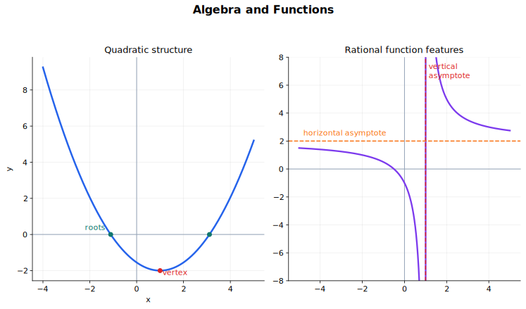

# Algebra and Functions Lecture Notes

These notes develop the core algebra and function ideas used in CAIE
Mathematics 9709 and Further Mathematics 9231. The emphasis is not on memorising
question types, but on recognising structure, choosing a representation, and
checking answers against domains and graphs.

## Visual Guide

Figure: This guide highlights quadratic form, vertex information, roots, and rational-function asymptotes.

## Source Route

- 9709 Pure Mathematics 1: Quadratics and Functions.
- 9709 Pure Mathematics 2 and 3: Algebra, including modulus, polynomial
  division, factor theorem, remainder theorem, partial fractions, and binomial
  extensions.
- 9231 Further Pure Mathematics 1: Roots of polynomial equations; Rational
  functions and graphs.

## 1. Quadratic Structure

A quadratic expression has the form

$$
ax^2 + bx + c, \qquad a \ne 0.
$$

It can be useful in several equivalent forms:

| Form | Expression | Best for |
|---|---|---|
| Standard form | $ax^2 + bx + c$ | Substitution, coefficients, discriminant |
| Factorised form | $a(x-r_1)(x-r_2)$ | Roots and sign diagrams |
| Completed-square form | $a(x-h)^2 + k$ | Vertex, range, sketching |

The same quadratic may reveal different information in different forms. A good
solution often changes form rather than forcing one representation to do every
job.

### Completing the Square

For $a \ne 0$,

$$
ax^2 + bx + c
= a\left(x+\frac{b}{2a}\right)^2
+ c - \frac{b^2}{4a}.
$$

This shows the vertex directly:

$$
x = -\frac{b}{2a}, \qquad
y = c - \frac{b^2}{4a}.
$$

Use completed-square form when a question asks for a maximum or minimum value,
range, vertex, or sketch.

### Discriminant

The discriminant of $ax^2 + bx + c$ is

$$
\Delta = b^2 - 4ac.
$$

For the equation $ax^2 + bx + c = 0$:

| Condition | Roots | Graph meaning |
|---|---|---|
| $\Delta > 0$ | Two distinct real roots | Crosses the $x$-axis twice |
| $\Delta = 0$ | One repeated real root | Touches the $x$-axis |
| $\Delta < 0$ | No real roots | Does not meet the $x$-axis |

The discriminant is also a parameter tool. If a line touches a quadratic curve,
substitution often produces a quadratic equation with $\Delta = 0$.

### Quadratic Inequalities

To solve a quadratic inequality:

1. Move everything to one side.
2. Factorise or find the roots.
3. Place the roots on a number line.
4. Decide the sign on each interval.
5. Include or exclude endpoints according to the inequality sign.

For example, if

$$
(x-2)(x+3) > 0,
$$

then the expression is positive outside the roots:

$$
x < -3 \quad \text{or} \quad x > 2.
$$

### Quadratic in Another Expression

Some equations are quadratic in a function of $x$. For instance,

$$
x^4 - 5x^2 + 4 = 0
$$

is quadratic in $x^2$. Put $u = x^2$:

$$
u^2 - 5u + 4 = 0.
$$

After solving for $u$, return to $x$ and check any restrictions introduced by
the substitution.

## 2. Functions as Objects

A function is a rule that assigns each input in its domain exactly one output.
For a function

$$
f: x \mapsto f(x),
$$

the **domain** is the set of allowed inputs, and the **range** is the set of
outputs actually produced.

### Domain First

Domain restrictions usually come from:

- denominators: avoid division by zero;
- square roots: require the expression under an even root to be non-negative;
- logarithms: require the argument to be positive;
- modelling context: time, length, probability, or number of objects may be
  restricted.

Write the domain before solving when the equation contains fractions, roots,
logs, or inverse functions.

### Range

Range is often found by using one of these routes:

- complete the square for quadratic functions;
- use graph transformations;
- use monotonicity;
- solve $y = f(x)$ for $x$ and ask which $y$ values allow a real $x$.

For example,

$$
f(x) = (x-3)^2 + 2
$$

has range

$$
f(x) \ge 2.
$$

### One-One Functions and Inverses

A function is one-one if different inputs always give different outputs. A
one-one function has an inverse function on its domain.

To find the inverse:

1. Write $y = f(x)$.
2. Rearrange to make $x$ the subject.
3. Swap $x$ and $y$.
4. State the domain of the inverse.

The graph of $y = f^{-1}(x)$ is the reflection of $y = f(x)$ in the line
$y = x$, provided the original function is one-one on the chosen domain.

### Composite Functions

The composite function $gf$ means

$$
gf(x) = g(f(x)).
$$

It can be formed only when every output of $f$ that is being used lies inside
the domain of $g$. In practice, check the range of the inner function against
the domain of the outer function.

## 3. Graph Transformations

For $y = f(x)$:

| Transformation | Result | Effect |
|---|---|---|
| $y = f(x) + a$ | Vertical translation | Up by $a$ |
| $y = f(x+a)$ | Horizontal translation | Left by $a$ |
| $y = af(x)$ | Vertical stretch | Scale factor $a$ |
| $y = f(ax)$ | Horizontal stretch | Scale factor $\frac{1}{a}$ |
| $y = -f(x)$ | Reflection | In the $x$-axis |
| $y = f(-x)$ | Reflection | In the $y$-axis |

The horizontal transformations are the easiest place to make mistakes. Test a
simple point if the direction is unclear.

## 4. Modulus Algebra

The modulus $|x|$ is the distance of $x$ from zero:

$$
|x| =
\begin{cases}
x, & x \ge 0, \\
-x, & x < 0.
\end{cases}
$$

Useful equivalences include

$$
|a| = |b| \iff a^2 = b^2
$$

and, for $b > 0$,

$$
|x-a| < b \iff a-b < x < a+b.
$$

For inequalities such as $|x-a| > b$, the solution is outside the interval:

$$
x < a-b \quad \text{or} \quad x > a+b.
$$

For more complicated expressions, split into cases at the values where the
inside of each modulus becomes zero.

## 5. Polynomial Division and Theorems

If polynomial $f(x)$ is divided by $d(x)$, then

$$
f(x) = d(x)q(x) + r(x),
$$

where the degree of $r(x)$ is smaller than the degree of $d(x)$.

### Remainder Theorem

When $f(x)$ is divided by $x-a$, the remainder is $f(a)$.

When the divisor is $ax+b$, set $ax+b=0$, so

$$
x = -\frac{b}{a}.
$$

The remainder is then

$$
f\left(-\frac{b}{a}\right).
$$

### Factor Theorem

If $f(a)=0$, then $x-a$ is a factor of $f(x)$.

Conversely, if $x-a$ is a factor of $f(x)$, then $f(a)=0$.

Use this to find unknown coefficients, factor polynomial equations, or check a
suspected root.

## 6. Roots of Polynomial Equations

For a monic cubic

$$
x^3 + ax^2 + bx + c = 0
$$

with roots $\alpha$, $\beta$, and $\gamma$:

$$
\alpha + \beta + \gamma = -a,
$$

$$
\alpha\beta + \beta\gamma + \gamma\alpha = b,
$$

$$
\alpha\beta\gamma = -c.
$$

For a quartic, the same pattern continues with alternating signs. These
relations allow you to find symmetric expressions in the roots without solving
the equation.

### Transforming Roots

9231 also expects you to form new equations whose roots are related to the old
ones. Common transformations include:

- reciprocal roots: if $y = \frac{1}{x}$, substitute $x = \frac{1}{y}$ and
  clear denominators;
- shifted roots: if $y = x + k$, substitute $x = y-k$;
- squared roots: use symmetric relations carefully, because signs may be lost.

Always state the new variable and check whether any root is excluded, especially
for reciprocal transformations.

## 7. Rational Functions and Graphs

A rational function has the form

$$
f(x) = \frac{p(x)}{q(x)}, \qquad q(x) \ne 0.
$$

Its graph is controlled by:

- domain restrictions from $q(x) \ne 0$;
- intercepts;
- vertical asymptotes;
- horizontal or oblique asymptotes;
- turning points if differentiation is available or useful;
- range, sometimes found by a discriminant argument.

### Oblique Asymptotes

If the numerator degree is exactly one more than the denominator degree, divide:

$$
\frac{p(x)}{q(x)} = ax+b+\frac{r(x)}{q(x)}.
$$

As $|x|$ becomes large, the fraction $\frac{r(x)}{q(x)}$ tends to zero, so

$$
y = ax+b
$$

is the oblique asymptote.

### Range by Discriminant

To find the range of

$$
y = \frac{p(x)}{q(x)},
$$

rearrange into a polynomial equation in $x$. Values of $y$ are in the range
when the resulting equation has real solution(s), usually controlled by a
discriminant condition.

## 8. Partial Fractions

Partial fractions rewrite a rational function as a sum of simpler fractions.
This is essential preparation for integration and binomial expansion.

Common forms:

| Denominator form | Partial fraction form |
|---|---|
| $(ax+b)(cx+d)$ | $\frac{A}{ax+b}+\frac{B}{cx+d}$ |
| $(ax+b)(cx+d)^2$ | $\frac{A}{ax+b}+\frac{B}{cx+d}+\frac{C}{(cx+d)^2}$ |
| $(ax+b)(cx^2+d)$ | $\frac{A}{ax+b}+\frac{Bx+C}{cx^2+d}$ |

After finding the constants, always recombine the fractions to check the
decomposition.

## Study Strategy

Learn this topic in layers:

1. Quadratics: forms, roots, inequalities, and discriminant.
2. Functions: domain, range, inverse, composite functions, and transformations.
3. Algebraic methods: modulus, polynomial division, factor theorem, remainder
   theorem.
4. Further structure: root-coefficient relations and rational function graphs.
5. Preparation for calculus: partial fractions and graph analysis.

The main habit is simple: before solving, ask what object you are handling and
which representation makes its structure visible.