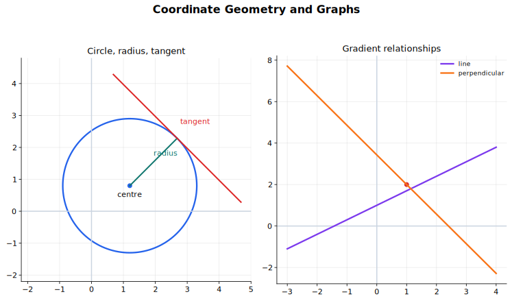

# Coordinate Geometry and Graphs Lecture Notes

Coordinate geometry is the habit of turning a geometric statement into an algebraic condition, then using the picture to check whether the algebra makes sense. In this topic the main objects are points, straight lines, circles, and graphs of functions. The same coordinates can describe distance, gradient, intersection, tangency, and graph transformation.

Use this note after [Algebra and Functions](../01%20Algebra%20and%20Functions/00%20Overview.md). Algebra supplies the equations; coordinate geometry gives them a spatial meaning.

## Source Route

- 9709 1.3 Coordinate geometry
- 9709 1.2 Functions
- Coursebook route: 9709 Pure Mathematics 1 Chapter 3, with graph transformation material from Chapter 2.

## Visual Guide

Figure: The diagram shows the main language of this topic in one picture: a line, a circle, a radius, and a tangent. While studying, keep asking which part of the picture is being translated into an equation.

## 1. The Basic Translation

Coordinate geometry works because a point has two roles at once. The point $P(x,y)$ is a location in the plane, but its coordinates are also algebraic variables. A condition such as "the point lies on this line" or "the point is a fixed distance from this centre" becomes an equation in $x$ and $y$.

| Geometric statement | Algebraic form |
|---|---|
| $P(x,y)$ lies on a straight line with gradient $m$ and intercept $c$ | $y=mx+c$ |
| $P(x,y)$ is distance $r$ from $(a,b)$ | $(x-a)^2+(y-b)^2=r^2$ |
| Two graphs meet | Their equations hold at the same $x$ and $y$ |
| A tangent touches a circle at $T$ | The tangent is perpendicular to the radius through $T$ |

The core routine is:

1. Draw or imagine the geometry.
2. Name the known points, gradients, lengths, centres, or intersections.
3. Choose an equation form that exposes the known information.
4. Solve algebraically.
5. Check the result back on the diagram.

## 2. Points, Distance, Midpoint, and Gradient

For two points $A(x_1,y_1)$ and $B(x_2,y_2)$, the coordinate differences are

$$
\Delta x=x_2-x_1,\qquad \Delta y=y_2-y_1.
$$

The length of $AB$ follows from Pythagoras' theorem:

$$
AB=\sqrt{(x_2-x_1)^2+(y_2-y_1)^2}.
$$

The midpoint of $AB$ is

$$
\left(\frac{x_1+x_2}{2},\frac{y_1+y_2}{2}\right).
$$

The gradient of a non-vertical line through $A$ and $B$ is

$$
m=\frac{y_2-y_1}{x_2-x_1},\qquad x_2\ne x_1.
$$

Gradient is "change in $y$ divided by change in $x$". It is related to the angle of inclination $\theta$ by $m=\tan\theta$, but it is not the angle itself. This distinction matters when a question gives an angle or asks for one.

The midpoint formula can also be used backwards. If $M$ is the midpoint of $AB$ and one endpoint is known, equate coordinates in

$$
M=\left(\frac{x_A+x_B}{2},\frac{y_A+y_B}{2}\right)
$$

to find the missing endpoint.

## 3. Straight Lines

A straight line can be written in several useful forms.

| Form | Equation | Best when you know |
|---|---|---|
| Gradient-intercept form | $y=mx+c$ | Gradient and $y$-intercept |
| Point-gradient form | $y-y_1=m(x-x_1)$ | One point and the gradient |
| General form | $ax+by+c=0$ | You want a tidy implicit equation or are solving simultaneous equations |
| Vertical line | $x=a$ | All points have the same $x$-coordinate |
| Horizontal line | $y=b$ | All points have the same $y$-coordinate |

When a problem gives two points, first find the gradient, then use point-gradient form. For example, the line through $(2,5)$ with gradient $3$ is

$$
y-5=3(x-2),
$$

so

$$
y=3x-1.
$$

Do not expand too early if the unexpanded form shows the structure. The equation $y-5=3(x-2)$ makes the point and gradient visible; the equation $y=3x-1$ makes the intercept visible.

### Parallel and Perpendicular Lines

Two non-vertical lines are parallel when their gradients are equal:

$$
m_1=m_2.
$$

Two non-vertical lines are perpendicular when their gradients multiply to $-1$:

$$
m_1m_2=-1.
$$

So if one line has gradient $m$, a perpendicular line has gradient

$$
-\frac{1}{m}.
$$

Vertical and horizontal lines need separate care. A vertical line has equation $x=a$ and no finite gradient. A horizontal line has equation $y=b$ and gradient $0$. They are perpendicular to each other, but the product rule cannot be applied directly because the vertical gradient is undefined.

## 4. Circles

A circle is the locus of all points that are a fixed distance from a fixed point. If the centre is $(a,b)$ and the radius is $r$, then a point $P(x,y)$ lies on the circle exactly when

$$
(x-a)^2+(y-b)^2=r^2.
$$

This is just the distance formula with the distance fixed at $r$. For example,

$$
(x-3)^2+(y+2)^2=25
$$

has centre $(3,-2)$ and radius $5$.

### Expanded Form and Completing the Square

The syllabus also uses the expanded form

$$
x^2+y^2+2gx+2fy+c=0.
$$

The safest way to read a circle from this form is to complete the square. For example,

$$
x^2+y^2-6x+4y-12=0
$$

becomes

$$
x^2-6x+y^2+4y=12,
$$

then

$$
(x-3)^2-9+(y+2)^2-4=12.
$$

Hence

$$
(x-3)^2+(y+2)^2=25.
$$

The centre is $(3,-2)$ and the radius is $5$. The most common error here is losing the constants introduced while completing the square.

A quadratic equation in $x$ and $y$ represents a circle only when the coefficients of $x^2$ and $y^2$ are equal and there is no $xy$ term. If these features are missing, the curve may be another conic rather than a circle.

### Circle from a Diameter

If a circle has diameter $AB$, then its centre is the midpoint of $AB$ and its radius is half the length of $AB$. If $A(1,2)$ and $B(7,10)$ are endpoints of a diameter, the centre is

$$
\left(\frac{1+7}{2},\frac{2+10}{2}\right)=(4,6),
$$

and the radius is

$$
\frac{1}{2}\sqrt{(7-1)^2+(10-2)^2}=5.
$$

So the circle is

$$
(x-4)^2+(y-6)^2=25.
$$

This method is usually cleaner than starting with the expanded equation of a circle.

## 5. Intersections and Tangency

Points of intersection of graphs are solutions of simultaneous equations. If a line and a circle meet, the coordinates of any common point must satisfy both equations.

For instance, to find where

$$
y=2x+1
$$

meets

$$
x^2+y^2=25,
$$

substitute the line equation into the circle equation:

$$
x^2+(2x+1)^2=25.
$$

This gives a quadratic equation in $x$. Solve it, then substitute back into $y=2x+1$ to find the corresponding $y$-coordinates.

When a line and a circle lead to a quadratic equation, the discriminant tells you the geometry.

| Discriminant | Geometry |
|---|---|
| $\Delta>0$ | Two intersections |
| $\Delta=0$ | One repeated intersection, so the line is tangent |
| $\Delta<0$ | No real intersection |

The discriminant is especially useful when the line contains a parameter. A question may ask for the values of $k$ for which a line such as $y=x+k$ intersects, touches, or does not meet a curve. Translate "touches" into $\Delta=0$.

### Tangent to a Circle

The radius to the point of contact is perpendicular to the tangent. If the centre is $C$ and the tangent touches the circle at $T$, first find the gradient of $CT$. If this gradient is $m$, the tangent gradient is

$$
-\frac{1}{m}.
$$

Then use point-gradient form through $T$.

There are two special cases:

- If $CT$ is vertical, the tangent is horizontal.
- If $CT$ is horizontal, the tangent is vertical.

Circle geometry can also simplify algebra. The angle in a semicircle is a right angle; the perpendicular from the centre to a chord bisects the chord; and symmetry can reveal a centre or a missing coordinate before any heavy calculation.

## 6. Graphs and Algebraic Equations

The graph of an equation is the set of all points that satisfy it. This is why solving simultaneous equations gives intersections: at an intersection, the same point satisfies both equations.

This idea connects coordinate geometry with [Algebra and Functions](../01%20Algebra%20and%20Functions/00%20Overview.md). A quadratic equation can be studied by solving it, factorising it, completing the square, or looking at the graph. Coordinate geometry asks you to move fluently between these representations.

For example, if a question asks for values of $k$ for which the line $y=x+k$ meets the curve $y=x^2-4$, set

$$
x+k=x^2-4,
$$

so

$$
x^2-x-(k+4)=0.
$$

The number of real intersections is controlled by the discriminant.

## 7. Transformations of $y=f(x)$

The 9709 function work includes translations, reflections, and stretches of graphs. The cleanest way to learn them is to track what happens to a point $(x,y)$ on the original graph.

| New graph | Transformation of $y=f(x)$ |
|---|---|
| $y=f(x)+a$ | Translation by $\begin{pmatrix}0\\a\end{pmatrix}$ |
| $y=f(x-a)$ | Translation by $\begin{pmatrix}a\\0\end{pmatrix}$ |
| $y=af(x)$ | Stretch parallel to the $y$-axis with scale factor $a$ |
| $y=f(ax)$ | Stretch parallel to the $x$-axis with scale factor $\frac{1}{a}$ |
| $y=-f(x)$ | Reflection in the $x$-axis |
| $y=f(-x)$ | Reflection in the $y$-axis |

Horizontal transformations often feel reversed. The graph of $y=f(x-3)$ is the graph of $y=f(x)$ translated 3 units to the right, because the input $x-3$ must equal the old input.

Point tracking is the best check:

- If $(2,5)$ is on $y=f(x)$, then $(2,9)$ is on $y=f(x)+4$.
- If $(2,5)$ is on $y=f(x)$, then $(5,5)$ is on $y=f(x-3)$.
- If $(2,5)$ is on $y=f(x)$, then $(2,10)$ is on $y=2f(x)$.
- If $(2,5)$ is on $y=f(x)$, then $(1,5)$ is on $y=f(2x)$.

Always transform the domain and range as well as the shape. If $y=f(x)$ has domain $1\le x\le 4$, then $y=f(x-2)$ has domain

$$
3\le x\le 6.
$$

If $y=f(x)$ has range $-1\le y\le 3$, then $y=2f(x)+1$ has range

$$
-1\le y\le 7.
$$

## 8. Worked-Thinking Routines

### Finding a Line

1. Decide what information is given: two points, one point and gradient, intercepts, parallel/perpendicular relation, or a graph.
2. Find the gradient if needed.
3. Use point-gradient form unless the intercept form is immediate.
4. Convert to the requested form.
5. Check by substituting a known point.

### Finding a Circle

1. Look for centre and radius directly.
2. If a diameter is given, use midpoint and half-distance.
3. If an expanded equation is given, complete the square.
4. If several points are given, use perpendicular bisectors or substitute points into the general circle equation.
5. Check that the radius is positive and that a known point lies on the circle.

### Solving an Intersection Problem

1. Substitute the simpler equation into the other.
2. Solve the resulting equation.
3. Substitute back to find the second coordinate.
4. Use the discriminant if the question asks how many intersections are possible.
5. Check the answer on a sketch.

## Common Mistakes

- Treating gradient as an angle. Use $m=\tan\theta$ only when an angle is actually involved.
- Forgetting that vertical lines have no finite gradient.
- Applying $m_1m_2=-1$ to a vertical line.
- Expanding a circle equation and losing the centre-radius information.
- Completing the square but forgetting to balance constants.
- Saying a tangent "just touches" without using either $\Delta=0$ or the perpendicular radius fact.
- Moving $f(x+a)$ to the right instead of to the left.
- Sketching a transformed graph but leaving the old domain or range unchanged.

## Quick Self-Check

You are ready to move on when you can do the following without looking up the method:

- Find the equation of a line from two points.
- Find a line parallel or perpendicular to a given line through a given point.
- Find distance and midpoint, including using the midpoint formula backwards.
- Convert a circle between centre-radius form and expanded form.
- Find a circle from a diameter.
- Use simultaneous equations to find line-circle or graph intersections.
- Use the discriminant to distinguish intersection, tangency, and no real intersection.
- Sketch basic transformations of $y=f(x)$ and update the domain and range.

## Connections

- [Algebra and Functions](../01%20Algebra%20and%20Functions/00%20Overview.md)
- [Polar Coordinates and Parametric Curves](../12%20Polar%20Coordinates%20and%20Parametric%20Curves/00%20Overview.md)
