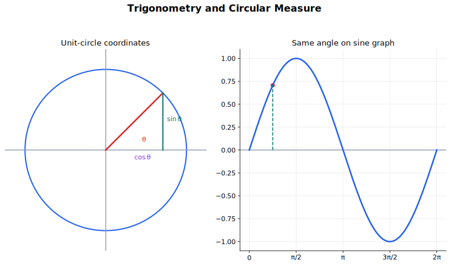

# Trigonometry and Circular Measure 中文讲义

三角函数这章的主线是：用圆来理解角，用单位圆来理解正弦、余弦和正切，再用图像和恒等式解决方程问题。弧度制不是一个额外单位，而是让“角”和“弧长”直接相连的自然单位。

学习时不要把它当成一堆公式。你真正要熟的是四种视角之间的转换：

- 圆：角、弧长、扇形、单位圆；
- 图像：周期、振幅、对称性、渐近线；
- 代数：恒等式、和差角公式、二倍角公式；
- 方程：在指定区间内找全所有解。

## 图示导读

这张图用来快速理解“三角函数与弧度制”：把单位圆上的坐标和正弦图像连起来。

## 来源范围

- 9709 1.4 Circular measure。
- 9709 1.5 Trigonometry。
- 9709 2.3 Trigonometry。
- 9709 3.3 Trigonometry。
- Coursebook route：9709 Pure Mathematics 1 Chapters 4-5；9709 Pure Mathematics 2 and 3 Chapter 3。

## 学习范围

- 弧度制、弧长和扇形面积。
- 正弦、余弦、正切的特殊角精确值、图像、周期和对称性。
- 反三角函数记号的主值意义。
- 正割、余割、余切及其图像和恒等式。
- 和差角公式、二倍角公式，以及 $a\sin\theta+b\cos\theta$ 的辅助角形式。
- 三角方程在给定区间内的完整解。

## 1. 弧度制

弧度制把角定义成“在圆上走过的弧长相当于多少个半径”。如果半径是 $r$，圆心角是 $\theta$，并且 $\theta$ 用弧度表示，那么弧长是

$$
s=r\theta.
$$

这里的 $\theta$ 必须用弧度。一个完整圆周的弧长是 $2\pi r$，所以一整圈的角是

$$
2\pi \text{ radians}.
$$

因此

$$
180^\circ=\pi,\qquad 90^\circ=\frac{\pi}{2},\qquad 360^\circ=2\pi.
$$

扇形面积是

$$
A=\frac{1}{2}r^2\theta.
$$

这两个公式里，$\theta$ 都必须是弧度。题目如果给的是度数，先换单位：

$$
\theta_{\text{radians}}=\theta_{\text{degrees}}\cdot\frac{\pi}{180}.
$$

一整圈是

$$
360^\circ=2\pi,\qquad 180^\circ=\pi,\qquad 90^\circ=\frac{\pi}{2}.
$$

弧度题经常和三角形面积一起出现。两边夹角为 $C$ 的三角形面积是

$$
A=\frac{1}{2}ab\sin C.
$$

如果要求弓形面积，常见方法是

$$
\text{弓形面积}=\text{扇形面积}-\text{三角形面积}.
$$

做这类题先画图，标清 $r$、$\theta$、弧、弦和三角形。不要一上来就代公式。

## 2. 单位圆

单位圆半径为 1。角 $\theta$ 对应圆上的点

$$
(\cos\theta,\sin\theta).
$$

这句话很重要：余弦是横坐标，正弦是纵坐标。正切是

$$
\tan\theta=\frac{\sin\theta}{\cos\theta},
$$

只要 $\cos\theta\ne 0$。

单位圆最有用的地方是判断符号和周期。

| 象限 | $\sin\theta$ | $\cos\theta$ | $\tan\theta$ |
|---|---|---|---|
| 第一象限 | 正 | 正 | 正 |
| 第二象限 | 正 | 负 | 负 |
| 第三象限 | 负 | 负 | 正 |
| 第四象限 | 负 | 正 | 负 |

## 3. 基本恒等式

从单位圆可以直接得到

$$
\sin^2\theta+\cos^2\theta=1.
$$

这是最常用的三角恒等式。把它除以 $\cos^2\theta$，得到

$$
1+\tan^2\theta=\sec^2\theta.
$$

如果除以 $\sin^2\theta$，得到

$$
1+\cot^2\theta=\operatorname{cosec}^2\theta.
$$

解题时不要为了变形而变形。看到 $\sin^2\theta+\cos^2\theta$，优先想到 1；看到 $\tan\theta$，优先想到 $\frac{\sin\theta}{\cos\theta}$。目标通常是把式子变成同一种函数，或者变成可以因式分解的形式。

## 4. 特殊角精确值和倒数三角函数

$30^\circ$、$45^\circ$、$60^\circ$ 的精确值要很熟。对应的弧度分别是 $\frac{\pi}{6}$、$\frac{\pi}{4}$、$\frac{\pi}{3}$。

| $\theta$ | $\sin\theta$ | $\cos\theta$ | $\tan\theta$ |
|---|---|---|---|
| $\frac{\pi}{6}$ | $\frac{1}{2}$ | $\frac{\sqrt3}{2}$ | $\frac{1}{\sqrt3}$ |
| $\frac{\pi}{4}$ | $\frac{\sqrt2}{2}$ | $\frac{\sqrt2}{2}$ | $1$ |
| $\frac{\pi}{3}$ | $\frac{\sqrt3}{2}$ | $\frac{1}{2}$ | $\sqrt3$ |

其他相关角用“参考角 + 象限符号”处理。例如 $150^\circ$ 的参考角是 $30^\circ$，在第二象限，余弦为负，所以

$$
\cos150^\circ=-\frac{\sqrt3}{2}.
$$

CAIE 还会用三个倒数三角函数：

$$
\operatorname{cosec}\theta=\frac{1}{\sin\theta},\qquad
\sec\theta=\frac{1}{\cos\theta},\qquad
\cot\theta=\frac{1}{\tan\theta}.
$$

中文里通常叫余割、正割、余切。它们不是反三角函数，而是倒数函数。分母为 0 的地方没有定义，所以图像上会出现竖直渐近线。

## 5. 三角函数图像

$y=\sin x$ 和 $y=\cos x$ 的周期都是 $2\pi$，值域都是

$$
-1\le y\le 1.
$$

$y=\tan x$ 的周期是 $\pi$，在

$$
x=\frac{\pi}{2}+k\pi
$$

处没有定义。这里 $k$ 是整数。

三角图像题要先标出几个关键特征：

- 周期；
- 振幅；
- 最大值和最小值；
- 截距；
- 正切、正割、余割、余切的渐近线；
- 题目给定的定义域。

例如 $y=3\sin x$ 的振幅是 3；$y=1-\cos2x$ 的周期是 $\pi$；$y=\tan x+4$ 是正切图像向上平移 4。

图像题最容易漏的是定义域。比如只在 $0\le x\le2\pi$ 上画图，就不能把其他周期的交点也写进答案。

## 6. 反三角函数记号

$\sin^{-1}x$、$\cos^{-1}x$、$\tan^{-1}x$ 表示反三角函数的主值，不表示倒数。

例如

$$
\sin^{-1}\left(\frac{1}{2}\right)=\frac{\pi}{6}
$$

是一个主值。但方程

$$
\sin x=\frac{1}{2}
$$

在不同区间里可能有多个解。

不要把

$$
\sin^{-1}x
$$

和

$$
\frac{1}{\sin x}
$$

混在一起。后者是 $\operatorname{cosec}x$。

## 7. 解三角方程

解三角方程的顺序可以这样做：

1. 先把方程化成基本形式，比如 $\sin x=a$、$\cos x=a$ 或 $\tan x=a$。
2. 找参考角。
3. 用单位圆判断哪些象限符合符号。
4. 写出题目指定区间内的所有解。

例如在 $0\le x<2\pi$ 内解

$$
\sin x=\frac{1}{2}.
$$

参考角是 $\frac{\pi}{6}$。正弦为正在第一、第二象限，所以

$$
x=\frac{\pi}{6},\frac{5\pi}{6}.
$$

不要只写第一个解。三角方程的主要陷阱就是周期和区间。

如果方程里出现 $2x$、$x-\alpha$ 这类角，要先把整个角的取值范围写出来。例如 $0\le x<2\pi$ 时，$2x$ 的范围是 $0\le2x<4\pi$。这样不容易漏解。

如果解题过程中平方、约分或除以 $\sin x$、$\cos x$，最后一定要代回去检查。约分可能丢掉解，平方可能引入多余解。

## 8. 证明恒等式

恒等式是对所有允许取值都成立的式子。证明恒等式时，不要“左右两边同时乱变”。比较稳的方法是只从一边出发，把它变成另一边。

常用策略：

- 把 $\tan$、$\sec$、$\operatorname{cosec}$、$\cot$ 全部化成 $\sin$ 和 $\cos$；
- 看到 $\sin^2\theta+\cos^2\theta$ 就合成 1；
- 看到 $1+\tan^2\theta$ 就想到 $\sec^2\theta$；
- 看到 $1+\cot^2\theta$ 就想到 $\operatorname{cosec}^2\theta$；
- 先因式分解，再考虑恒等式。

恒等式题的关键不是背得多，而是知道现在这个式子“想变成哪种形状”。

## 9. 和差角公式

和差角公式把 $A+B$ 或 $A-B$ 的三角函数拆成 $A$ 和 $B$ 的三角函数：

$$
\sin(A+B)=\sin A\cos B+\cos A\sin B,
$$

$$
\sin(A-B)=\sin A\cos B-\cos A\sin B,
$$

$$
\cos(A+B)=\cos A\cos B-\sin A\sin B,
$$

$$
\cos(A-B)=\cos A\cos B+\sin A\sin B,
$$

$$
\tan(A+B)=\frac{\tan A+\tan B}{1-\tan A\tan B},
$$

$$
\tan(A-B)=\frac{\tan A-\tan B}{1+\tan A\tan B}.
$$

这些公式主要用在三类地方：

1. 求 exact value，比如把 $75^\circ$ 写成 $45^\circ+30^\circ$；
2. 化简表达式；
3. 解含有 $x\pm\alpha$ 的三角方程。

符号很容易错。记忆时可以特别注意：$\cos(A+B)$ 里面是减号，$\cos(A-B)$ 里面是加号。

## 10. 二倍角公式

把和差角公式里的 $B$ 换成 $A$，得到二倍角公式：

$$
\sin2A=2\sin A\cos A,
$$

$$
\cos2A=\cos^2A-\sin^2A,
$$

$$
\tan2A=\frac{2\tan A}{1-\tan^2A}.
$$

其中 $\cos2A$ 还有两个常用变形：

$$
\cos2A=2\cos^2A-1,
$$

$$
\cos2A=1-2\sin^2A.
$$

选择哪个版本，看题目里有什么。如果式子里主要是 $\sin^2A$，用 $1-2\sin^2A$；如果主要是 $\cos^2A$，用 $2\cos^2A-1$。

## 11. 辅助角形式

形如

$$
a\sin\theta+b\cos\theta
$$

的式子，可以合成一个平移后的正弦或余弦。常用写法是

$$
a\sin\theta+b\cos\theta=R\sin(\theta+\alpha),
$$

其中

$$
R=\sqrt{a^2+b^2},\qquad R\cos\alpha=a,\qquad R\sin\alpha=b.
$$

这样做的好处是：一个正弦函数的最大值、最小值、图像和方程都更容易处理。合成后最大值是 $R$，最小值是 $-R$。

同一个式子也可以写成

$$
R\cos(\theta-\beta).
$$

不管用正弦形式还是余弦形式，本质都是展开右边，然后比较 $\sin\theta$ 和 $\cos\theta$ 的系数。

## 做题顺序

### 弧度和圆

1. 先把度数换成弧度。
2. 判断题目要的是弧长、扇形面积、三角形面积，还是组合面积。
3. 画图并标出半径、圆心角、弧和弦。
4. 代公式时带单位。
5. 检查结果是长度、面积还是角度。

### 三角方程

1. 先用恒等式化简。
2. 找参考角。
3. 用单位圆或图像确定所有符合符号的象限。
4. 根据题目区间列出所有解。
5. 最后代回原方程，尤其是有平方或约分时。

### 恒等式

1. 从更复杂的一边开始。
2. 必要时把倒数三角函数化成 $\sin$ 和 $\cos$。
3. 看到平方和、$1+\tan^2\theta$、$1+\cot^2\theta$ 时优先用基本恒等式。
4. 只有当角的结构需要时，才用和差角或二倍角公式。
5. 每一步写成清楚的等式链。

## 常见错误

- 用弧长公式时忘记把度数换成弧度。
- 把 $\sin^{-1}x$ 当作 $\frac{1}{\sin x}$。反三角函数和倒数不是一回事。
- 解三角方程只写计算器给出的一个角。
- 图像平移后忘记周期、定义域和值域的变化。
- 忘记 $\tan x$ 在某些点没有定义。
- 把 $\tan x$ 的周期记成 $2\pi$。
- $2x$ 这类方程没有先扩大角的范围，导致漏解。
- 除以 $\sin x$ 或 $\cos x$ 时没有考虑它可能等于 0。
- 和差角公式里的符号记反。

## 快速自查

- 我能不能解释为什么 $s=r\theta$ 要求 $\theta$ 用弧度？
- 我能不能用单位圆判断三角函数的符号？
- 我能不能从图像说出周期、最大值和最小值？
- 我能不能在指定区间内找全三角方程的解？
- 我能不能证明一个基础恒等式，而不是只代几个数验证？
- 我能不能正确使用正割、余割、余切？
- 我能不能用和差角、二倍角和辅助角形式化简表达式？

## 关联内容

- [Differentiation](../05%20Differentiation/00%20Overview.md)：三角函数图像和标准导数会在微分中反复使用。
- [Integration](../06%20Integration/00%20Overview.md)：三角恒等式和弧度制是三角积分的基础。
- [Complex Numbers](../09%20Complex%20Numbers/00%20Overview.md)：de Moivre's theorem 会把三角形式和复数幂联系起来。
