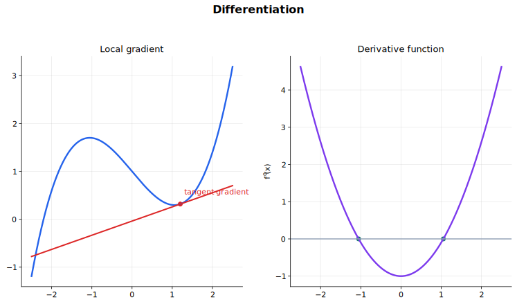

# Differentiation 中文讲义

微分研究“局部变化”。在图像上，导数是切线斜率；在实际问题里，导数是瞬时变化率；在代数上，求导把一个函数变成另一个描述变化的函数。

这一章最重要的问题是：谁在随着谁变化？写清楚 $\frac{dy}{dx}$、$\frac{dy}{dt}$、$\frac{dA}{dr}$ 里的变量，比机械套公式更重要。

## 图示导读

这张图用来快速理解“微分”：把曲线上的切线斜率理解成导函数。

## 来源范围

- 9709 1.7 Differentiation。
- 9709 2.4 Differentiation。
- 9709 3.4 Differentiation。
- 9231 2.3 Differentiation。
- Coursebook route：9709 Pure Mathematics 1 Chapters 7-8；9709 Pure Mathematics 2 and 3 Chapters 4 and 8；9231 Further Mathematics differentiation content。

## 学习范围

- 导数作为切线斜率和瞬时变化率。
- 幂函数、指数函数、对数函数、三角函数和反三角函数的求导。
- 链式法则、乘积法则、商法则。
- 切线、法线、驻点、单调性、最值和变化率问题。
- 隐函数求导、参数方程求导和二阶导数。
- 9231 中的双曲函数、反双曲函数和 Maclaurin 级数（Maclaurin series）。

## 1. 导数是什么

函数 $y=f(x)$ 在某一点的导数，表示图像在这一点的切线斜率：

$$
\frac{dy}{dx}=f'(x).
$$

从变化率角度看，导数是

$$
f'(x)=\lim_{h\to 0}\frac{f(x+h)-f(x)}{h}.
$$

这个极限的意思是：把两点之间的平均变化率压到一个点附近，得到瞬时变化率。很多实际题里的速度、加速度、边际变化，本质上都是导数。

二阶导数

$$
\frac{d^2y}{dx^2}=f''(x)
$$

表示斜率本身如何变化。图像上，它和弯曲方向、驻点分类有关。

## 2. 基本求导

幂函数最常用：

$$
\frac{d}{dx}x^n=nx^{n-1}.
$$

例如

$$
\frac{d}{dx}(3x^4-5x^2+7)=12x^3-10x.
$$

常数倍、和与差可以直接拆开：

$$
\frac{d}{dx}(ku)=k\frac{du}{dx},
$$

$$
\frac{d}{dx}(u\pm v)=\frac{du}{dx}\pm\frac{dv}{dx}.
$$

常见标准函数包括

$$
\frac{d}{dx}e^x=e^x,\qquad
\frac{d}{dx}\ln x=\frac{1}{x},
$$

$$
\frac{d}{dx}\sin x=\cos x,\qquad
\frac{d}{dx}\cos x=-\sin x,
$$

$$
\frac{d}{dx}\tan x=\sec^2x.
$$

这里的三角函数求导默认角用弧度。

## 3. 三个常用法则

复合函数用链式法则：

$$
\frac{d}{dx}f(g(x))=f'(g(x))g'(x).
$$

例如

$$
\frac{d}{dx}(3x+1)^5=5(3x+1)^4\cdot 3.
$$

两个函数相乘，用乘积法则：

$$
\frac{d}{dx}(uv)=u'v+uv'.
$$

两个函数相除，用商法则：

$$
\frac{d}{dx}\left(\frac{u}{v}\right)=\frac{u'v-uv'}{v^2}.
$$

判断用哪个法则时，先看函数结构。括号套括号，多半用链式法则；两个大块相乘，用乘积法则；分子分母都含 $x$，通常用商法则。

有些式子可以先改写，少用一个复杂法则。比如

$$
\frac{1}{(2x+1)^3}=(2x+1)^{-3}
$$

用链式法则比硬套商法则更清楚。

## 4. 反函数、双曲函数和进一步求导

9709 会用到

$$
\frac{d}{dx}\tan^{-1}x=\frac{1}{1+x^2}.
$$

9231 还会用到

$$
\frac{d}{dx}\sin^{-1}x=\frac{1}{\sqrt{1-x^2}},
$$

$$
\frac{d}{dx}\cos^{-1}x=-\frac{1}{\sqrt{1-x^2}}.
$$

注意反三角函数有定义域和值域限制，不能只把它当作普通代数符号。

双曲函数的基本求导是

$$
\frac{d}{dx}\sinh x=\cosh x,\qquad
\frac{d}{dx}\cosh x=\sinh x,
$$

$$
\frac{d}{dx}\tanh x=\operatorname{sech}^2x.
$$

常见反双曲函数导数包括

$$
\frac{d}{dx}\sinh^{-1}x=\frac{1}{\sqrt{x^2+1}},
$$

$$
\frac{d}{dx}\cosh^{-1}x=\frac{1}{\sqrt{x^2-1}},
$$

$$
\frac{d}{dx}\tanh^{-1}x=\frac{1}{1-x^2}.
$$

这些公式要和函数的定义域一起记，尤其是 $\cosh^{-1}x$ 和 $\tanh^{-1}x$。

## 5. 切线与法线

在 $x=a$ 处，切线斜率是

$$
f'(a).
$$

先算点 $(a,f(a))$，再用点斜式写切线：

$$
y-f(a)=f'(a)(x-a).
$$

法线垂直于切线。如果切线斜率是 $m$，法线斜率是

$$
-\frac{1}{m},
$$

前提是 $m\ne 0$。如果切线水平，法线就是竖直线。

写切线或法线时，斜率不够，还必须有切点。很多错误是算出了 $f'(a)$，却忘了先求 $(a,f(a))$。

## 6. 驻点和单调性

驻点满足

$$
f'(x)=0.
$$

它可能是极大值、极小值，也可能是水平拐点。常用判断方法有两个：

- 看 $f'(x)$ 在驻点左右的符号变化；
- 看二阶导数 $f''(x)$ 的符号。

如果 $f''(a)>0$，图像在附近向上弯，通常是极小值。如果 $f''(a)<0$，图像向下弯，通常是极大值。如果 $f''(a)=0$，需要再检查，不能直接下结论。

单调性也来自导数符号：

$$
f'(x)>0 \Rightarrow f(x)\text{ 递增},
$$

$$
f'(x)<0 \Rightarrow f(x)\text{ 递减}.
$$

如果题目要求 sketch graph，就把截距、渐近线、驻点、单调区间和弯曲趋势放在一起看，不要只求导数。

## 7. 最值和变化率问题

最优化问题一般按这个顺序做：

1. 先定义要最大化或最小化的量。
2. 把它写成一个变量的函数。
3. 求导。
4. 解 $f'(x)=0$。
5. 用二阶导数、符号变化或端点比较判断最大/最小。
6. 回答原问题，而不是只给一个 $x$。

相关变化率问题用链式法则。比如面积 $A$ 依赖半径 $r$，半径又随时间 $t$ 变化，那么

$$
\frac{dA}{dt}=\frac{dA}{dr}\frac{dr}{dt}.
$$

这类题一定要带单位。负号通常表示“正在减少”，不是答案错了。

## 8. 隐函数求导

如果 $x$ 和 $y$ 混在同一个方程里，可以对两边同时关于 $x$ 求导。遇到 $y$ 时要记得乘上 $\frac{dy}{dx}$。

例如

$$
x^2+y^2=25
$$

两边求导：

$$
2x+2y\frac{dy}{dx}=0.
$$

所以

$$
\frac{dy}{dx}=-\frac{x}{y}.
$$

如果要求二阶导数，就继续对 $\frac{dy}{dx}$ 关于 $x$ 求导。这时 $y$ 仍然是 $x$ 的函数，所以遇到 $y$ 还要继续乘 $\frac{dy}{dx}$。

## 9. 参数方程求导

参数方程中，如果

$$
x=x(t),\qquad y=y(t),
$$

那么

$$
\frac{dy}{dx}=\frac{\frac{dy}{dt}}{\frac{dx}{dt}},
$$

前提是 $\frac{dx}{dt}\ne 0$。

二阶导数不是

$$
\frac{d^2y/dt^2}{d^2x/dt^2}.
$$

正确做法是

$$
\frac{d^2y}{dx^2}
=\frac{\frac{d}{dt}\left(\frac{dy}{dx}\right)}{\frac{dx}{dt}}.
$$

参数题里的切线和法线，通常先求参数值，再求点和斜率。

## 10. Maclaurin 级数

Maclaurin 级数（Maclaurin series）是在 $x=0$ 附近用导数展开函数：

$$
f(x)=f(0)+xf'(0)+\frac{x^2}{2!}f''(0)+\frac{x^3}{3!}f'''(0)+\cdots.
$$

它本质上是“用函数在 0 附近的导数信息构造近似”。做题时依次求导，在 $x=0$ 代入，再放回公式。一般只需要前几项。

## 做题顺序

### 显函数求导

1. 先看结构：和差、乘积、商，还是复合函数。
2. 根式和倒数可以先改写成幂。
3. 链式法则一定要乘内层导数。
4. 不必过度化简，只化到后续使用方便。
5. 检查符号、定义域和变量。

### 切线与法线

1. 求切点坐标。
2. 求导并代入切点得到切线斜率。
3. 用点斜式写切线。
4. 法线用负倒数斜率，注意水平切线的特殊情况。
5. 把点代回直线方程检查。

### 驻点

1. 解 $f'(x)=0$。
2. 求对应的 $y$ 坐标。
3. 用导数符号变化或二阶导数分类。
4. 如果 $f''(x)=0$，换方法判断。
5. 把结果解释成图像形状或实际意义。

## 常见错误

- 链式法则只求外层，忘记乘内层导数。
- 商法则里分子顺序写反。
- 把 $f'(x)=0$ 当作一定是最大或最小。
- 求切线时只算斜率，忘记还需要切点坐标。
- 参数方程里把 $\frac{dy}{dt}$ 直接当成 $\frac{dy}{dx}$。
- 隐函数求导时忘记 $y$ 是 $x$ 的函数。
- 二阶导数为 0 时仍然强行判断极大/极小。
- 忽略 $\ln x$、反三角函数和反双曲函数的定义域限制。

## 快速自查

- 我能不能说清导数在图像和实际问题里各表示什么？
- 我能不能根据函数结构选对求导法则？
- 我能不能写出切线和法线方程？
- 我能不能用导数符号判断递增、递减和驻点性质？
- 我能不能处理最值和相关变化率问题？
- 我能不能做隐函数和参数方程的一阶、二阶求导？
- 我能不能用导数写出 Maclaurin 级数的前几项？

## 关联内容

- [Integration](../06%20Integration/00%20Overview.md)：积分是反向求导，定积分和微分共同描述累积与变化。
- [Kinematics and Newtonian Motion](../../02%20Mechanics/02%20Kinematics%20and%20Newtonian%20Motion/00%20Overview.md)：速度、加速度和变化率建模会直接使用导数。
