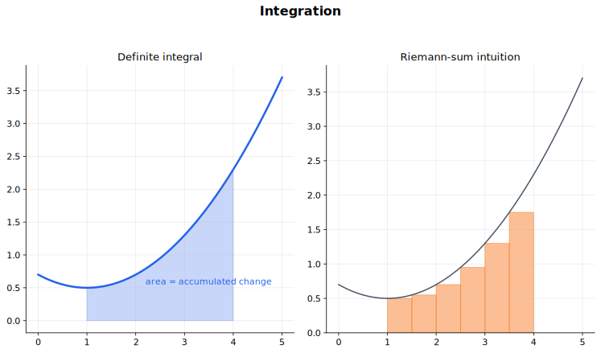

# Integration 中文讲义

积分有两个互相连接的意思：一是反向求导，二是累积。看到不定积分，要想“哪个函数求导会得到它”；看到定积分，要想“这个区间内总共累积了多少”。

做积分题之前，先判断它代表什么：

- 不定积分给出一族函数；
- 定积分给出一个数；
- 面积题需要先画区域；
- 体积题需要先看旋转轴；
- 近似积分题要看步长和估计方向。

## 图示导读

这张图用来快速理解“积分”：把曲线下面积理解成累积变化。

## 来源范围

- 9709 1.8 Integration。
- 9709 2.5 Integration。
- 9709 3.5 Integration。
- 9231 2.4 Integration。
- Coursebook route：9709 Pure Mathematics 1 Chapter 9；9709 Pure Mathematics 2 and 3 Chapters 5 and 8；9231 Further Mathematics integration content。

## 学习范围

- 不定积分和积分常数。
- 定积分、反常积分、面积和累积量。
- 旋转体体积。
- 换元积分、分部积分、部分分式和三角恒等变形。
- 梯形法则（trapezium rule）。
- 9231 中的双曲函数积分、递推公式（reduction formulae）、矩形估计、弧长和旋转曲面面积。

## 1. 积分的两个意思

不定积分是反向求导：

$$
\int f(x)\,dx=F(x)+C,
$$

其中 $F'(x)=f(x)$。这里的 $C$ 不能省，因为常数求导后都会消失。

基本幂函数积分是

$$
\int x^n\,dx=\frac{x^{n+1}}{n+1}+C,\qquad n\ne -1.
$$

例外是

$$
\int \frac{1}{x}\,dx=\ln|x|+C.
$$

常见积分包括

$$
\int e^{ax+b}\,dx=\frac{1}{a}e^{ax+b}+C,
$$

$$
\int \frac{1}{ax+b}\,dx=\frac{1}{a}\ln|ax+b|+C,
$$

$$
\int \sin(ax+b)\,dx=-\frac{1}{a}\cos(ax+b)+C,
$$

$$
\int \cos(ax+b)\,dx=\frac{1}{a}\sin(ax+b)+C,
$$

$$
\int \sec^2(ax+b)\,dx=\frac{1}{a}\tan(ax+b)+C.
$$

不定积分做完以后，最快的检查方法就是把答案求导，看能不能回到被积函数。

## 2. 定积分和面积

定积分表示区间上的有符号累积：

$$
\int_a^b f(x)\,dx.
$$

如果 $F'(x)=f(x)$，那么

$$
\int_a^b f(x)\,dx=F(b)-F(a).
$$

注意是上限代入减下限代入。顺序反了，符号就会反。

面积题要小心：面积不能为负。如果图像在 $x$ 轴下方，定积分是负数，但实际面积要取正。跨过 $x$ 轴时，要分段积分。

两条曲线之间的面积要先判断上、下曲线：

$$
\int_a^b(\text{上方曲线}-\text{下方曲线})\,dx.
$$

如果两条曲线在区间中间交换上下位置，就要在交点处分段。

反常积分要写成极限。例如

$$
\int_1^\infty\frac{1}{x^2}\,dx
=\lim_{b\to\infty}\int_1^b\frac{1}{x^2}\,dx.
$$

## 3. 旋转体体积

把 $y=f(x)$ 下方的区域绕 $x$ 轴旋转，体积是

$$
V=\pi\int_a^b y^2\,dx.
$$

如果绕 $y$ 轴旋转，并且用 $x$ 表示成 $y$ 的函数，则

$$
V=\pi\int_c^d x^2\,dy.
$$

这里的平方来自圆形截面积。若区域夹在两条曲线之间，要用“外半径平方减内半径平方”。先画图再写积分，特别是旋转轴不在区域边界时。

## 4. 换元积分

如果被积函数里出现“一个复合函数”和它内层的导数，可以考虑换元。

例如

$$
\int 2x(x^2+1)^5\,dx.
$$

令

$$
u=x^2+1,
$$

则

$$
\frac{du}{dx}=2x.
$$

原积分变成

$$
\int u^5\,du=\frac{u^6}{6}+C=\frac{(x^2+1)^6}{6}+C.
$$

换元的关键是把 $dx$ 也一起换掉，不要只替换括号。

定积分换元时有两种做法：

- 把上下限也换成 $u$ 的取值；
- 或者算完换回 $x$，再用原来的上下限。

不要把 $u$ 的被积函数和 $x$ 的上下限混在一起。

## 5. 分部积分

分部积分来自乘积法则：

$$
\int u\frac{dv}{dx}\,dx=uv-\int v\frac{du}{dx}\,dx.
$$

常见情况是 $x e^x$、$x\sin x$、$x\ln x$ 这类乘积。选 $u$ 时通常选“求导后更简单”的部分，例如 $\ln x$ 或多项式。

例如

$$
\int \ln x\,dx
$$

可以取

$$
u=\ln x,\qquad \frac{dv}{dx}=1.
$$

于是 $v=x$，得到

$$
\int \ln x\,dx=x\ln x-\int 1\,dx=x\ln x-x+C.
$$

## 6. 部分分式和有理函数

部分分式把一个复杂分式拆成简单分式，再分别积分。

例如

$$
\frac{3x+5}{(x+1)(x+2)}
=\frac{A}{x+1}+\frac{B}{x+2}.
$$

求出 $A$、$B$ 后，每一项都能用对数积分：

$$
\int\frac{A}{x+1}\,dx=A\ln|x+1|+C.
$$

还要熟悉

$$
\int\frac{f'(x)}{f(x)}\,dx=\ln|f(x)|+C.
$$

例如

$$
\int\tan x\,dx
=\int\frac{\sin x}{\cos x}\,dx
=-\ln|\cos x|+C.
$$

## 7. 三角恒等变形

有些三角积分不是直接套公式，而是先用恒等式。常见的是

$$
\sin^2x=\frac{1-\cos2x}{2},
$$

$$
\cos^2x=\frac{1+\cos2x}{2}.
$$

这样 $\sin^2x$、$\cos^2(2x)$ 这类式子就能转成可以直接积分的形式。

## 8. 梯形法则

梯形法则（trapezium rule）用梯形面积近似定积分。如果 $[a,b]$ 被分成 $n$ 个等宽小区间，步长为

$$
h=\frac{b-a}{n},
$$

那么

$$
\int_a^b y\,dx
\approx
\frac{h}{2}\left(y_0+2y_1+2y_2+\cdots+2y_{n-1}+y_n\right).
$$

图像能帮助判断高估还是低估。曲线向上弯时，梯形常常在曲线上方；曲线向下弯时，梯形常常在曲线下方。

## 9. 进一步积分内容

9231 会把积分继续扩展。双曲函数积分仍然按反向求导理解：

$$
\int\sinh x\,dx=\cosh x+C,
$$

$$
\int\cosh x\,dx=\sinh x+C.
$$

配方可以帮助识别这些形式：

$$
\int\frac{1}{x^2+a^2}\,dx,\qquad
\int\frac{1}{a^2-x^2}\,dx,\qquad
\int\frac{1}{x^2-a^2}\,dx.
$$

它们常常和三角换元或双曲换元有关。

递推公式（reduction formulae）是把含参数 $n$ 的积分化成较小参数的积分。例如把

$$
I_n=\int_0^\pi\sin^n x\,dx
$$

表示成 $I_{n-2}$ 的形式。重点不是死记公式，而是看分部积分或某个导数怎样产生递推关系。

矩形估计把积分和求和联系起来。用矩形逼近曲线下面积，可以得到关于和式的界或极限。

弧长和旋转曲面面积也来自积分。Cartesian 坐标下的弧长公式是

$$
L=\int_a^b\sqrt{1+\left(\frac{dy}{dx}\right)^2}\,dx.
$$

旋转曲面面积要把“旋转半径”和“微小弧长”相乘，再积分。先判断绕哪条轴旋转。

## 做题顺序

### 不定积分

1. 先看有没有直接反向求导。
2. 根式、倒数、括号幂可以先改写。
3. 结构明显时再选择换元、分部积分、部分分式或三角恒等式。
4. 写 $+C$。
5. 求导检查。

### 定积分和面积

1. 先画区域。
2. 找交点或截距作为上下限。
3. 判断是有符号面积还是几何面积。
4. 图像跨轴或上下曲线交换时要分段。
5. 尽量保留精确值到最后。

### 技巧选择

- 复合函数旁边有内层导数：换元；
- 乘积中有一部分求导会变简单：分部积分；
- 有理函数且分母可分解：部分分式；
- 三角函数平方或乘积：三角恒等式；
- 没有简单原函数或只有数据：梯形法则。

## 10. 积分和微分方程

一阶可分离变量微分方程可以写成

$$
\frac{dy}{dx}=g(x)h(y).
$$

把含 $y$ 的放一边，含 $x$ 的放另一边：

$$
\frac{1}{h(y)}\,dy=g(x)\,dx.
$$

然后两边积分。若题目给了初值，比如 $y=2$ when $x=0$，要用它求积分常数。

## 常见错误

- 不定积分忘记写 $+C$。
- 把 $\int \frac{1}{x}\,dx$ 错写成普通幂函数公式。
- 定积分上下限代入顺序反了。
- 面积题没有分清定积分和几何面积。
- 换元后忘记把 $dx$ 一起处理。
- 定积分换元后没有同步换上下限。
- 旋转体体积忘记平方。
- 分部积分里 $u$ 选得越来越复杂。
- 梯形法则的步长 $h$ 算错。

## 快速自查

- 我能不能把积分结果求导检查回来？
- 我能不能判断定积分表示有符号面积还是实际面积？
- 我能不能设出面积、体积和反常积分的正确表达式？
- 我能不能看出什么时候适合换元、分部积分、部分分式或三角恒等式？
- 我能不能正确使用梯形法则？
- 我能不能用初值求出积分常数？

## 关联内容

- [Differentiation](../05%20Differentiation/00%20Overview.md)：积分与微分互为核心反向过程，也共同用于面积、变化率和微分方程。
- [Continuous Random Variables](../../03%20Probability%20and%20Statistics/05%20Continuous%20Random%20Variables/00%20Overview.md)：连续随机变量的概率密度、分布函数和期望都依赖定积分。
