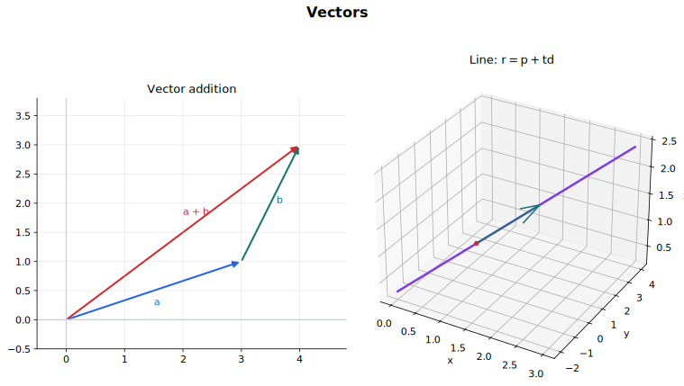

# Vectors Lecture Notes

Vectors describe magnitude and direction. In pure mathematics they give a compact language for position, displacement, straight lines, angles, perpendicularity, and three-dimensional geometry. The most important habit is to say what each vector represents: a point's position, a displacement from one point to another, a line's direction, or a plane's normal.

## Source Route

- 9709 3.7 Vectors
- 9231 1.6 Vectors
- Coursebook route: 9709 Pure Mathematics 2 and 3 Chapter 9; 9231 Further Mathematics vector content.

## Visual Guide

Figure: The guide shows vector addition and a parametric line. Use it to keep the geometry visible while doing component algebra.

## 1. Notation, Magnitude, and Unit Vectors

A vector in two or three dimensions may be written as a column vector or in unit-vector notation:

$$
\begin{pmatrix}x\\y\end{pmatrix}=x\mathbf i+y\mathbf j,
$$

or

$$
\begin{pmatrix}x\\y\\z\end{pmatrix}=x\mathbf i+y\mathbf j+z\mathbf k.
$$

Its magnitude is

$$
|\mathbf a|=\sqrt{x^2+y^2}
$$

in two dimensions, and

$$
|\mathbf a|=\sqrt{x^2+y^2+z^2}
$$

in three dimensions.

A unit vector in the direction of a non-zero vector $\mathbf a$ is

$$
\frac{\mathbf a}{|\mathbf a|}.
$$

Unit vectors keep direction but scale the length to $1$.

## 2. Position and Displacement

If point $A$ has position vector $\mathbf a$ and point $B$ has position vector $\mathbf b$, then the displacement from $A$ to $B$ is

$$
\overrightarrow{AB}=\mathbf b-\mathbf a.
$$

This is one of the most important distinctions in the topic. A position vector points from the origin to a point. A displacement vector points from one point to another and does not depend on the origin.

The midpoint of $AB$ has position vector

$$
\frac{1}{2}(\mathbf a+\mathbf b).
$$

Vector addition has a geometric meaning: follow one displacement, then the next. For a parallelogram $OABC$,

$$
\overrightarrow{OB}=\overrightarrow{OA}+\overrightarrow{OC}
$$

when the vectors are arranged as adjacent sides from $O$.

## 3. Vector Equation of a Line

A straight line in vector form is

$$
\mathbf r=\mathbf a+t\mathbf d.
$$

Here $\mathbf a$ is the position vector of one point on the line, $\mathbf d$ is a direction vector, and $t$ is a real parameter. The equation means: start at $\mathbf a$ and move any scalar multiple of $\mathbf d$.

If a line passes through points with position vectors $\mathbf a$ and $\mathbf b$, a direction vector is

$$
\mathbf b-\mathbf a,
$$

so the line can be written as

$$
\mathbf r=\mathbf a+t(\mathbf b-\mathbf a).
$$

To test whether two lines are parallel, compare their direction vectors. If the direction vectors are scalar multiples, the lines are parallel or identical. If not, solve the component equations to test for an intersection. In three dimensions, two lines can be neither parallel nor intersecting; such lines are skew.

## 4. Scalar Product

The scalar product, or dot product, connects vectors with angles:

$$
\mathbf a\cdot\mathbf b=|\mathbf a||\mathbf b|\cos\theta.
$$

In components,

$$
\mathbf a\cdot\mathbf b=a_1b_1+a_2b_2+a_3b_3.
$$

Therefore

$$
\cos\theta=\frac{\mathbf a\cdot\mathbf b}{|\mathbf a||\mathbf b|}.
$$

If $\mathbf a$ and $\mathbf b$ are non-zero and

$$
\mathbf a\cdot\mathbf b=0,
$$

then the vectors are perpendicular.

The scalar product also finds projections. The scalar projection of $\mathbf a$ onto $\mathbf b$ is

$$
\frac{\mathbf a\cdot\mathbf b}{|\mathbf b|}.
$$

This supports problems such as finding the foot of the perpendicular from a point to a line.

## 5. Further Vector Geometry

The following ideas belong mainly to 9231 but fit naturally after 9709 vectors.

The vector product $\mathbf a\times\mathbf b$ is perpendicular to both $\mathbf a$ and $\mathbf b$. Its magnitude is

$$
|\mathbf a\times\mathbf b|=|\mathbf a||\mathbf b|\sin\theta.
$$

It can be used for:

- area of a parallelogram spanned by two vectors;
- a normal vector to a plane;
- shortest-distance problems in three dimensions.

A plane can be written in normal form as

$$
(\mathbf r-\mathbf a)\cdot\mathbf n=0,
$$

where $\mathbf a$ is a point on the plane and $\mathbf n$ is a normal vector. It can also be written in Cartesian form

$$
ax+by+cz=d
$$

or in parametric form

$$
\mathbf r=\mathbf a+s\mathbf u+t\mathbf v.
$$

Here $\mathbf u$ and $\mathbf v$ are two non-parallel direction vectors lying in the plane.

Distance from a point to a plane uses the normal direction. Intersections between lines and planes are found by substituting the line equation into the plane equation. The angle between a line and a plane is best handled by comparing the line direction with the plane normal.

For two skew lines, the shortest distance is measured along a common perpendicular. A vector product of the two direction vectors gives a direction perpendicular to both lines.

## Worked-Thinking Routines

### Line Problems

1. Identify a point on the line and a direction vector.
2. Write $\mathbf r=\mathbf a+t\mathbf d$.
3. For intersections, equate components and solve parameters.
4. Check all components, not just two.
5. Classify as intersecting, parallel, identical, or skew.

### Angle or Perpendicularity

1. Choose the two direction vectors.
2. Use the scalar product.
3. For perpendicularity, test whether the dot product is zero.
4. For an angle, compute $\cos\theta$ and interpret the angle required by the problem.

### Plane Problems

1. Decide whether a normal vector or two direction vectors are given.
2. Choose normal, Cartesian, or parametric form accordingly.
3. Convert between forms using dot products or vector products.
4. Use substitution for intersections.
5. Check the geometry with a sketch.

## Common Mistakes

- Confusing a point with its position vector.
- Confusing a position vector with a displacement vector.
- Finding a unit vector but forgetting to divide by the magnitude.
- Using only two components to prove that 3D lines intersect.
- Assuming non-intersecting 3D lines are parallel.
- Using scalar product when a normal vector from a vector product is needed.
- Forgetting that a plane needs either one point and a normal, or one point and two independent directions.

## Quick Self-Check

You are ready to move on when you can:

- Move between column-vector and unit-vector notation.
- Find displacement vectors and midpoints from position vectors.
- Write a vector equation of a line from two points or from one point and a direction.
- Classify two 3D lines as parallel, intersecting, identical, or skew.
- Use scalar products for angles, perpendicularity, and projections.
- Explain what vector products and plane normals add in 9231.

## Connections

- [Matrices and Transformations](../10%20Matrices%20and%20Transformations/00%20Overview.md)
- [Physics Vectors](../../../10%20Physics/01%20Topics/01%20Physical%20Quantities%20and%20Units/00%20Overview.md)
