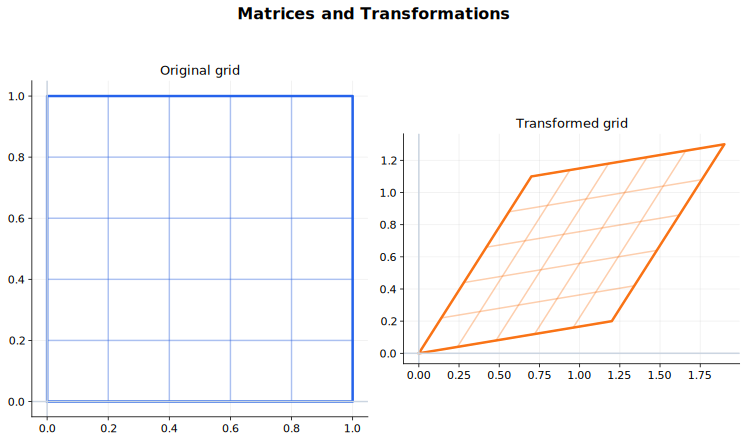

# Matrices and Transformations 中文讲义

矩阵不只是数字排成的表。它可以表示线性方程组，也可以表示线性变换。一个 $2\times2$ 矩阵作用在平面向量上，会把整个平面旋转、反射、伸缩、剪切，或者压扁。

读矩阵时要同时看两面：

- 代数上，它是一套计算规则；
- 几何上，它告诉你基向量和整个图形怎样移动；
- 线性代数上，它还能告诉你哪些方向保持不变，也就是 eigenvectors。

## 图示导读

这张图用来快速理解“矩阵与变换”：观察矩阵怎样把一个网格变形。

## 来源范围

- 9231 1.4 Matrices。
- 9231 2.2 Matrices。
- Coursebook route：9231 Further Mathematics Coursebook matrix and transformation chapters；Hodder FP1/FP2 matrix chapters。

## 学习范围

- 矩阵加减、数乘和乘法。
- 单位矩阵、逆矩阵和行列式。
- 二维线性变换：反射、旋转、伸缩、剪切。
- 复合变换和变换矩阵的构造。
- 不变点、不变直线、面积比例因子。
- 线性方程组、一致性、特征值、特征向量和对角化。

## 1. 矩阵运算

矩阵只有阶数合适时才能相加、相乘。加减要求两个矩阵同阶；乘法要求前一个矩阵的列数等于后一个矩阵的行数。

矩阵乘法一般不能交换：

$$
AB\ne BA.
$$

单位矩阵 $I$ 类似乘法里的 1：

$$
AI=IA=A.
$$

零矩阵的所有元素都是 0。

## 2. 矩阵乘向量

一个 $2\times 2$ 矩阵

$$
A=\begin{pmatrix}a&b\\c&d\end{pmatrix}
$$

作用在向量

$$
\begin{pmatrix}x\\y\end{pmatrix}
$$

上，得到

$$
A\begin{pmatrix}x\\y\end{pmatrix}
=
\begin{pmatrix}ax+by\\cx+dy\end{pmatrix}.
$$

几何上，这表示点 $(x,y)$ 被送到另一个点。整个图形的变换，就是每个点都这样变过去。

矩阵的两列有非常重要的意义：

$$
A\begin{pmatrix}1\\0\end{pmatrix}
=A\text{ 的第一列},
$$

$$
A\begin{pmatrix}0\\1\end{pmatrix}
=A\text{ 的第二列}.
$$

也就是说，矩阵的两列就是两个基向量变换后的像。构造变换矩阵时，先看基向量去哪里，再把它们作为列写进去。

## 3. 矩阵乘法顺序

如果先做 $B$，再做 $A$，总变换是

$$
AB.
$$

这是因为向量在右边：

$$
A(B\mathbf{x})=(AB)\mathbf{x}.
$$

做复合变换题时，顺序非常重要。文字里说“先反射，再旋转”，写矩阵时通常是旋转矩阵乘反射矩阵。

### 代表例：复合变换

先在 $x$ 方向伸长 2 倍，再绕原点逆时针旋转 $90^\circ$。

伸长矩阵是

$$
S=\begin{pmatrix}2&0\\0&1\end{pmatrix},
$$

旋转矩阵是

$$
R=\begin{pmatrix}0&-1\\1&0\end{pmatrix}.
$$

因为先做 $S$，再做 $R$，总矩阵是

$$
RS=
\begin{pmatrix}0&-1\\1&0\end{pmatrix}
\begin{pmatrix}2&0\\0&1\end{pmatrix}
=\begin{pmatrix}0&-1\\2&0\end{pmatrix}.
$$

它的行列式是 2，所以面积比例因子是 2。也可以检查基向量：$(1,0)$ 先变成 $(2,0)$，再变成 $(0,2)$，正好是总矩阵第一列。

## 4. 行列式和逆矩阵

如果矩阵 $A$ 有逆矩阵 $A^{-1}$，那么

$$
AA^{-1}=A^{-1}A=I.
$$

对

$$
A=\begin{pmatrix}a&b\\c&d\end{pmatrix},
$$

行列式是

$$
\det A=ad-bc.
$$

如果 $\det A\ne 0$，逆矩阵是

$$
A^{-1}=\frac{1}{ad-bc}\begin{pmatrix}d&-b\\-c&a\end{pmatrix}.
$$

如果 $\det A=0$，矩阵是奇异矩阵，不能求逆。几何上，变换把平面压扁到一条线或一个点，不能唯一反过来。

非奇异矩阵满足

$$
(AB)^{-1}=B^{-1}A^{-1}.
$$

逆的顺序反过来，是因为要先撤销最后做的变换。

二维变换的面积比例因子是

$$
|\det A|.
$$

## 5. 常见二维变换

关于 $x$ 轴反射：

$$
\begin{pmatrix}1&0\\0&-1\end{pmatrix}.
$$

关于 $y$ 轴反射：

$$
\begin{pmatrix}-1&0\\0&1\end{pmatrix}.
$$

逆时针旋转 $\theta$：

$$
\begin{pmatrix}\cos\theta&-\sin\theta\\
\sin\theta&\cos\theta\end{pmatrix}.
$$

在 $x$ 方向放大 $k$ 倍：

$$
\begin{pmatrix}k&0\\0&1\end{pmatrix}.
$$

记矩阵时不要死背。看它把基向量

$$
\begin{pmatrix}1\\0\end{pmatrix},\quad
\begin{pmatrix}0\\1\end{pmatrix}
$$

送到哪里，矩阵的两列就是这两个新向量。

## 6. 不变点和不变直线

不变点满足

$$
A\mathbf x=\mathbf x.
$$

也就是

$$
(A-I)\mathbf x=\mathbf0.
$$

不变直线是整条直线被映到自身。过原点的直线若方向向量为 $\mathbf v$，当 $A\mathbf v$ 与 $\mathbf v$ 平行时，这条方向就是不变方向。这和特征向量直接相关。

### 代表例：过原点的不变直线

设

$$
A=\begin{pmatrix}2&1\\0&1\end{pmatrix}.
$$

过原点的直线可写成 $y=mx$，方向向量取

$$
\begin{pmatrix}1\\m\end{pmatrix}.
$$

变换后

$$
A\begin{pmatrix}1\\m\end{pmatrix}
=\begin{pmatrix}2+m\\m\end{pmatrix}.
$$

若直线不变，新方向的斜率仍应为 $m$：

$$
\frac{m}{2+m}=m.
$$

所以

$$
m(1+m)=0.
$$

不变直线是

$$
y=0
\qquad\text{和}\qquad
y=-x.
$$

这也说明不变直线和特征向量方向是同一件事的两种说法。

## 7. 线性方程组

三个三元一次方程可以写成矩阵方程

$$
A\mathbf x=\mathbf b.
$$

如果 $A$ 非奇异，则唯一解是

$$
\mathbf x=A^{-1}\mathbf b.
$$

如果 $A$ 奇异，可能无解，也可能有无穷多解。几何上，三个平面可能交于一点、交于一条线，或者没有公共点。

## 8. 特征值和特征向量

如果非零向量 $\mathbf e$ 满足

$$
A\mathbf e=\lambda\mathbf e,
$$

那么 $\lambda$ 是特征值，$\mathbf e$ 是特征向量。

几何意义是：这个方向被矩阵变换后仍然留在原方向上，只是长度按 $\lambda$ 缩放，方向可能反向。

求特征值时解特征方程：

$$
\det(A-\lambda I)=0.
$$

每个特征值代回

$$
(A-\lambda I)\mathbf e=\mathbf0
$$

求对应特征向量。

## 9. 对角化和特征方程

如果矩阵有足够多线性无关的特征向量，可以写成

$$
A=QDQ^{-1}.
$$

$Q$ 的列是特征向量，$D$ 的对角线是对应特征值。这样求幂很方便：

$$
A^n=QD^nQ^{-1}.
$$

凯莱-哈密顿定理（Cayley-Hamilton theorem）说明方阵满足自己的特征方程。对 $2\times2$ 和 $3\times3$ 矩阵，它可以用来求矩阵幂或逆矩阵。

### 代表例：用对角化求矩阵幂

对

$$
A=\begin{pmatrix}3&1\\0&2\end{pmatrix},
$$

特征值是 $3$ 和 $2$。可以取对应特征向量

$$
\begin{pmatrix}1\\0\end{pmatrix},
\qquad
\begin{pmatrix}1\\-1\end{pmatrix}.
$$

于是

$$
Q=\begin{pmatrix}1&1\\0&-1\end{pmatrix},
\qquad
D=\begin{pmatrix}3&0\\0&2\end{pmatrix},
\qquad
A=QDQ^{-1}.
$$

这里 $Q^{-1}=Q$，所以

$$
A^n=QD^nQ^{-1}
=\begin{pmatrix}3^n&3^n-2^n\\0&2^n\end{pmatrix}.
$$

关键检查是：$Q$ 里特征向量的顺序必须和 $D$ 里特征值的顺序一致。

### 代表例：用凯莱-哈密顿定理求逆矩阵

对

$$
B=\begin{pmatrix}2&1\\1&2\end{pmatrix},
$$

特征方程是

$$
\lambda^2-4\lambda+3=0.
$$

根据凯莱-哈密顿定理，

$$
B^2-4B+3I=0.
$$

因为 $\det B=3\ne0$，可以两边乘 $B^{-1}$：

$$
B-4I+3B^{-1}=0.
$$

所以

$$
B^{-1}=\frac{1}{3}(4I-B)
=\frac{1}{3}\begin{pmatrix}2&-1\\-1&2\end{pmatrix}.
$$

当题目已经给出或容易得到特征方程时，这个方法比反复乘矩阵更清楚。

## 做题顺序

### 构造变换矩阵

1. 找 $\begin{pmatrix}1\\0\end{pmatrix}$ 变到哪里。
2. 找 $\begin{pmatrix}0\\1\end{pmatrix}$ 变到哪里。
3. 把这两个像作为矩阵的两列。
4. 复合变换按“右边先做”写乘积。
5. 用简单点检查结果。

### 逆矩阵和行列式

1. 先算行列式。
2. 行列式为 0，就停止求逆，解释矩阵奇异。
3. 行列式非零，再用公式求逆。
4. 必要时乘回 $I$ 检查。

### 特征值和特征向量

1. 写 $\det(A-\lambda I)=0$。
2. 解出特征值。
3. 对每个特征值解 $(A-\lambda I)\mathbf e=\mathbf0$。
4. 把特征向量理解成不变方向。
5. 对角化时，$Q$ 中特征向量的顺序要和 $D$ 中特征值顺序一致。

## 10. 用关键点检查图形变换

变换多边形时，只需要变换顶点，再连线。比如三角形的三个顶点变完，整个三角形就确定了。

如果结果看起来奇怪，检查两个基向量的去向。很多矩阵错误其实是把列写成了行，或把变换顺序写反。

## 常见错误

- 把 $AB$ 和 $BA$ 当成一样。
- 求逆矩阵时忘记除以行列式。
- 行列式为 0 时还强行求逆。
- 复合变换顺序写反。
- 构造变换矩阵时把基向量的像写成行，而不是列。
- 忘记面积比例因子是 $|\det A|$。
- 把零向量当成特征向量。
- 对角化时 $Q$ 和 $D$ 的顺序不对应。

## 快速自查

- 我能不能解释矩阵的两列表示什么？
- 我能不能判断一个矩阵是否可逆？
- 我能不能根据文字描述写出复合变换矩阵？
- 我能不能用关键点检查图形变换是否合理？
- 我能不能求特征值和特征向量？
- 我能不能说明对角化为什么能简化矩阵幂？

## 关联内容

- [Vectors](../08%20Vectors/00%20Overview.md)：矩阵变换作用在向量上，不变方向和特征向量也需要向量语言。
- [Coordinate Geometry and Graphs](../02%20Coordinate%20Geometry%20and%20Graphs/00%20Overview.md)：二维变换、图形检查和不变直线都依赖坐标几何。
