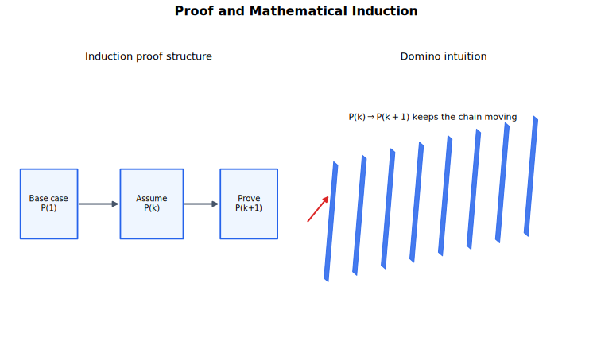

# Proof and Mathematical Induction Lecture Notes

Proof is the part of mathematics where you explain why a statement must be true, not only that it works in examples. Mathematical induction is a proof method for statements indexed by integers. It turns one verified starting case and one repeatable implication into a result for every integer in the required range.

## Source Route

- 9231 1.7 Proof by induction
- Coursebook route: 9231 Further Mathematics Coursebook proof by induction sections; Hodder FP1 proof chapter.

## Visual Guide

Figure: The guide shows the logic of induction: a base case starts the chain, and the induction step passes truth from one integer to the next.

## 1. Reading a Statement

Before proving anything, identify the proposition and its quantifiers. A statement such as

$$
P(n)\text{ is true for all integers }n\ge1
$$

is different from "there exists an integer $n$" or "for some values of $n$". Proof depends on the range and conditions.

Useful words to mark:

- for all;
- there exists;
- if ... then;
- if and only if;
- positive integer;
- non-zero;
- real, rational, integer, or natural number.

Examples can suggest a pattern, but they do not prove a universal statement.

## 2. Direct Proof, Contradiction, and Counterexample

A direct proof starts from definitions and assumptions, then derives the conclusion. For example, to prove that the square of an even integer is even, write $n=2k$ for some integer $k$:

$$
n^2=(2k)^2=4k^2=2(2k^2),
$$

so $n^2$ is even.

A proof by contradiction assumes the opposite of what you want, then derives an impossibility. This is useful for irrationality, uniqueness, and "no solution" claims.

A counterexample disproves a universal claim. If someone claims "all prime numbers are odd", the number $2$ is enough to disprove it.

## 3. Mathematical Induction

To prove $P(n)$ for all integers $n\ge n_0$, write four parts clearly.

1. Base case: prove $P(n_0)$.
2. Induction hypothesis: assume $P(k)$ is true for some integer $k\ge n_0$.
3. Induction step: prove $P(k+1)$ using the induction hypothesis.
4. Conclusion: state that $P(n)$ is true for all integers $n\ge n_0$.

The induction step must use the induction hypothesis. If it does not, the proof may be a different kind of proof, but it is not induction.

## 4. Summation Proofs

For a summation formula, the induction step usually adds the next term. Suppose

$$
P(n):\quad 1+2+\cdots+n=\frac{n(n+1)}{2}.
$$

The base case $n=1$ is true. Assume

$$
1+2+\cdots+k=\frac{k(k+1)}{2}.
$$

Then

$$
1+2+\cdots+k+(k+1)
=\frac{k(k+1)}{2}+(k+1)
=\frac{(k+1)(k+2)}{2}.
$$

This is the required form for $P(k+1)$.

A slightly richer summation proof follows the same pattern. Let

$$
P(n):\quad \sum_{r=1}^{n}r^2=\frac{n(n+1)(2n+1)}{6}.
$$

The base case $n=1$ is true. Assume

$$
\sum_{r=1}^{k}r^2=\frac{k(k+1)(2k+1)}{6}.
$$

Then

$$
\sum_{r=1}^{k+1}r^2
=\frac{k(k+1)(2k+1)}{6}+(k+1)^2
=\frac{(k+1)(k+2)(2k+3)}{6},
$$

which is the required formula with $n=k+1$. Therefore the result is true for all positive integers $n$.

More advanced summation proofs may involve $\sum r^3$, factorials, or expressions discovered from limited trials.

## 5. Divisibility Proofs

For divisibility, write the induction hypothesis in a form that exposes a factor. If the claim is "$A_n$ is divisible by $8$", the induction hypothesis means

$$
A_k=8m
$$

for some integer $m$.

In the induction step, manipulate $A_{k+1}$ until it contains $A_k$ or a known multiple of $8$. Then conclude the remaining expression is also a multiple of $8$.

The important phrase is "for some integer". Divisibility is not only about algebraic rearrangement; it is about proving the quotient is an integer.

For example, prove that $3^{2n+1}+5$ is divisible by $8$ for all integers $n\ge0$. The base case is

$$
3^{1}+5=8.
$$

Assume

$$
3^{2k+1}+5=8m
$$

for some integer $m$. Then

$$
3^{2(k+1)+1}+5
=9\cdot3^{2k+1}+5
=9(3^{2k+1}+5)-40
=8(9m-5).
$$

Since $9m-5$ is an integer, the expression is divisible by $8$ for $n=k+1$.

## 6. Recurrence and Matrix Proofs

If a sequence is defined recursively, the induction hypothesis gives a formula for $u_k$, and the recurrence gives $u_{k+1}$.

Example structure:

$$
u_{k+1}=3u_k-1.
$$

Assume the proposed formula for $u_k$, substitute it into the recurrence, and simplify to the proposed formula for $u_{k+1}$.

For a complete example, let $u_1=1$ and $u_{n+1}=3u_n-1$. Prove

$$
u_n=\frac{3^{n-1}+1}{2}.
$$

The base case $n=1$ gives $u_1=1$. Assume

$$
u_k=\frac{3^{k-1}+1}{2}.
$$

Then

$$
u_{k+1}=3u_k-1
=3\left(\frac{3^{k-1}+1}{2}\right)-1
=\frac{3^k+1}{2},
$$

which is the formula with $n=k+1$.

For matrix powers, induction often proves a formula for $A^n$. The step uses

$$
A^{k+1}=A^kA
$$

or

$$
A^{k+1}=AA^k,
$$

then the induction hypothesis replaces $A^k$.

For instance, if

$$
A=\begin{pmatrix}1&1\\0&1\end{pmatrix},
$$

then

$$
A^n=\begin{pmatrix}1&n\\0&1\end{pmatrix}
$$

for all positive integers $n$. The base case is $A^1=A$. If

$$
A^k=\begin{pmatrix}1&k\\0&1\end{pmatrix},
$$

then

$$
A^{k+1}=A^kA
=\begin{pmatrix}1&k\\0&1\end{pmatrix}
\begin{pmatrix}1&1\\0&1\end{pmatrix}
=\begin{pmatrix}1&k+1\\0&1\end{pmatrix}.
$$

## 7. Conjecture Before Proof

Sometimes the result is not given. The syllabus includes situations where limited trials suggest a conjecture, then induction proves it.

Typical workflow:

1. Compute the first few cases.
2. Look for a pattern.
3. State the conjecture as $P(n)$.
4. Prove it by induction.

This can occur with repeated differentiation, sums involving factorials, recurrence relations, or matrix powers.

## Worked-Thinking Routine

1. State $P(n)$ exactly.
2. Check the first required value of $n$.
3. Write the induction hypothesis clearly.
4. Start the step from the $k+1$ expression, not from the desired final line.
5. Use the induction hypothesis explicitly.
6. Simplify to the required $P(k+1)$ form.
7. Write the conclusion with the correct range of integers.

## Common Mistakes

- Proving only examples.
- Omitting the base case.
- Starting induction at the wrong value.
- Assuming $P(k+1)$ instead of deriving it.
- Not using the induction hypothesis.
- Writing "therefore true" without stating the range of $n$.
- In divisibility proofs, forgetting to say a quotient is an integer.
- Changing the statement being proved halfway through the proof.

## Quick Self-Check

You are ready to move on when you can:

- Identify the quantifiers and conditions in a statement.
- Decide whether direct proof, contradiction, counterexample, or induction is appropriate.
- Write a complete induction proof with base case, hypothesis, step, and conclusion.
- Prove summation, divisibility, recurrence, and matrix-power statements by induction.
- Form a conjecture from examples and then prove it.

## Connections

- [Sequences, Series and Binomial Expansions](../04%20Sequences%20Series%20and%20Binomial%20Expansions/00%20Overview.md)
