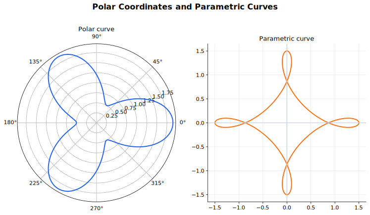

# Polar Coordinates and Parametric Curves Lecture Notes

Polar and parametric forms are alternative languages for curves. Polar coordinates describe a point by distance and direction from a pole. Parametric equations describe a curve by allowing both coordinates to depend on a third variable. These forms are useful when $y=f(x)$ hides the geometry or makes the algebra awkward.

## Source Route

- 9231 1.5 Polar coordinates
- 9709 parametric differentiation content
- Coursebook route: 9231 Further Mathematics Coursebook polar coordinate sections; 9709 Pure Mathematics 2 and 3 parametric differentiation sections.

## Visual Guide

Figure: The guide compares polar and parametric descriptions of curves. Use it to remember that a curve can be easier to understand in a coordinate system chosen for its shape.

## 1. Polar Coordinates

In Cartesian coordinates, a point is described by $(x,y)$. In polar coordinates, a point is described by

$$
(r,\theta),
$$

where $r$ is the distance from the pole and $\theta$ is the angle from the initial line. In the 9231 convention, $r\ge0$.

The conversion formulae are

$$
x=r\cos\theta,\qquad y=r\sin\theta,
$$

and

$$
r^2=x^2+y^2,\qquad \tan\theta=\frac{y}{x}.
$$

When finding $\theta$, check the quadrant. The tangent ratio alone does not determine the angle.

## 2. Polar Curves

A polar curve is often written as

$$
r=f(\theta).
$$

As $\theta$ changes, the radius changes. To sketch a polar curve, do not try to plot dozens of points. Look for:

- symmetry;
- intersections with the initial line;
- values of $\theta$ where $r=0$;
- least and greatest values of $r$;
- the given angle interval.

Examples:

$$
r=a
$$

is a circle centred at the pole.

The curve

$$
r=a\cos\theta
$$

can be converted by multiplying by $r$:

$$
r^2=ar\cos\theta,
$$

so

$$
x^2+y^2=ax.
$$

This is a circle.

A compact curve-tracing example is

$$
r=2+2\cos\theta,\qquad 0\le\theta\le\pi.
$$

Check key values:

$$
r(0)=4,\qquad r\left(\frac{\pi}{2}\right)=2,\qquad r(\pi)=0.
$$

The radius is non-negative on this interval, so the path starts on the initial line at distance $4$, passes through $(2,\pi/2)$, and reaches the pole at $\theta=\pi$. The full curve is symmetric about the initial line, but this interval traces the upper half.

## 3. Area in Polar Coordinates

The area swept out by a polar curve from $\theta=\alpha$ to $\theta=\beta$ is

$$
A=\frac{1}{2}\int_\alpha^\beta r^2\,d\theta.
$$

This comes from the sector area formula $\frac{1}{2}r^2\theta$. The integral adds many small sectors.

Choose limits from the geometry, not from habit. If a curve is traced more than once over an interval, the area integral may double-count. Sketch first.

For example,

$$
r=2a\cos\theta
$$

is the circle

$$
x^2+y^2=2ax.
$$

With the convention $r\ge0$, one complete tracing occurs for

$$
-\frac{\pi}{2}\le\theta\le\frac{\pi}{2},
$$

because $r=0$ at both endpoints and $r>0$ between them. The area is

$$
A=\frac{1}{2}\int_{-\pi/2}^{\pi/2}4a^2\cos^2\theta\,d\theta
=\pi a^2,
$$

matching the area of a circle of radius $a$.

## 4. Parametric Curves

A parametric curve is described by

$$
x=x(t),\qquad y=y(t).
$$

The parameter $t$ may represent time, but it does not have to. As $t$ changes, the point $(x(t),y(t))$ traces the curve.

Example:

$$
x=\cos t,\qquad y=\sin t
$$

traces the unit circle because

$$
x^2+y^2=1.
$$

Eliminating the parameter can reveal the Cartesian equation, but keep the parameter range. If $x=t+1$ and $y=t^2$, then $y=(x-1)^2$; if $t\ge0$, then $x\ge1$.

## 5. Differentiating Parametric Curves

For

$$
x=x(t),\qquad y=y(t),
$$

the gradient is

$$
\frac{dy}{dx}=\frac{\frac{dy}{dt}}{\frac{dx}{dt}},
\qquad \frac{dx}{dt}\ne0.
$$

For a tangent, first find the parameter value, then the point, then the gradient. Do not treat $\frac{dy}{dt}$ as the gradient of the curve in the $xy$-plane.

The second derivative is

$$
\frac{d^2y}{dx^2}
=\frac{\frac{d}{dt}\left(\frac{dy}{dx}\right)}{\frac{dx}{dt}}.
$$

For example, let

$$
x=t^2,\qquad y=t^3.
$$

When $t\ne0$,

$$
\frac{dy}{dx}
=\frac{3t^2}{2t}
=\frac{3t}{2}.
$$

At $t=1$, the point is $(1,1)$ and the tangent gradient is $\frac{3}{2}$, so the tangent is

$$
y-1=\frac{3}{2}(x-1).
$$

The normal gradient is the negative reciprocal, $-\frac{2}{3}$, so the normal is

$$
y-1=-\frac{2}{3}(x-1).
$$

If $\frac{dx}{dt}=0$ but $\frac{dy}{dt}\ne0$, do not divide by zero; this usually signals a tangent parallel to the $y$-axis.

## 6. Arc Length and Related Further Ideas

Parametric form is useful in integration. For a parametric curve,

$$
\frac{ds}{dt}
=\sqrt{\left(\frac{dx}{dt}\right)^2+\left(\frac{dy}{dt}\right)^2},
$$

so arc length is

$$
L=\int_{t_1}^{t_2}
\sqrt{\left(\frac{dx}{dt}\right)^2+\left(\frac{dy}{dt}\right)^2}\,dt.
$$

For a circular arc

$$
x=a\cos t,\qquad y=a\sin t,\qquad 0\le t\le\frac{\pi}{2},
$$

we have

$$
\frac{ds}{dt}
=\sqrt{a^2\sin^2t+a^2\cos^2t}
=a,
$$

so

$$
L=\int_0^{\pi/2}a\,dt=\frac{\pi a}{2}.
$$

For polar curves, later integration work uses

$$
L=\int_\alpha^\beta \sqrt{r^2+\left(\frac{dr}{d\theta}\right)^2}\,d\theta.
$$

The same rule applies: identify the variable, interval, and geometry before integrating.

## Worked-Thinking Routines

### Polar Sketch

1. Note the angle interval.
2. Test symmetry.
3. Find values where $r=0$.
4. Find least and greatest values of $r$.
5. Mark key angles and sketch the path.

### Polar Area

1. Sketch the region.
2. Choose angle limits from the sketch.
3. Use $A=\frac{1}{2}\int r^2\,d\theta$.
4. Check whether the curve is traced once or more than once.

### Parametric Curve

1. Identify the parameter interval.
2. Find key points by substituting parameter values.
3. Eliminate the parameter only if it helps.
4. Use $\frac{dy/dt}{dx/dt}$ for gradient.
5. Keep parameter restrictions after conversion.

## Common Mistakes

- Using the wrong angle interval.
- Forgetting the convention $r\ge0$ when using polar coordinates.
- Computing $\theta$ from tangent without checking the quadrant.
- Double-counting polar area.
- Eliminating a parameter but forgetting the original range.
- Treating $\frac{dy}{dt}$ as $\frac{dy}{dx}$.
- Dividing by $\frac{dx}{dt}$ at a vertical tangent without checking the geometry.
- Assuming the parameter must be time.

## Quick Self-Check

You are ready to move on when you can:

- Convert between Cartesian and polar coordinates.
- Sketch simple polar curves using symmetry and key values.
- Use $\frac{1}{2}\int r^2\,d\theta$ for polar area.
- Interpret and eliminate parametric equations.
- Find tangent and normal equations for parametric curves.
- Use parametric or polar arc length formulae with the correct interval.
- Preserve interval restrictions when changing representation.

## Connections

- [Coordinate Geometry and Graphs](../02%20Coordinate%20Geometry%20and%20Graphs/00%20Overview.md)
- [Differentiation](../05%20Differentiation/00%20Overview.md)
