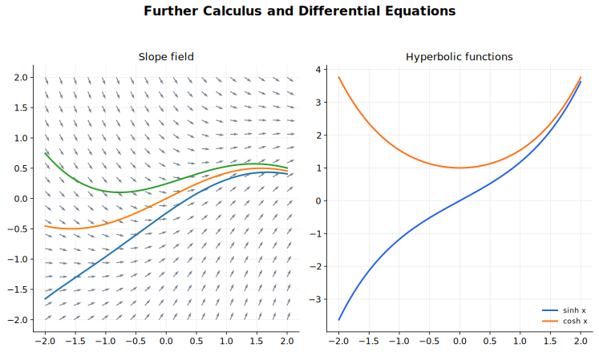

# Further Calculus and Differential Equations Lecture Notes

Further calculus extends the differentiation and integration toolkit. Differential equations use that toolkit to describe quantities whose rates of change are part of the problem. The goal is not only to solve equations, but to interpret the behaviour of the solution.

## Source Route

- 9709 3.8 Differential equations
- 9231 2.1 Hyperbolic functions
- 9231 2.3 Differentiation
- 9231 2.4 Integration
- 9231 2.6 Differential equations
- Coursebook route: 9709 Pure Mathematics 2 and 3 Chapter 10; 9231 Further Mathematics Coursebook chapters on hyperbolic functions, further calculus, and differential equations.

## Visual Guide

Figure: The guide shows a slope field with solution curves. A differential equation gives local slope information; solving it finds curves that follow those slopes.

## 1. Hyperbolic Functions

The hyperbolic functions are defined using exponentials:

$$
\sinh x=\frac{e^x-e^{-x}}{2},
\qquad
\cosh x=\frac{e^x+e^{-x}}{2},
$$

and

$$
\tanh x=\frac{\sinh x}{\cosh x}.
$$

The reciprocal hyperbolic functions are $\operatorname{sech}x$, $\operatorname{cosech}x$, and $\coth x$.

The central identity is

$$
\cosh^2x-\sinh^2x=1.
$$

Hyperbolic functions have identities similar to trigonometric identities, but with sign changes. The sign changes are not decoration: they come from the exponential definitions. For example, $\cosh x$ is even, $\sinh x$ is odd, and $\cosh x\ge1$ for all real $x$.

The inverse hyperbolic functions have logarithmic forms:

$$
\sinh^{-1}x=\ln\left(x+\sqrt{x^2+1}\right),
$$

$$
\cosh^{-1}x=\ln\left(x+\sqrt{x^2-1}\right),\qquad x\ge1,
$$

and

$$
\tanh^{-1}x=\frac12\ln\left(\frac{1+x}{1-x}\right),\qquad |x|<1.
$$

Here the power $-1$ means inverse function, not reciprocal. The reciprocal functions are $\operatorname{cosech}x$, $\operatorname{sech}x$, and $\coth x$.

A typical derivation is to set $y=\sinh^{-1}x$, so $x=\sinh y=\frac{e^y-e^{-y}}{2}$. With $u=e^y>0$,

$$
u^2-2xu-1=0,
$$

so $u=x+\sqrt{x^2+1}$ and $y=\ln\left(x+\sqrt{x^2+1}\right)$. The positive root is required because $u=e^y>0$.

The corresponding inverse-function derivatives are:

$$
\frac{d}{dx}\sinh^{-1}x=\frac1{\sqrt{x^2+1}},
\qquad
\frac{d}{dx}\cosh^{-1}x=\frac1{\sqrt{x^2-1}},
\qquad
\frac{d}{dx}\tanh^{-1}x=\frac1{1-x^2}.
$$

## 2. Further Differentiation and Maclaurin Series

The 9231 differentiation toolkit includes hyperbolic functions, inverse trigonometric functions, inverse hyperbolic functions, and second derivatives for implicit or parametric curves.

A Maclaurin series expands a function around $x=0$:

$$
f(x)=f(0)+xf'(0)+\frac{x^2}{2!}f''(0)+\frac{x^3}{3!}f'''(0)+\cdots.
$$

The work is systematic: differentiate repeatedly, evaluate at $0$, and substitute. Sometimes implicit differentiation is used to find successive derivatives efficiently, for example after rewriting a derivative in terms of $y$.

Many standard Maclaurin series can be obtained from known expansions. From the exponential definitions,

$$
\sinh x=x+\frac{x^3}{3!}+\frac{x^5}{5!}+\cdots,
\qquad
\cosh x=1+\frac{x^2}{2!}+\frac{x^4}{4!}+\cdots.
$$

For a product, keep only the terms that can affect the requested order. For example, up to and including the term in $x^3$,

$$
e^x\cos x
=\left(1+x+\frac{x^2}{2}+\frac{x^3}{6}+\cdots\right)
\left(1-\frac{x^2}{2}+\cdots\right)
=1+x-\frac{x^3}{3}+\cdots.
$$

The missing $x^2$ term is not a mistake; the contributions $\frac{x^2}{2}$ and $-\frac{x^2}{2}$ cancel. A good Maclaurin answer should state the order of approximation and should not include terms that could be changed by omitted higher-order terms.

## 3. Further Integration Techniques

Further integration includes hyperbolic functions, completing the square, trigonometric and hyperbolic substitutions, integration by parts, reduction formulae, rectangular estimates, arc length, and surface area of revolution.

A substitution is chosen to simplify the structure that is causing the difficulty:

| Structure | Common substitution or recognition |
| --- | --- |
| $\sqrt{a^2-x^2}$ | $x=a\sin\theta$, or recognise an inverse sine form |
| $\sqrt{x^2+a^2}$ | $x=a\sinh u$, or recognise an inverse hyperbolic sine form |
| $\sqrt{x^2-a^2}$ | $x=a\cosh u$ when $x\ge a$, or a trigonometric secant substitution |
| completed square | shift the variable first, then use a standard form |

For example,

$$
\int\frac{dx}{\sqrt{x^2+a^2}}
=\sinh^{-1}\left(\frac{x}{a}\right)+C
=\ln\left|x+\sqrt{x^2+a^2}\right|+C',
$$

where constants absorb terms such as $-\ln a$. The method boundary is important: substitutions are useful when they remove a square root, expose a standard derivative, or convert a repeated pattern. They are poor choices if they merely make a rational integral more complicated.

A reduction formula relates an integral with parameter $n$ to another with a smaller parameter. It is usually created by integration by parts or by differentiating a product. For

$$
I_n=\int_0^{\pi/2}\sin^n x\,dx,
$$

write $I_n=\int_0^{\pi/2}\sin^{n-1}x\sin x\,dx$ and integrate by parts. The boundary term vanishes, so

$$
I_n=(n-1)\int_0^{\pi/2}\sin^{n-2}x\cos^2x\,dx.
$$

Using $\cos^2x=1-\sin^2x$ gives

$$
I_n=(n-1)(I_{n-2}-I_n),
$$

and hence

$$
I_n=\frac{n-1}{n}I_{n-2}.
$$

After deriving a reduction formula, check the starting values such as $I_0$ and $I_1$; the recurrence alone does not evaluate the whole family.

The point of these techniques is method selection. Before calculating, ask what structure is visible: product, composite, rational function, square root of a quadratic, or repeated power.

## 4. Separable Differential Equations

A differential equation relates an unknown function to its derivatives. In 9709, a main type is separable:

$$
\frac{dy}{dx}=g(x)h(y).
$$

Separate variables:

$$
\frac{1}{h(y)}\,dy=g(x)\,dx,
$$

then integrate both sides.

Example:

$$
\frac{dy}{dx}=xy
$$

gives

$$
\frac{1}{y}\,dy=x\,dx.
$$

Integrating,

$$
\ln|y|=\frac{x^2}{2}+C,
$$

so

$$
y=Ae^{x^2/2}
$$

for a non-zero constant $A$, with any special zero solution checked separately if relevant.

Initial conditions choose a particular solution from the general family.

## 5. Modelling with Differential Equations

A rate statement becomes a differential equation. For example, "the rate of change of $y$ is proportional to $y$" becomes

$$
\frac{dy}{dt}=ky.
$$

The constant $k$ must be introduced and later evaluated if data or an initial condition is given.

After solving, interpret the solution in context:

- Is the quantity increasing or decreasing?
- Does it approach a limiting value?
- What does the arbitrary constant mean?
- Does the domain make sense for the model?

## 6. First-Order Linear Differential Equations

In 9231, a first-order linear equation has standard form

$$
\frac{dy}{dx}+P(x)y=Q(x).
$$

The integrating factor is

$$
\mu(x)=e^{\int P(x)\,dx}.
$$

Multiplying the equation by $\mu(x)$ makes the left side a product derivative:

$$
\frac{d}{dx}(\mu y)=\mu Q(x).
$$

Then integrate and solve for $y$.

For example,

$$
\frac{dy}{dx}+2y=e^{-x}
$$

has integrating factor $\mu=e^{2x}$. Therefore

$$
\frac{d}{dx}(e^{2x}y)=e^x,
$$

so

$$
e^{2x}y=e^x+C
$$

and

$$
y=e^{-x}+Ce^{-2x}.
$$

The most common error is failing to first divide through so that the coefficient of $\frac{dy}{dx}$ is $1$. The constant of integration inside $\int P(x)\,dx$ is normally omitted, because it only multiplies $\mu$ by a non-zero constant and cancels out of the final product-derivative equation.

## 7. Linear Equations with Constant Coefficients

For a linear differential equation with constant coefficients, the general solution is

$$
\text{general solution}=\text{complementary function}+\text{particular integral}.
$$

The complementary function solves the homogeneous equation. For example,

$$
\frac{d^2y}{dx^2}-3\frac{dy}{dx}+2y=0
$$

has auxiliary equation

$$
\lambda^2-3\lambda+2=0.
$$

Since $\lambda=1,2$, the complementary function is

$$
y=Ae^x+Be^{2x}.
$$

Second-order equations include distinct real roots, repeated real roots, and conjugate complex roots. For an auxiliary equation with roots $m$:

| Auxiliary roots | Complementary function |
| --- | --- |
| distinct real roots $\alpha,\beta$ | $Ae^{\alpha x}+Be^{\beta x}$ |
| repeated real root $\alpha$ | $(A+Bx)e^{\alpha x}$ |
| complex roots $\alpha\pm i\beta$ | $e^{\alpha x}(A\cos\beta x+B\sin\beta x)$ |

First-order constant-coefficient equations use the same idea with a first-degree auxiliary equation.

The particular integral is chosen to match the forcing term, such as a polynomial, $ae^{bx}$, or $a\cos px+b\sin px$. Substitute the trial form into the differential equation to determine coefficients.

Useful trial forms are:

| Forcing term | Try |
| --- | --- |
| polynomial of degree $n$ | polynomial of degree $n$ |
| $ke^{ax}$ | $Ae^{ax}$ |
| $k\cos px+l\sin px$ | $A\cos px+B\sin px$ |

If the trial form is already part of the complementary function, multiply the trial by $x$ until it becomes independent. For example, if the forcing term is $e^x$ and $e^x$ is already in the complementary function, try $Axe^x$ instead of $Ae^x$. This adjustment is the usual boundary between a correct particular-integral trial and one that collapses into the homogeneous solution.

## 8. Substitutions in Differential Equations

Some differential equations become standard only after a given substitution. For example, a substitution such as $x=e^t$ can reduce an equation to one with constant coefficients, and a substitution such as $y=ux$ can reduce certain equations to separable form.

When a substitution is given:

1. Rewrite derivatives carefully.
2. Substitute into the equation.
3. Solve the transformed equation.
4. Convert back to the original variables.

Two derivative conversions are especially common. If $x=e^t$, then

$$
\frac{dy}{dx}=\frac1x\frac{dy}{dt},
\qquad
\frac{d^2y}{dx^2}=\frac1{x^2}\left(\frac{d^2y}{dt^2}-\frac{dy}{dt}\right).
$$

If $y=ux$, where $u$ is a function of $x$, then

$$
\frac{dy}{dx}=u+x\frac{du}{dx}.
$$

The substitution is not the answer by itself; the final solution must be written in the original variables unless the question explicitly asks otherwise.

## Worked-Thinking Routines

### Differential Equation from Words

1. Identify the changing quantity and independent variable.
2. Translate "rate of change" into a derivative.
3. Introduce a constant of proportionality if needed.
4. Solve the differential equation.
5. Use initial or boundary conditions.
6. Interpret the result in context.

### Solving a Differential Equation

1. Classify the equation: separable, first-order linear, constant-coefficient linear, or substitution-based.
2. Put it into standard form.
3. Apply the matching method.
4. Include arbitrary constants.
5. Apply conditions for a particular solution.
6. Differentiate and substitute back to check.

## Common Mistakes

- Dropping arbitrary constants.
- Separating variables incorrectly.
- Forgetting special constant solutions.
- Using an integrating factor before putting the equation in standard form.
- Confusing complementary function with particular integral.
- Choosing a particular-integral trial form that duplicates the complementary function without adjusting it.
- Using a substitution but forgetting to convert all derivatives and the final answer back to the original variables.
- Solving symbolically but not interpreting the solution in context.

## Quick Self-Check

You are ready to move on when you can:

- Use hyperbolic definitions, identities, inverse logarithmic forms, and domains.
- Form the first few Maclaurin terms of a function and state the order used.
- Recognise further integration structures, including reduction formulae and substitution choices.
- Solve separable differential equations.
- Translate simple rate statements into differential equations.
- Solve first-order linear equations using an integrating factor.
- Solve constant-coefficient linear differential equations using complementary functions, particular integrals, and the resonance adjustment.
- Use initial or boundary conditions and check the final solution.

## Connections

- [Differentiation](../05%20Differentiation/00%20Overview.md)
- [Integration](../06%20Integration/00%20Overview.md)
- [Physics Oscillations](../../../10%20Physics/01%20Topics/17%20Oscillations/00%20Overview.md)
