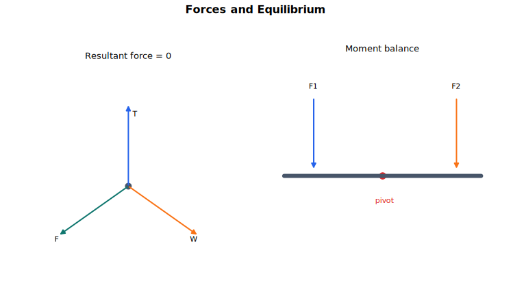

# Forces and Equilibrium Lecture Notes

Equilibrium is the first modelling language of mechanics. A physical situation is reduced to a chosen body, the forces acting on it, and the condition that there is no resultant tendency to translate. For a rigid body there is one more check: there must also be no resultant tendency to rotate.

## Source Route

- 9709 4.1 Forces and equilibrium
- 9231 3.2 Equilibrium of a rigid body
- Coursebook route: 9709 Mechanics force and equilibrium chapters; 9231 Further Mechanics rigid-body equilibrium content.

## Visual Guide

Figure: use the diagram to keep force balance and moment balance as separate checks.

## 1. What Equilibrium Means

For a particle in equilibrium, the vector sum of the forces acting on it is zero:

$$
\sum \mathbf F=\mathbf 0.
$$

In practice this is usually written by resolving forces in two perpendicular directions:

$$
\sum F_x=0,\qquad \sum F_y=0.
$$

For a rigid body, force balance is not enough. A body can have zero resultant force and still have a resultant turning effect. Rigid-body equilibrium requires both

$$
\sum \mathbf F=\mathbf 0,\qquad \sum M=0,
$$

where moments are taken about any convenient point.

The modelling process is always the same:

1. Choose the body or system.
2. Draw only the forces acting on that body.
3. State contact assumptions such as smooth, rough, light string, or smooth pulley.
4. Resolve forces or take moments.
5. Check signs, units, and whether the answer matches the physical situation.

## 2. Force Diagrams

A force diagram is not a picture of the whole scene. It is a diagram of one chosen body with every external force acting on it. Do not include forces that the body exerts on other objects; those belong on the other object's diagram.

Common forces are:

- weight $mg$, acting vertically downwards;
- a normal contact force $R$, perpendicular to the contact surface;
- tension $T$, acting along a string or rope away from the body;
- thrust or compression in a light rigid rod, acting along the rod;
- friction $F$, acting along the contact surface and opposing actual or impending relative motion;
- applied forces, with their directions and angles as given.

A smooth contact is modelled as frictionless, so the contact force is normal only. A rough contact may include friction as well as the normal component. These are idealised models: the question chooses the model so that the calculation is possible.

Newton's third law says that two interacting bodies exert equal and opposite forces on each other. The two forces act on different bodies, so they should not cancel on the same force diagram.

When a situation contains several bodies, draw separate diagrams before deciding whether to combine equations. For example, a block pulled by a string over a pulley has tension acting on the block; the block's pull on the string belongs on the string or pulley model, not on the block. If you later treat several bodies as one system, internal tensions can cancel algebraically, but they should first be understood as forces between different chosen bodies.

## 3. Resolving Forces

Choose axes that make the equations simple. On a horizontal surface, horizontal and vertical axes are natural. On an inclined plane, axes parallel and perpendicular to the plane usually reduce the algebra.

If a particle is on a plane inclined at angle $\theta$ to the horizontal, the weight has components

$$
mg\sin\theta
$$

down the plane, and

$$
mg\cos\theta
$$

perpendicular into the plane. The most reliable way to remember this is to draw the right triangle for the components and check the limiting cases: if $\theta=0$, the down-plane component should be zero and the normal component should be $mg$.

Triangle of forces and Lami's theorem can be efficient in special three-force problems, but resolving forces is the standard method because it works in nearly every equilibrium question.

**Compact example: rough inclined plane.** A particle of mass $m$ rests on a rough plane inclined at angle $\theta$, held by friction alone. Resolve perpendicular to the plane first:

$$
R=mg\cos\theta.
$$

Along the plane, equilibrium requires an up-plane friction force

$$
F=mg\sin\theta.
$$

The particle can remain at rest only if $mg\sin\theta\le \mu mg\cos\theta$, so $\tan\theta\le \mu$. At the greatest possible angle before slipping, the inequality becomes equality. This example shows why the normal reaction is found before using the friction limit.

## 4. Friction and Limiting Equilibrium

The frictional force is not automatically equal to $\mu R$. The coefficient of friction gives the largest possible friction before slipping:

$$
F\le \mu R.
$$

At limiting equilibrium, also described as "about to slip", friction has reached its limiting value:

$$
F=\mu R.
$$

The direction of friction opposes actual motion or impending motion. If you assume a direction and later obtain a negative value for $F$, the magnitude is still useful but the assumed direction was opposite to the real one.

Limiting equilibrium can happen in more than one possible direction. A body on a rough slope may be about to slide down the slope, so friction acts up the slope. If it is being pulled hard up the slope, it may instead be about to slide up the slope, so friction acts down the slope. The words "about to move" are not enough on their own; decide the impending motion before assigning the direction of friction.

## 5. Moments and Rigid Bodies

The moment of a force about a point measures its turning effect about that point. In this syllabus context, only coplanar forces are needed, so the magnitude of a moment is

$$
\text{moment}=F d,
$$

where $d$ is the perpendicular distance from the point to the line of action of the force.

When taking moments, choose a point that removes unwanted unknown forces. If a force passes through the chosen point, its moment about that point is zero. This is why taking moments about a hinge, support, or contact point often simplifies a rigid-body problem.

For a single rigid body in equilibrium under coplanar forces:

$$
\sum F_x=0,\qquad \sum F_y=0,\qquad \sum M=0.
$$

These equations are also a diagnostic tool. If a rigid body is about to slide, friction is limiting. If it is about to topple, the normal contact force has shifted to an edge or pivot point, and the line of action of the weight is critical.

**Compact example: loaded beam.** A uniform beam of length $4$ m and weight $60$ N rests on supports at its two ends. A $100$ N load is placed $1$ m from the left end. Let the reactions at the left and right supports be $R_A$ and $R_B$. Vertical force balance gives

$$
R_A+R_B=160.
$$

Taking moments about the left support removes $R_A$:

$$
4R_B=100(1)+60(2),
$$

so $R_B=55$ N and $R_A=105$ N. Notice that the beam's own weight acts at its centre of mass, while the load acts at its stated position. Moment equations are not extra decoration; they are what distinguish a rigid-body problem from a particle problem.

## 6. Centre of Mass

For a rigid body, the effect of gravity is equivalent to a single force $mg$ acting at the centre of mass. Symmetry is the first tool: the centre of mass of a uniform body lies on every axis of symmetry.

For a composite body, replace each part by a particle of its own mass at its own centre of mass, then take moments or weighted averages. For example, if two parts have masses $m_1$ and $m_2$ and centres at positions $x_1$ and $x_2$ along a line, the centre of mass has coordinate

$$
\bar x=\frac{m_1x_1+m_2x_2}{m_1+m_2}.
$$

Area may replace mass for a uniform lamina, and volume may replace mass for a uniform solid of constant density.

For toppling questions, the centre of mass gives a quick physical check. A body supported on a base is just about to topple when the line of action of its weight passes through the edge that becomes the pivot. Before that point, the normal reaction can still act somewhere within the base; after that point, no non-negative normal reaction distribution can keep the body in rotational equilibrium.

## Worked-Thinking Routine

1. Choose the object and draw a force diagram.
2. Mark known angles, distances, and contact assumptions.
3. Decide whether the object is a particle or a rigid body.
4. For a particle, resolve forces in two directions.
5. For a rigid body, add a moment equation about a useful point.
6. For rough contact, decide whether friction is limiting before using $F=\mu R$.
7. Interpret the signs of unknowns rather than hiding them.

## Common Mistakes

- Drawing action and reaction forces on the same body.
- Treating every friction force as $\mu R$ instead of using $F\le \mu R$.
- Resolving weight incorrectly on an inclined plane.
- Using a slanted distance instead of the perpendicular distance in a moment.
- Checking force equilibrium for a rigid body but forgetting moment equilibrium.
- Assuming a normal contact force stays at the centre of a base when the body is close to toppling.

## Quick Self-Check

- Can you draw a clean force diagram for a body on a rough inclined plane?
- Can you explain the difference between $F\le \mu R$ and $F=\mu R$?
- Can you choose axes that avoid unnecessary trigonometry?
- Can you take moments about a point that removes an unknown reaction?
- Can you tell whether a rigid body is more likely to slide or topple?

## Connections

- [Kinematics and Newtonian Motion](../02%20Kinematics%20and%20Newtonian%20Motion/00%20Overview.md)
- [Work, Energy, Power and Elasticity](../04%20Work%20Energy%20Power%20and%20Elasticity/00%20Overview.md)
- [Physics Forces, Density and Pressure](../../../10%20Physics/01%20Topics/04%20Forces%20Density%20and%20Pressure/00%20Overview.md)

## Study Sequence

1. Practise drawing force diagrams before solving equations.
2. Do several particle equilibrium problems with different axes.
3. Add rough contact and limiting friction.
4. Move to rigid-body moment problems.
5. Finish by comparing sliding, toppling, and centre-of-mass questions.
