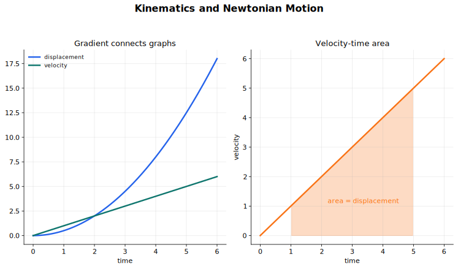

# Kinematics and Newtonian Motion Lecture Notes

Kinematics describes motion. Newtonian motion explains motion by connecting force and acceleration. Keep those two jobs separate while learning: first describe how position and velocity change, then ask what resultant force would produce that acceleration.

## Source Route

- 9709 4.2 Kinematics of motion in a straight line
- 9709 4.4 Newton's laws of motion
- Coursebook route: 9709 Mechanics kinematics and Newton's laws chapters; linked to Physics kinematics and dynamics.

## Visual Guide

Figure: use the diagram to connect motion graphs, calculus relationships, and the force model.

## 1. Quantities and Sign Conventions

In one-dimensional motion, the first decision is the positive direction. After that, every displacement, velocity, acceleration, and force component must follow that sign convention.

Distance and speed are scalar quantities. They tell you how far or how fast without direction. Displacement, velocity, and acceleration are vector quantities in this syllabus context; in a straight-line problem that means they may be positive or negative.

The basic calculus links are

$$
v=\frac{ds}{dt},\qquad a=\frac{dv}{dt}.
$$

Going the other way,

$$
s=\int v\,dt,\qquad v=\int a\,dt,
$$

with constants of integration found from the initial conditions.

## 2. Motion Graphs

Graphs are not decorations in kinematics. They are another form of the same information.

For a displacement-time graph:

- the gradient is velocity;
- a horizontal tangent means zero velocity at that instant;
- increasing steepness means increasing speed in the positive direction.

For a velocity-time graph:

- the gradient is acceleration;
- the area under the graph is displacement, with area below the time axis counted as negative;
- a crossing of the time axis means the particle changes direction.

Graph questions often become simple once you translate "gradient" and "area" before doing any algebra.

If a velocity-time graph is made from straight-line pieces, treat each piece separately. The gradient of each piece gives the acceleration on that interval, and the signed area gives the displacement on that interval. Total distance is different: add the magnitudes of the areas whenever the velocity changes sign.

**Compact example: reading a velocity-time graph.** Suppose a particle's velocity increases uniformly from $2$ m s$^{-1}$ to $8$ m s$^{-1}$ in the first $3$ s, then decreases uniformly to $0$ m s$^{-1}$ in the next $2$ s. The displacement is the total area:

$$
\frac12(2+8)(3)+\frac12(8+0)(2)=15+8=23\text{ m}.
$$

The acceleration is $2$ m s$^{-2}$ on the first interval and $-4$ m s$^{-2}$ on the second. A single acceleration value for the whole motion would hide the change in model.

## 3. Constant-Acceleration Formulae

When acceleration is constant, the standard formulae are

$$
v=u+at,
$$

$$
s=ut+\frac12at^2,
$$

$$
v^2=u^2+2as,
$$

and

$$
s=\frac12(u+v)t.
$$

Here $u$ is initial velocity, $v$ is final velocity, $a$ is constant acceleration, $s$ is displacement, and $t$ is time.

These formulae are powerful because they remove calculus, but only when $a$ is constant. If acceleration changes with time, return to $v=ds/dt$ and $a=dv/dt$.

Vertical motion is just constant acceleration with gravity. If upward is positive, a freely moving particle has acceleration $-g$; if downward is positive, it has acceleration $g$. The sign is not a property of gravity alone, but of your coordinate choice.

## 4. Variable Acceleration

For variable acceleration, choose the calculus form that matches the independent variable in the question.

- If $v$ or $a$ is given as a function of $t$, use
  $$
  v=\frac{ds}{dt},\qquad a=\frac{dv}{dt}.
  $$
- If $a$ is given as a function of displacement $s$, use the chain rule
  $$
  a=\frac{dv}{dt}=\frac{dv}{ds}\frac{ds}{dt}=v\frac{dv}{ds}.
  $$

The second form is mainly an extension tool for variable-force or position-dependent motion, but it is worth recognising early because it prevents trying to force everything into time equations.

**Compact example: acceleration depending on time.** If $a=6t$ and $v=4$ when $t=0$, then

$$
v=\int 6t\,dt=3t^2+C.
$$

The initial condition gives $C=4$, so $v=3t^2+4$. If also $s=0$ when $t=0$, then

$$
s=\int (3t^2+4)\,dt=t^3+4t.
$$

At each integration step, the constant has physical meaning: initial velocity first, then initial displacement.

## 5. From Kinematics to Dynamics

Newton's second law is the bridge from forces to acceleration:

$$
\sum F=ma.
$$

The left side is the resultant force in the chosen direction, not just one convenient force. Before using the equation, draw a force diagram and resolve forces along the direction of motion.

Mass and weight are connected by

$$
W=mg.
$$

Mass is the amount of matter and is measured in kilograms. Weight is a force and is measured in newtons.

In this topic, the usual models are particles of constant mass under constant forces. Forces may include weight, tension, friction, normal contact force, thrust in a rod, or an applied force. If resistance such as air resistance is relevant, the question must specify it.

## 6. Connected Particles

Connected-particle questions test modelling as much as algebra. A light inextensible string gives connected particles the same magnitude of acceleration along the string. A smooth pulley changes the direction of tension without changing its magnitude in the ideal model.

There are two useful viewpoints.

- Treat each particle separately when you need the tension.
- Treat the connected particles as one system when you want to eliminate internal tension.

For example, if two particles are connected by a light string over a smooth pulley, write $\sum F=ma$ for each particle with a consistent direction of motion. The tension appears in both equations and can often be eliminated by adding them.

**Compact example: two particles over a smooth pulley.** Let masses $3$ kg and $2$ kg hang over a smooth pulley, connected by a light inextensible string. If the $3$ kg mass moves downward, write

$$
3g-T=3a,
$$

and for the $2$ kg mass moving upward,

$$
T-2g=2a.
$$

Adding gives $g=5a$, so $a=\frac15g$. Substituting back gives $T=2g+2a=\frac{12}{5}g$. The two equations use different positive directions for the two particles, but both positive directions follow the actual string motion.

## 7. Method Choice

Start by identifying which information is given.

- Use constant-acceleration formulae when acceleration is constant and the unknown is one of $u,v,a,s,t$.
- Use graphs when slopes or areas are given or requested.
- Use calculus when velocity or acceleration is given as a function of time.
- Use $a=v\dfrac{dv}{ds}$ when acceleration is naturally given as a function of displacement.
- Use Newton's second law when forces are given and acceleration is unknown.
- Use the whole-system method when internal tensions are distracting.

## Worked-Thinking Routine

1. State the positive direction.
2. Identify whether the problem is kinematics only, or whether forces are involved.
3. For kinematics, choose graph, formula, or calculus.
4. For dynamics, draw the force diagram before writing $\sum F=ma$.
5. Keep units consistent: metres, seconds, kilograms, newtons.
6. Interpret negative answers as direction information.

## Common Mistakes

- Changing the positive direction halfway through.
- Using distance when the equation requires displacement.
- Treating speed and velocity as interchangeable.
- Using constant-acceleration formulae when acceleration varies.
- Reading height instead of area on a velocity-time graph.
- Writing $F=ma$ for a single force instead of the resultant force.
- Forgetting that connected particles share acceleration magnitude only under the ideal string constraint.

## Quick Self-Check

- Can you explain the difference between distance and displacement?
- Can you read velocity and acceleration from motion graphs?
- Can you decide whether the constant-acceleration formulae are allowed?
- Can you derive $s$ from $v(t)$, or $v$ from $a(t)$?
- Can you draw a force diagram and turn it into $\sum F=ma$?

## Connections

- [Forces and Equilibrium](../01%20Forces%20and%20Equilibrium/00%20Overview.md)
- [Work, Energy, Power and Elasticity](../04%20Work%20Energy%20Power%20and%20Elasticity/00%20Overview.md)
- [Physics Kinematics](../../../10%20Physics/01%20Topics/02%20Kinematics/00%20Overview.md)
- [Physics Dynamics](../../../10%20Physics/01%20Topics/03%20Dynamics/00%20Overview.md)

## Study Sequence

1. Practise sign conventions with short straight-line examples.
2. Translate displacement-time and velocity-time graphs into words.
3. Use constant-acceleration formulae until you can choose the right equation quickly.
4. Rework the same motion with calculus where possible.
5. Add force diagrams and Newton's second law.
6. Finish with connected-particle models.
