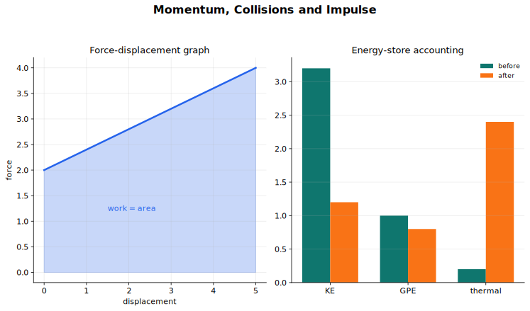

# Momentum, Collisions and Impulse Lecture Notes

Momentum is the quantity that stays useful when interactions are brief and forces are hard to know in detail. In a collision, the contact force may be large and variable, but the total momentum of a suitable system can often be tracked before and after the impact.

## Source Route

- 9709 4.3 Momentum
- 9231 3.6 Momentum
- Coursebook route: 9709 Mechanics momentum chapter; 9231 Further Mechanics momentum and impact content.

## Visual Guide

Figure: use the guide to separate before-and-after momentum from impulse as force accumulated over time.

## 1. Momentum and System Boundaries

Linear momentum is

$$
p=mv.
$$

It is a vector quantity. In one-dimensional problems, that means velocities must carry signs. A negative velocity after a collision is not a failure; it means the particle moves in the direction opposite to your chosen positive direction.

For a system with no external impulse in a chosen direction, total momentum in that direction is conserved:

$$
\sum m u=\sum m v.
$$

The phrase "in a chosen direction" matters. Momentum can be conserved horizontally even if vertical external forces are present, and in oblique impact each component must be considered separately.

## 2. Impulse

Impulse is the effect of a force acting over a time interval. For a constant force,

$$
I=Ft.
$$

For a variable force,

$$
I=\int F\,dt,
$$

so impulse is the area under a force-time graph. The impulse-momentum relation is

$$
I=\Delta p=m(v-u).
$$

During a collision between two bodies, the impulses they exert on each other are equal and opposite. This is why internal collision forces do not change the total momentum of the two-body system.

On a force-time graph, use signed area. A force in the chosen positive direction gives positive impulse; a force in the opposite direction gives negative impulse. If the graph is a triangle or trapezium, ordinary area formulae are usually enough.

**Compact example: impulse-time area.** A force rises linearly from $0$ to $40$ N and then returns linearly to $0$ over a total time of $0.5$ s. The impulse is the triangular area

$$
I=\frac12(0.5)(40)=10\text{ N s}.
$$

If this impulse acts in the direction of motion on a $2$ kg particle initially moving at $3$ m s$^{-1}$, then

$$
10=2(v-3),
$$

so $v=8$ m s$^{-1}$.

## 3. Direct Impact

A direct impact is one-dimensional along the line of motion or line of centres. Let two bodies of masses $m_1$ and $m_2$ have velocities $u_1,u_2$ before impact and $v_1,v_2$ after impact, all measured in the same positive direction. Momentum conservation gives

$$
m_1u_1+m_2u_2=m_1v_1+m_2v_2.
$$

For 9709-style direct impact, this equation may be enough, especially when the bodies coalesce. If they stick together, then

$$
v_1=v_2.
$$

For 9231 impact problems, momentum conservation is usually paired with Newton's experimental law through the coefficient of restitution.

## 4. Coefficient of Restitution

The coefficient of restitution $e$ measures how much relative speed along the line of impact remains after a collision:

$$
e=\frac{\text{speed of separation}}{\text{speed of approach}},
\qquad 0\le e\le 1.
$$

In a common one-dimensional setup where body 1 approaches body 2, this becomes

$$
e=\frac{v_2-v_1}{u_1-u_2}.
$$

The numerator is the relative speed after impact, and the denominator is the relative speed before impact. Do not memorise only the positions of the symbols; identify which bodies are separating and approaching.

Special cases:

- $e=1$: perfectly elastic impact.
- $e=0$: inelastic impact, with no separation speed along the line of impact.
- $0<e<1$: kinetic energy is lost from mechanical form during impact.

**Compact example: direct impact with energy loss.** A $2$ kg particle moving at $5$ m s$^{-1}$ strikes a $1$ kg particle at rest. If $e=\frac12$, momentum conservation and restitution give

$$
10=2v_1+v_2,\qquad v_2-v_1=\frac12(5-0).
$$

Solving gives $v_1=2.5$ m s$^{-1}$ and $v_2=5$ m s$^{-1}$. The kinetic energy before impact is

$$
\frac12(2)(5^2)=25\text{ J},
$$

and after impact it is

$$
\frac12(2)(2.5^2)+\frac12(1)(5^2)=18.75\text{ J}.
$$

The lost mechanical energy is $6.25$ J. Momentum is conserved for the two-particle system, but kinetic energy is not conserved because $e<1$.

## 5. Oblique Impact

In oblique impact of smooth spheres, choose axes along the line of centres and perpendicular to it. Smooth contact means the impulse acts along the line of centres only. Therefore:

- along the line of centres, use momentum conservation and restitution;
- perpendicular to the line of centres, each sphere's velocity component is unchanged.

For impact with a fixed smooth surface, resolve velocity into normal and tangential components. The tangential component is unchanged. The normal component reverses direction and is multiplied in magnitude by $e$:

$$
v_{\text{normal after}}=-e\,u_{\text{normal before}}.
$$

This component view is the cleanest way to avoid confusion about angles after impact.

For a smooth sphere hitting a smooth fixed plane, "normal" means perpendicular to the plane and "tangential" means parallel to the plane. If the incoming speed is $u$ at angle $\alpha$ to the normal, the incoming components are $u\cos\alpha$ normal and $u\sin\alpha$ tangential. After impact, the tangential component is still $u\sin\alpha$, while the normal component has magnitude $eu\cos\alpha$ in the opposite normal direction. The angle after impact should be found from the new component ratio, not assumed to equal the angle before impact.

## 6. Energy as a Check

Momentum conservation does not mean kinetic energy conservation. In a perfectly elastic collision, kinetic energy is conserved. In most impact models with $e<1$, kinetic energy decreases. The lost mechanical energy has gone into deformation, sound, heat, or internal energy.

Use energy mainly as a check unless the problem explicitly gives an elastic collision. If your calculation gives a gain in kinetic energy with no external energy input, check your signs and restitution equation.

## Worked-Thinking Routine

1. Define the system and the direction or axes.
2. Label all before-impact and after-impact velocities with signs.
3. Decide whether external impulse can be ignored in the direction used.
4. Write momentum conservation for the relevant direction.
5. Add a second equation: coalescence, restitution, or an unchanged tangential component.
6. Check whether the final velocities make physical sense.
7. Use kinetic energy as a final reasonableness check.

## Common Mistakes

- Ignoring direction in momentum.
- Treating momentum conservation as automatic when there is an external impulse.
- Reversing speed of approach and speed of separation in the restitution equation.
- Assuming every collision conserves kinetic energy.
- Forgetting that smooth oblique impact leaves tangential components unchanged.
- Deleting a negative velocity instead of interpreting it as direction.

## Quick Self-Check

- Can you explain why impulse equals change in momentum?
- Can you choose a system where internal impulses cancel?
- Can you write momentum conservation with signed velocities?
- Can you form the restitution equation from approach and separation?
- Can you resolve an oblique impact into normal and tangential components?

## Connections

- [Kinematics and Newtonian Motion](../02%20Kinematics%20and%20Newtonian%20Motion/00%20Overview.md)
- [Work, Energy, Power and Elasticity](../04%20Work%20Energy%20Power%20and%20Elasticity/00%20Overview.md)
- [Physics Dynamics](../../../10%20Physics/01%20Topics/03%20Dynamics/00%20Overview.md)

## Study Sequence

1. Start with one-dimensional momentum conservation.
2. Add coalescence and signed velocities.
3. Introduce impulse using force-time area.
4. Add the coefficient of restitution.
5. Move to oblique impact by resolving into normal and tangential components.
