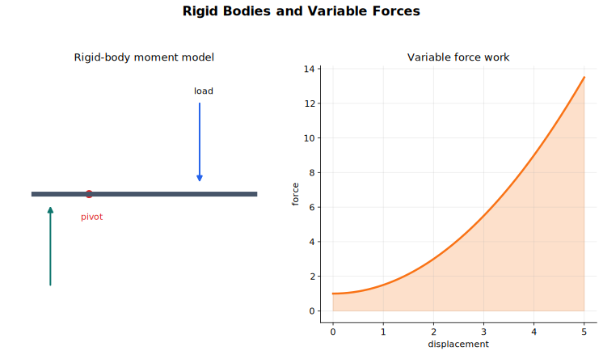

# Rigid Bodies and Variable Forces Lecture Notes

This topic extends mechanics in two directions. Rigid bodies make shape and rotation unavoidable. Variable forces make calculus unavoidable. In both cases, the main skill is choosing the right model before writing equations.

## Source Route

- 9231 3.2 Equilibrium of a rigid body
- 9231 3.5 Linear motion under a variable force
- Coursebook route: 9231 Further Mechanics rigid-body and variable-force content.

## Visual Guide

Figure: use the diagram to connect moment balance for an extended body with calculus for a variable force.

## 1. Rigid Bodies Beyond Particles

A particle model ignores size and rotation. A rigid body has shape, so forces can have turning effects. For coplanar forces, rigid-body equilibrium requires

$$
\sum F_x=0,\qquad \sum F_y=0,\qquad \sum M=0.
$$

The moment equation is not optional. A body can have zero resultant force and still rotate if the moments do not balance.

Choose the point for taking moments strategically. A force passing through the chosen point has zero moment, so taking moments about a hinge, contact point, or support often removes unknown reactions.

## 2. Centre of Mass

The effect of gravity on a rigid body is equivalent to a single force $mg$ acting at the centre of mass. For uniform bodies, symmetry is the first method: the centre of mass lies on every line or plane of symmetry.

For composite bodies, replace each part by a particle at its own centre of mass. In one dimension,

$$
\bar x=\frac{\sum m_i x_i}{\sum m_i}.
$$

For a uniform lamina, mass is proportional to area, so areas may replace masses:

$$
\bar x=\frac{\sum A_i x_i}{\sum A_i}.
$$

For composite shapes with holes, treat the removed part as negative area or negative mass. Keep the reference axis fixed throughout the calculation.

## 3. Sliding and Toppling

Rigid-body questions often ask whether a body is about to slide or topple.

For sliding, friction reaches its limiting value:

$$
F=\mu R.
$$

For toppling, the normal reaction shifts to an edge or pivot point. The limiting condition is usually found by taking moments about that edge. The line of action of the weight through the centre of mass is what decides the turning effect.

If both sliding and toppling are possible, calculate the condition for each and compare which occurs first.

A compact comparison helps. Suppose a uniform rectangular block of weight $mg$ has half-width $a$ and is pulled horizontally by a force $P$ applied at height $h$ above the floor. If it is about to slide on a rough horizontal floor, then

$$
P=\mu mg.
$$

If it is about to topple about the lower far edge, take moments about that edge:

$$
Ph=mga,\qquad P=\frac{mga}{h}.
$$

The smaller of $\mu mg$ and $mga/h$ gives the first limiting event. This comparison is often more reliable than trying to guess from the picture.

## 4. Variable Forces and Newton's Second Law

When the force is not constant, acceleration is not usually constant, so the constant-acceleration formulae are no longer available. Start from Newton's second law:

$$
m a=F.
$$

Choose the form of acceleration that matches the variables in the force.

If force is given in terms of time, use

$$
a=\frac{dv}{dt}.
$$

If force is given in terms of displacement, use the chain rule form

$$
a=v\frac{dv}{dx}.
$$

If force is given in terms of velocity, either form may be useful: $m\,dv/dt=F(v)$ gives time as a function of speed, while $m v\,dv/dx=F(v)$ gives displacement as a function of speed. Let the question decide which final variable is wanted.

The syllabus keeps these differential equations separable, so after writing the equation your job is usually to rearrange variables and integrate.

## 5. Work Done by a Variable Force

If a force depends on position, the work done from $x=a$ to $x=b$ is

$$
W=\int_a^b F(x)\,dx.
$$

This can be used with the work-energy principle

$$
W=\Delta KE.
$$

For example, if a particle of mass $m$ starts with speed $u$ at $x=a$ and reaches speed $v$ at $x=b$ under a single force $F(x)$, then

$$
\int_a^b F(x)\,dx=\frac12mv^2-\frac12mu^2.
$$

This energy method often avoids solving explicitly for $v(x)$ or $x(t)$.

## 6. Solving Variable-Force Motion

The sequence is:

1. Choose the positive direction and variable.
2. Write the resultant force in that direction.
3. Replace $a$ by $dv/dt$ or $v\,dv/dx$.
4. Separate variables.
5. Integrate and use initial conditions.
6. Interpret the result in the original physical context.

For instance, if $m v\,dv/dx=F(x)$, then

$$
m v\,dv=F(x)\,dx,
$$

and integration gives a relationship between $v$ and $x$.

Two compact examples show the choice of acceleration form.

If a particle starts from rest and the resultant force is $F=kt$, then

$$
m\frac{dv}{dt}=kt,
$$

so

$$
v=\frac{k}{2m}t^2
$$

after using $v=0$ when $t=0$.

If a particle has speed $u$ at $x=0$ and the resultant force is $F=kx$, then use

$$
m v\frac{dv}{dx}=kx.
$$

Separating and integrating gives

$$
\frac12m(v^2-u^2)=\frac12kx^2,
$$

so

$$
v^2=u^2+\frac{k}{m}x^2.
$$

## Common Mistakes

- Treating an extended body as a particle when moments matter.
- Taking moments with a non-perpendicular distance.
- Moving the centre of mass calculation reference point halfway through.
- Using $F=\mu R$ before establishing limiting friction.
- Using constant-acceleration formulae under a variable force.
- Choosing $dv/dt$ when the force is naturally a function of $x$, or choosing $v\,dv/dx$ when time is the natural variable.
- Forgetting constants of integration and initial conditions.

## Quick Self-Check

- Can you decide whether a body must be treated as rigid rather than as a particle?
- Can you choose a moment point that removes an unknown force?
- Can you compute the centre of mass of a composite lamina using areas?
- Can you distinguish sliding from toppling conditions?
- Can you choose between $a=dv/dt$ and $a=v\,dv/dx$?
- Can you connect variable-force work with change in kinetic energy?

## Connections

- [Forces and Equilibrium](../01%20Forces%20and%20Equilibrium/00%20Overview.md)
- [Work, Energy, Power and Elasticity](../04%20Work%20Energy%20Power%20and%20Elasticity/00%20Overview.md)
- [Integration](../../01%20Pure%20Mathematics/06%20Integration/00%20Overview.md)
- [Further Calculus and Differential Equations](../../01%20Pure%20Mathematics/13%20Further%20Calculus%20and%20Differential%20Equations/00%20Overview.md)

## Study Sequence

1. Revisit rigid-body moment balance from equilibrium.
2. Practise centre-of-mass calculations for simple composite bodies.
3. Compare sliding and toppling thresholds.
4. Review separable differential equations.
5. Set up variable-force motion equations.
6. Use work-energy as an alternative route where the force depends on position.
