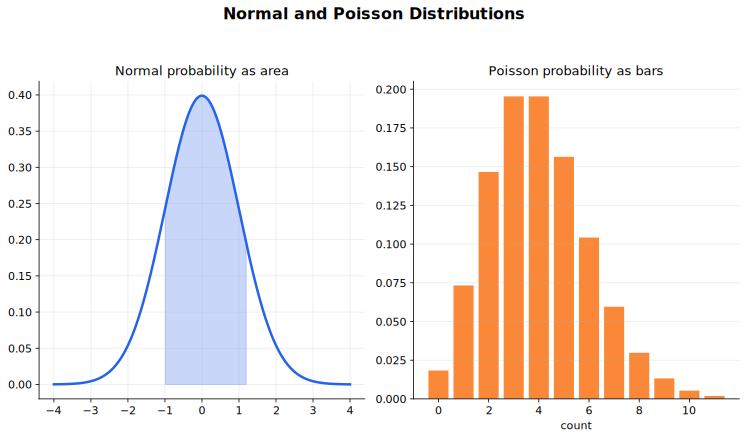

# Normal and Poisson Distributions Lecture Notes

The normal distribution models continuous variation around a centre. The Poisson distribution models counts of random events in a fixed interval. They are different kinds of distribution, but they meet through approximation and through linear combinations of random variables.

## Source Route

- 9709 5.5 The normal distribution
- 9709 6.1 The Poisson distribution
- 9709 6.2 Linear combinations of random variables
- Coursebook route: 9709 Probability and Statistics 1 normal distribution chapter; 9709 Probability and Statistics 2 Poisson and linear combinations chapters.

## Visual Guide

Figure: use the guide to compare continuous normal area with discrete Poisson counts.

## 1. Normal Distribution

If

$$
X\sim N(\mu,\sigma^2),
$$

then $X$ is normally distributed with mean $\mu$ and variance $\sigma^2$. The standard deviation is $\sigma$, not $\sigma^2$.

The normal curve is continuous, bell-shaped, and symmetric about $\mu$. Probabilities are areas under the curve. Since the distribution is continuous,

$$
P(X=a)=0,
$$

so inequalities such as $<$ and $\le$ give the same probability.

## 2. Standardisation and Inverse Normal Questions

The standard normal variable is

$$
Z=\frac{X-\mu}{\sigma},
\qquad Z\sim N(0,1).
$$

Standardisation turns a value of $X$ into a number of standard deviations from the mean. Sketch the curve first, mark the required area, then standardise the boundary value.

For an interval,

$$
P(a<X<b)=P\left(\frac{a-\mu}{\sigma}<Z<\frac{b-\mu}{\sigma}\right).
$$

Inverse probability questions run the process backwards. The critical values table gives $z$ from a left-tail probability:

$$
P(Z\le z)=p.
$$

If the probability is given as an upper tail, convert it first. For example, $P(Z>z)=0.05$ means $P(Z\le z)=0.95$, so $z\approx 1.645$. If the probability is below the mean, the $z$ value is negative; for example, $P(Z\le z)=0.10$ gives $z\approx -1.282$.

After the tail direction is settled, solve

$$
z=\frac{x-\mu}{\sigma}
$$

for the unknown boundary, mean, or standard deviation. Common forms are

$$
x=\mu+z\sigma,\qquad \mu=x-z\sigma,\qquad \sigma=\frac{x-\mu}{z}.
$$

The last formula needs care: if $z$ is negative, then $x-\mu$ should be negative too for a positive standard deviation. If a question gives two percentile statements, write two equations, such as

$$
\frac{x_1-\mu}{\sigma}=z_1,\qquad \frac{x_2-\mu}{\sigma}=z_2,
$$

then solve them simultaneously. Symmetric percentiles are faster: if the $10$th and $90$th percentiles are given, their midpoint is $\mu$ because the corresponding $z$ values are opposites.

Compact example: if $X\sim N(50,8^2)$ and $P(X>x)=0.10$, then the left-tail probability is $0.90$, so $z\approx 1.282$. Hence

$$
x=50+1.282(8)\approx 60.3.
$$

The sign of $z$ is a check: an upper-tail probability of $0.10$ puts the boundary above the mean.

## 3. Poisson Distribution

The Poisson distribution models counts of random events in a fixed interval of time, distance, area, or volume when events occur independently at an approximately constant average rate.

If

$$
X\sim \operatorname{Po}(\lambda),
$$

then

$$
P(X=r)=\frac{e^{-\lambda}\lambda^r}{r!},
\qquad r=0,1,2,\ldots.
$$

For a Poisson variable,

$$
E(X)=\operatorname{Var}(X)=\lambda.
$$

The parameter must match the interval. If the mean number of calls per hour is $6$, then the mean number in $30$ minutes is $3$, and the mean number in $2$ hours is $12$.

## 4. Linear Combinations

Linear transformations behave predictably:

$$
E(aX+b)=aE(X)+b,\qquad \operatorname{Var}(aX+b)=a^2\operatorname{Var}(X).
$$

If $X$ and $Y$ are independent, then

$$
E(aX+bY)=aE(X)+bE(Y),
$$

and

$$
\operatorname{Var}(aX+bY)=a^2\operatorname{Var}(X)+b^2\operatorname{Var}(Y).
$$

Independence is needed for the variance result above. Do not add standard deviations; transform and add variances.

Distribution type may also be preserved:

- if $X$ is normal, then $aX+b$ is normal;
- if independent $X$ and $Y$ are normal, then $aX+bY$ is normal;
- if independent $X$ and $Y$ are Poisson, then $X+Y$ is Poisson with parameter equal to the sum of the parameters.

More explicitly, if

$$
X\sim N(\mu_X,\sigma_X^2),\qquad Y\sim N(\mu_Y,\sigma_Y^2),
$$

and $X$ and $Y$ are independent, then

$$
aX+bY+c\sim N(a\mu_X+b\mu_Y+c,\ a^2\sigma_X^2+b^2\sigma_Y^2).
$$

For example, if $X\sim N(20,4)$ and $Y\sim N(30,9)$ are independent, then

$$
2X-Y\sim N(2(20)-30,\ 2^2(4)+(-1)^2(9))=N(10,25).
$$

Therefore

$$
P(2X-Y>15)=P\left(Z>\frac{15-10}{5}\right)=P(Z>1)\approx 0.159.
$$

Normal variables are stable under subtraction as well as addition, because negative coefficients are allowed. Poisson variables are more restrictive: if

$$
X\sim \operatorname{Po}(\lambda_1),\qquad Y\sim \operatorname{Po}(\lambda_2),
$$

and $X$ and $Y$ are independent, then

$$
X+Y\sim \operatorname{Po}(\lambda_1+\lambda_2).
$$

A difference such as $X-Y$, or a scaled variable such as $2X$, is not generally Poisson.

## 5. Approximations and Continuity Correction

Use the normal approximation to $B(n,p)$ when $n$ is large enough that both

$$
np>5,\qquad nq>5,
$$

where $q=1-p$. Then

$$
B(n,p)\approx N(np,npq).
$$

Use the Poisson approximation to $B(n,p)$ when $n$ is large and $p$ is small, with the syllabus rule of thumb

$$
n>50,\qquad np<5.
$$

Then

$$
B(n,p)\approx \operatorname{Po}(np).
$$

Use the normal approximation to $\operatorname{Po}(\lambda)$ when $\lambda$ is large, approximately $\lambda>15$:

$$
\operatorname{Po}(\lambda)\approx N(\lambda,\lambda).
$$

Whenever a discrete distribution is approximated by a continuous normal distribution, use a continuity correction. For example,

$$
P(X\le 10)\approx P(Y<10.5),
$$

and

$$
P(4\le X\le 10)\approx P(3.5<Y<10.5).
$$

Compact example: if $X\sim B(80,0.4)$, then $np=32$ and $nq=48$, so a normal approximation is reasonable:

$$
X\approx Y,\qquad Y\sim N(32,19.2).
$$

For

$$
P(X\ge 35),
$$

use the corrected boundary

$$
P(Y>34.5),
$$

not $P(Y>35)$. The correction moves the continuous boundary halfway between the discrete values $34$ and $35$.

## Worked-Thinking Routine

1. Identify whether the variable is continuous measurement or a count.
2. State the distribution and parameters, including units for rates.
3. Sketch the probability region.
4. For normal questions, standardise boundaries.
5. For Poisson questions, check the interval and adjust $\lambda$ if needed.
6. For approximations, state the condition and apply continuity correction.
7. Interpret the probability in the original context.

## Common Mistakes

- Treating $\sigma^2$ as the standard deviation in $N(\mu,\sigma^2)$.
- Standardising with variance instead of standard deviation.
- Forgetting to scale $\lambda$ when the interval changes.
- Using Poisson for counts that are not plausibly independent or rate-stable.
- Forgetting continuity correction when approximating a discrete distribution by a normal distribution.
- Adding variances for random variables that are not independent.
- Treating a difference of Poisson variables as Poisson.

## Quick Self-Check

- Can you standardise $X$ to $Z$ and reverse the process for inverse questions?
- Can you read normal probabilities as areas?
- Can you decide whether a count is plausibly Poisson?
- Can you adjust a Poisson parameter to a new interval?
- Can you choose the correct approximation and continuity correction?

## Connections

- [Discrete Random Variables](../03%20Discrete%20Random%20Variables/00%20Overview.md)
- [Sampling, Estimation and Hypothesis Tests](../06%20Sampling%20Estimation%20and%20Hypothesis%20Tests/00%20Overview.md)

## Study Sequence

1. Practise normal sketches and standardisation.
2. Work inverse normal questions.
3. Learn Poisson probabilities and parameter scaling.
4. Study linear combinations of normal and Poisson variables.
5. Practise binomial, Poisson, and normal approximations with continuity correction.
