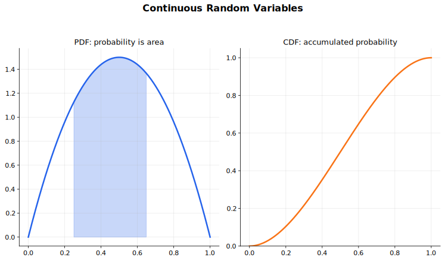

# Continuous Random Variables Lecture Notes

A continuous random variable is described by density, not by point probabilities. The height of a density curve is not itself a probability; probability is area under the curve.

## Source Route

- 9709 6.3 Continuous random variables
- 9231 4.1 Continuous random variables
- Coursebook route: 9709 Probability and Statistics 2 continuous random variable chapter; 9231 Further Probability and Statistics continuous random variable content.

## Visual Guide

Figure: use the guide to connect density as local shape with cumulative distribution as accumulated area.

## 1. Probability Density Functions

For a continuous random variable $X$, a probability density function $f$ must satisfy

$$
f(x)\ge 0
$$

on its support, and

$$
\int_{-\infty}^{\infty} f(x)\,dx=1.
$$

The support is the set of values where the density is not zero. Always write it down, especially for piecewise density functions.

For any interval,

$$
P(a<X<b)=\int_a^b f(x)\,dx.
$$

For a single point,

$$
P(X=a)=0.
$$

This is why $P(a<X<b)$, $P(a\le X<b)$, and $P(a\le X\le b)$ are equal for continuous variables.

## 2. Finding Constants and Probabilities

If a density function contains an unknown constant, use total area $1$. For example, if

$$
f(x)=kx,\qquad 0\le x\le 2,
$$

then

$$
\int_0^2 kx\,dx=1.
$$

After $k$ is known, probabilities are found by integrating over the required interval. For piecewise functions, split the integral at the breakpoints. The most common mistake is integrating beyond the support or forgetting a piece.

For a piecewise density, the support and the breakpoints control the work. Suppose

$$
f(x)=
\begin{cases}
kx, & 0\le x\le 1,\\
k(2-x), & 1<x\le 2,\\
0, & \text{otherwise}.
\end{cases}
$$

Then

$$
\int_0^1 kx\,dx+\int_1^2 k(2-x)\,dx=1,
$$

so $k=1$. A probability such as $P(0.5<X<1.5)$ must be split at $x=1$:

$$
P(0.5<X<1.5)=\int_{0.5}^{1}x\,dx+\int_1^{1.5}(2-x)\,dx.
$$

## 3. Cumulative Distribution Functions

The cumulative distribution function is

$$
F(x)=P(X\le x).
$$

It accumulates area from the left:

$$
F(x)=\int_{-\infty}^{x} f(t)\,dt.
$$

Where differentiable,

$$
f(x)=F'(x).
$$

CDFs are often the cleanest way to find percentiles:

$$
F(m)=0.5
$$

defines the median, and

$$
F(x_p)=p
$$

defines the $p$th quantile.

For the piecewise density above, the CDF is also piecewise. For $0\le x\le 1$,

$$
F(x)=\int_0^x t\,dt=\frac{x^2}{2}.
$$

For $1<x\le 2$,

$$
F(x)=\frac12+\int_1^x (2-t)\,dt
=2x-\frac{x^2}{2}-1.
$$

This form starts at $0$, is continuous at $x=1$, and ends at $1$. Those three checks catch many CDF errors.

## 4. Expectation, Variance, and Functions of $X$

For a continuous random variable,

$$
E(X)=\int_{-\infty}^{\infty}x f(x)\,dx.
$$

More generally, for a function $g(X)$,

$$
E(g(X))=\int_{-\infty}^{\infty}g(x)f(x)\,dx.
$$

In particular,

$$
E(X^2)=\int_{-\infty}^{\infty}x^2 f(x)\,dx,
$$

and

$$
\operatorname{Var}(X)=E(X^2)-[E(X)]^2.
$$

For piecewise density functions, every expectation integral must also be split over the pieces.

For example, if $X$ has density $f(x)=2x$ on $0\le x\le 1$, then

$$
E(X)=\int_0^1 x(2x)\,dx=\frac23,
$$

and

$$
E(X^2)=\int_0^1 x^2(2x)\,dx=\frac12.
$$

If the question asks for $E(1/X)$, do not find a new density. Use

$$
E\left(\frac1X\right)=\int_0^1 \frac1x(2x)\,dx=2.
$$

This is the main advantage of the $E(g(X))$ formula.

## 5. Related Variables

For a related variable $Y=g(X)$, a reliable method is to use the CDF:

$$
F_Y(y)=P(Y\le y).
$$

Rewrite the event in terms of $X$, use the CDF of $X$, and differentiate if the PDF of $Y$ is needed. For example, if $Y=X^3$ and the transformation is increasing on the support, then

$$
F_Y(y)=P(X^3\le y)=P(X\le \sqrt[3]{y})=F_X(\sqrt[3]{y}).
$$

If the transformation is decreasing, the inequality reverses. For example, if
$Y=1-X$ with $0\le X\le 1$, then for $0\le y\le 1$,

$$
F_Y(y)=P(1-X\le y)=P(X\ge 1-y)=1-F_X(1-y),
$$

using $P(X\ge a)=1-F_X(a)$ for a continuous variable. Differentiate to get the
PDF, watching the sign.

The main care is the range of $Y$ and whether the transformation is one-to-one on the support.

Support checks are not optional. If $X$ has support $0\le X\le 1$ and $Y=X^2$, then $0\le Y\le 1$. For $0\le y\le 1$,

$$
F_Y(y)=P(X^2\le y)=P(X\le \sqrt y)=F_X(\sqrt y),
$$

because $X$ is non-negative on its support. If the support included negative values as well, the same transformation would not be one-to-one, and this one-line argument would need to be replaced by a careful interval calculation.

## Worked-Thinking Routine

1. Write the support of the variable.
2. Check that the density is non-negative on the support.
3. Use total area $1$ to find unknown constants.
4. For probabilities, integrate over the required interval or use the CDF.
5. For percentiles, solve $F(x)=p$.
6. For expectation and variance, integrate with the correct function of $x$.
7. For related variables, convert the event about $Y$ into an event about $X$.

## Common Mistakes

- Treating $f(x)$ as $P(X=x)$.
- Forgetting that a density can be greater than $1$ while total area remains $1$.
- Ignoring the support interval.
- Dropping limits in density integrals.
- Forgetting to split integrals for piecewise functions.
- Confusing the PDF $f(x)$ with the CDF $F(x)$.
- Finding a CDF but not checking that it starts at $0$ and tends to $1$.
- Using a transformation formula without first finding the new support.

## Quick Self-Check

- Can you find a density constant using total area $1$?
- Can you explain why a point probability is zero?
- Can you move between PDF and CDF?
- Can you compute $E(X)$, $E(X^2)$, and $\operatorname{Var}(X)$?
- Can you find a percentile by solving $F(x)=p$?
- Can you find the CDF of a simple related variable?

## Connections

- [Integration](../../01%20Pure%20Mathematics/06%20Integration/00%20Overview.md)
- [Normal and Poisson Distributions](../04%20Normal%20and%20Poisson%20Distributions/00%20Overview.md)
- [Sampling, Estimation and Hypothesis Tests](../06%20Sampling%20Estimation%20and%20Hypothesis%20Tests/00%20Overview.md)

## Study Sequence

1. Practise reading support intervals.
2. Find constants in single-interval density functions.
3. Calculate interval probabilities and percentiles.
4. Build CDFs from PDFs and PDFs from CDFs.
5. Calculate expectation and variance.
6. Add piecewise densities and simple related-variable transformations.
