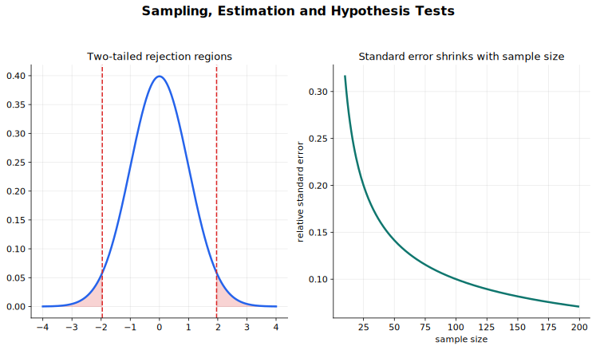

# Sampling, Estimation and Hypothesis Tests Lecture Notes

Statistical inference uses a sample to make a controlled, uncertain statement about a population. The central idea is that a statistic such as $\bar X$ or $\hat p$ varies from sample to sample. Once its sampling distribution is known or approximated, the same information can be used in two directions: confidence intervals estimate a plausible range of parameter values, while hypothesis tests judge whether the observed statistic is unusually far from a null model.

## Source Route

- 9709 6.4 Sampling and estimation
- 9709 6.5 Hypothesis tests
- 9231 4.2 Inference using normal and t-distributions
- Coursebook route: 9709 Probability and Statistics 2 sampling, estimation, and hypothesis testing chapters; 9231 further inference content.

## Visual Guide

Figure: use the guide to connect sampling distributions, confidence intervals, and rejection regions.

## 1. Population, Sample, and Sampling Distribution

A population is the whole group or process of interest. A sample is the observed subset. A parameter, such as a population mean $\mu$ or population proportion $p$, describes the population. A statistic, such as $\bar X$ or $\hat p$, is calculated from the sample.

Random sampling matters because it lets the statistic have a meaningful probability distribution. If the sample is biased, a neat formula cannot rescue the inference.

A sample mean is itself a random variable. If many random samples of size $n$ were taken from the same population, the sample means would form their own distribution. For a sample of size $n$ from a population with mean $\mu$ and variance $\sigma^2$,

$$
E(\bar X)=\mu,\qquad \operatorname{Var}(\bar X)=\frac{\sigma^2}{n}.
$$

The standard error of $\bar X$ is therefore

$$
\frac{\sigma}{\sqrt n}.
$$

The standard error is not the spread of the original observations. It is the spread of the estimator from sample to sample. Increasing $n$ reduces the standard error, which is why larger samples usually give more precise estimates.

If the original population is normal, then $\bar X$ is exactly normal. If the original population is not normal, the Central Limit Theorem says that $\bar X$ is approximately normal for large samples, provided the sample is random and the population is not so extreme that the approximation is unreasonable.

## 2. Estimators and Unbiased Estimates

An estimator is a rule for estimating a parameter. The sample mean estimates $\mu$, and the sample proportion $\hat p=X/n$ estimates $p$. An individual estimate may be too high or too low, but an unbiased estimator is centred correctly in repeated sampling.

For raw data,

$$
\bar x=\frac{\sum x}{n},\qquad s^2=\frac{\sum (x-\bar x)^2}{n-1}.
$$

The denominator $n-1$ is used for the usual unbiased estimate of the population variance. A convenient equivalent form is

$$
s^2=\frac{\sum x^2-\frac{(\sum x)^2}{n}}{n-1}.
$$

For summarised data with frequencies $f$ and total $N=\sum f$,

$$
\bar x=\frac{\sum fx}{N},\qquad
s^2=\frac{\sum fx^2-\frac{(\sum fx)^2}{N}}{N-1}.
$$

In interval and test formulae, keep the roles separate:

- $\sigma$ is the population standard deviation, known only when the question gives it or says it is known.
- $s$ is calculated from the sample.
- $\sigma/\sqrt n$ or $s/\sqrt n$ is a standard error.

## 3. Confidence Intervals

A confidence interval has the general form

$$
\text{estimate}\pm \text{critical value}\times \text{standard error}.
$$

For a population mean, if the population is normal with known variance, or if a large sample justifies a normal approximation,

$$
\bar x\pm z_{\alpha/2}\frac{\sigma}{\sqrt n}
$$

gives a two-sided $(1-\alpha)$ confidence interval. Common values are $z_{0.025}=1.96$ for 95% and $z_{0.005}=2.576$ for 99%.

If $\sigma$ is unknown and the sample is large, $s$ is usually used as an estimate of $\sigma$ in the standard error. If the sample is small, the normal approximation is not enough on its own. For a small sample from a normal population with unknown variance, use the $t$ distribution:

$$
\bar x\pm t_{\alpha/2,n-1}\frac{s}{\sqrt n}.
$$

For a large-sample population proportion,

$$
\hat p\pm z_{\alpha/2}\sqrt{\frac{\hat p(1-\hat p)}{n}}.
$$

A confidence level describes the long-run success rate of the method, not a probability attached to one finished interval. After an interval has been calculated, the unknown parameter is either inside it or not. The 95% statement means that repeated random samples, handled by the same method, would produce intervals containing the true parameter about 95% of the time.

For a difference of population means, use

$$
(\bar x-\bar y)\pm \text{critical value}\times \operatorname{SE}(\bar X-\bar Y),
$$

where the standard error depends on the model. With known variances or large samples,

$$
\operatorname{SE}(\bar X-\bar Y)=
\sqrt{\frac{\sigma_X^2}{m}+\frac{\sigma_Y^2}{n}}.
$$

With two independent normal samples and unknown but equal variances, replace the separate variances by the pooled estimate described below and use a $t$ critical value.

## 4. Hypothesis Test Structure

A hypothesis test asks whether the sample result is unusually far from what the null hypothesis predicts.

The null hypothesis $H_0$ is the model being tested. The alternative hypothesis $H_1$ states the direction or kind of departure:

- one-tailed: $H_1:\mu>\mu_0$ or $H_1:\mu<\mu_0$;
- two-tailed: $H_1:\mu\ne\mu_0$.

The significance level $\alpha$ is the probability of rejecting $H_0$ when $H_0$ is true. The rejection region, also called the critical region, is the set of test statistic values that lead to rejection.

A $p$-value is the probability, assuming $H_0$ is true, of obtaining the observed result or something at least as extreme in the direction of $H_1$. If $p<\alpha$, reject $H_0$.

There are two equivalent ways to make the decision:

- compare the test statistic with the critical region;
- calculate a $p$-value and compare it with $\alpha$.

Do not mix the tail direction from one method with the critical value from another. A two-tailed 5% test uses 2.5% in each tail, while a one-tailed 5% test puts the whole 5% in the relevant tail.

## 5. Normal and $t$ Tests for One Mean

The method depends on the statistic and the model assumptions.

For a population mean with known $\sigma$, or for a large sample where a normal approximation is appropriate,

$$
Z=\frac{\bar X-\mu_0}{\sigma/\sqrt n}.
$$

Under $H_0$, this is compared with the standard normal distribution.

For a small sample from a normal population with unknown variance,

$$
T=\frac{\bar X-\mu_0}{s/\sqrt n},
$$

with $n-1$ degrees of freedom. The $t$ distribution has heavier tails than the normal distribution because the standard deviation has been estimated from the same small sample. As $n$ increases, the $t$ distribution becomes closer to the normal distribution.

A one-sample mean test routine is:

1. Write $H_0:\mu=\mu_0$ and the correct one-tailed or two-tailed $H_1$.
2. Check whether $\sigma$ is known, the sample is large, or the small-sample normal-population $t$ model is needed.
3. Calculate the standard error and test statistic.
4. Use the correct tail area or critical value.
5. Conclude in context.

## 6. Paired and Two-Sample Tests

Paired data occur when observations naturally come in matched pairs, such as before-and-after measurements on the same subject. Do not treat the two columns as independent samples. Instead form differences

$$
D_i=X_i-Y_i
$$

and test the mean difference $\mu_D$. For a paired $t$-test,

$$
T=\frac{\bar D-\mu_{D,0}}{s_D/\sqrt n},
$$

with $n-1$ degrees of freedom, provided the paired differences are reasonably modelled as a sample from a normal population.

Two independent samples are used when the observations in one group are not matched with observations in the other group. If population variances are known, or the samples are large, a normal test for $\mu_X-\mu_Y$ uses

$$
Z=\frac{(\bar X-\bar Y)-\Delta_0}
{\sqrt{\frac{\sigma_X^2}{m}+\frac{\sigma_Y^2}{n}}},
$$

where $\Delta_0$ is the difference stated under $H_0$, often $0$.

If the two samples are from normal populations with unknown but equal variances, first calculate the pooled estimate

$$
s_p^2=\frac{(m-1)s_X^2+(n-1)s_Y^2}{m+n-2}.
$$

Then use

$$
T=\frac{(\bar X-\bar Y)-\Delta_0}
{s_p\sqrt{\frac{1}{m}+\frac{1}{n}}},
$$

with $m+n-2$ degrees of freedom.

The pooled test is not just a default two-sample test. It depends on the equal-variance assumption. If a question does not support that assumption, use the method the question indicates, usually a normal large-sample test in this syllabus context.

## 7. Binomial, Poisson, and Direct Probability Tests

For a single observation from a binomial or Poisson population, the test may be based directly on tail probabilities rather than a mean test statistic. The logic is still the same: calculate the probability, under $H_0$, of the observed result or something at least as extreme.

For example, if $X\sim B(n,p_0)$ under $H_0$ and the alternative is $p>p_0$, the rejection region is in the upper tail. Choose values of $x$ for which

$$
P(X\ge x\mid p=p_0)
$$

is small enough for the significance level. If a normal approximation is used, remember the continuity correction and check that the approximation is reasonable.

For a Poisson test, the same idea applies with

$$
X\sim \operatorname{Po}(\lambda_0)
$$

under $H_0$. Type I and Type II error calculations in these tests are often easiest if you first write the rejection or acceptance region in terms of the original count $X$.

## 8. Type I and Type II Errors

A Type I error is rejecting $H_0$ when $H_0$ is true. Its probability is the significance level, if the rejection region is set exactly to $\alpha$.

A Type II error is not rejecting $H_0$ when a specified alternative value is true. It cannot be calculated from the words "$H_1$ is true" alone; a particular alternative parameter value must be given or assumed.

The calculation routine is:

1. Set up the rejection region using the distribution under $H_0$.
2. Convert it into the acceptance region.
3. Change to the distribution under the specified alternative value.
4. Find the probability of falling in the acceptance region under that alternative.

For a normal mean test, suppose the acceptance region for $\bar X$ is

$$
a\le \bar X\le b.
$$

If the true mean is actually $\mu_1$, then

$$
P(\text{Type II error})=
P\left(a\le \bar X\le b\mid \mu=\mu_1\right),
$$

using the sampling distribution of $\bar X$ under $\mu_1$.

These errors are not just vocabulary. They describe the trade-off between being too quick to reject and being too slow to detect a real change.

## Worked-Thinking Routine

1. Identify the population, parameter, sample statistic, and model assumptions.
2. Decide whether the task is estimation or testing.
3. For intervals, choose the standard error and critical value.
4. For tests, write $H_0$ and $H_1$ in symbols and words.
5. Select the distribution of the test statistic under $H_0$.
6. Use a rejection region or $p$-value consistently.
7. For Type II error, rewrite the acceptance region before changing to the alternative distribution.
8. State the conclusion in context without saying $H_0$ has been proved.

## Common Mistakes

- Treating a biased sampling method as if it were random.
- Confusing population standard deviation, sample standard deviation, and standard error.
- Saying a fixed confidence interval has a 95% probability of containing the parameter.
- Writing hypotheses after seeing the calculation.
- Confusing one-tailed and two-tailed alternatives.
- Using a paired test as if the samples were independent.
- Using a pooled 2-sample $t$-test without the equal-variance assumption.
- Forgetting the degrees of freedom for $t$ tests.
- Saying the null hypothesis is proved.
- Interpreting the significance level as the probability that $H_0$ is true.
- Using a normal test when a small-sample $t$-test is required.
- Calculating a Type II error using the null distribution instead of the specified alternative distribution.

## Quick Self-Check

- Can you distinguish parameter, statistic, estimator, and estimate?
- Can you explain why $\operatorname{Var}(\bar X)=\sigma^2/n$?
- Can you construct and interpret confidence intervals for means, proportions, and differences of means?
- Can you choose between normal, binomial, Poisson, one-sample $t$, paired $t$, and 2-sample $t$ tests?
- Can you calculate a pooled variance and choose the correct degrees of freedom?
- Can you calculate Type I and Type II error probabilities from a stated rejection region?

## Connections

- [Normal and Poisson Distributions](../04%20Normal%20and%20Poisson%20Distributions/00%20Overview.md)
- [Chi-Squared, Non-Parametric Tests and PGF](../07%20Chi%20Squared%20Nonparametric%20and%20PGF/00%20Overview.md)

## Study Sequence

1. Review samples, populations, and random sampling.
2. Study the sampling distribution of $\bar X$.
3. Build confidence intervals for means, proportions, and differences of means.
4. Practise the structure of hypothesis tests.
5. Add binomial, Poisson, normal, one-sample $t$, paired $t$, and 2-sample $t$ tests.
6. Finish with pooled variance and Type I/Type II error calculations.
